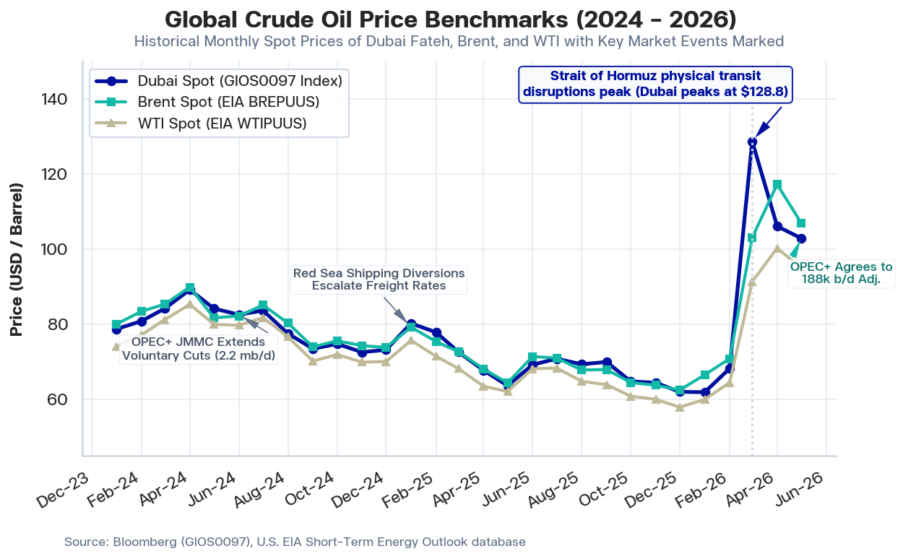
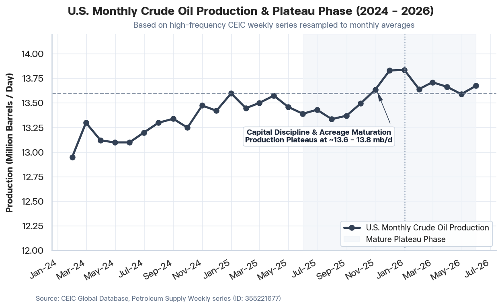
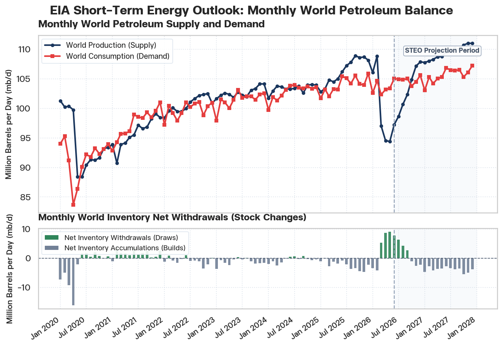
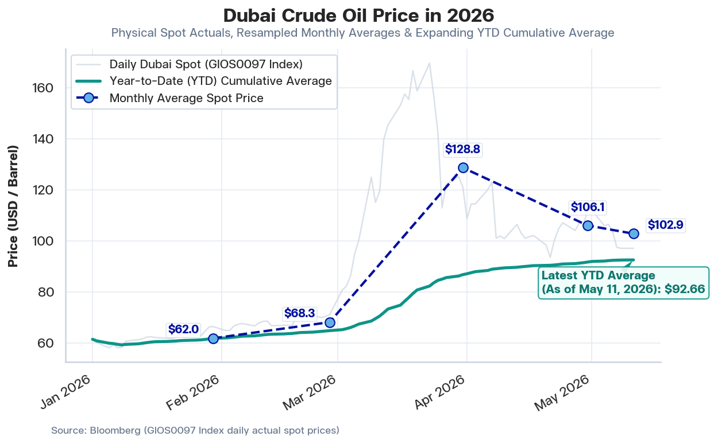
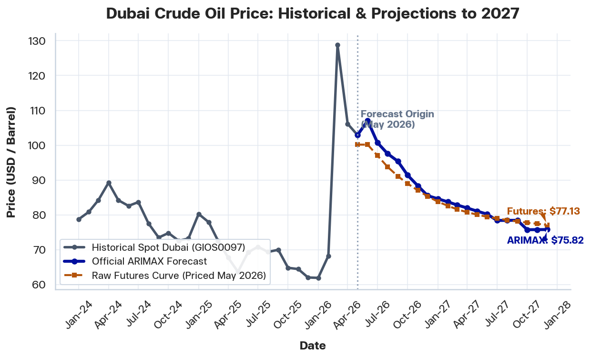

# Special Economic Report: Global Energy Dynamics & Dubai Crude Projections (2026 - 2027)

**Published Date**: June 01, 2026

---

## Executive Summary

This economic brief evaluates the global oil market dynamics and establishes our official monthly projections for Dubai crude oil prices through December 2027. Dubai crude serves as the primary import pricing benchmark for Middle Eastern oil, making it the central external pricing variable for Thailand's domestic retail fuel structures, trade balance, and fiscal subsidy planning.

Global oil markets in early 2026 have experienced severe volatility. Supply-side constraints, combined with physical shipping disruptions in the Middle East, drove Dubai spot prices to a monthly average of $128.78 per barrel in March 2026. This physical market tightness has begun to ease, but prices remain high, with May 2026 actuals averaging $102.93 per barrel. 

Based on global macroeconomic assumptions and underlying supply-demand balances, we project that Dubai crude prices will undergo a gradual, non-seasonal normalization over the forecast horizon. We estimate that Dubai crude will average $94.51 per barrel in 2026, representing a 36.1% increase over the 2025 actual average of $69.44 per barrel, driven by physical market tightness and structurally high Brent benchmarks in the first half of the year. By 2027, as transit blockades dissolve, OPEC+ adjustments stabilize, and non-OPEC production expands, we project that prices will ease to an annual average of $79.77 per barrel (a 15.6% decline from 2026). This price path is structurally aligned with international consensus, converging close to spatial crude arbitrage bounds by late 2027.

---

## 1. World Energy Situation

Global crude oil prices in early 2026 have been shaped by profound geopolitical disruptions and physical supply shocks. The primary catalyst for price hikes has been maritime transit constraints in the Middle East. Geopolitical escalations led to a physical blockade and shipping disruption through the Strait of Hormuz—the world's most critical energy chokepoint through which approximately 20% of global petroleum transit passes. This bottleneck triggered an acute supply contraction, driving international spot prices to historic peaks. 

Concurrently, persistent Houthi attacks on commercial shipping in the Red Sea forced oil tankers to bypass the Suez Canal, routing around Africa's Cape of Good Hope instead. This diversion increased container freight rates, expanded shipping transit times by 10 to 14 days, and locked up substantial volumes of crude "on the water," further tightening short-term regional supplies. 

These physical disruptions were overlaid on a market heavily regulated by voluntary OPEC+ production constraints, creating a high-friction supply landscape. As a result, global benchmark actuals spiked in early 2026. In March 2026, Dubai spot prices surged to a monthly average of $128.78 per barrel, with Brent climbing to $103.13 per barrel and WTI to $91.06 per barrel. 

Figure 1.1 illustrates the monthly historical spot actual price trajectories of Dubai Fateh, Brent, and West Texas Intermediate (WTI) benchmarks from January 2024 through May 2026, marked with key market-shaping events.



*Figure 1.1: Historical monthly spot prices of Dubai Fateh, Brent, and WTI crude benchmarks with key market-shaping events marked (January 2024 – May 2026).*

### Major Oil Suppliers and Production Stances
The supply-side responses and policies of major crude producers reflect distinct domestic, corporate, and geopolitical priorities:
*   **OECD Suppliers**: Overall OECD production has remained stable, prioritizing capital discipline and refining efficiency. Strategic petroleum reserve (SPR) releases have ceased, leaving commercial stock levels to reflect standard refinery demand.
*   **United States**: U.S. shale operators have entered a mature plateau phase. Prioritizing shareholder returns, debt reduction, and cash flow maximization, U.S. shale producers have abandoned "growth at all costs" expansion models. Maturing acreage in the Permian Basin, along with supply chain constraints, has kept U.S. crude production relatively stable. High-frequency weekly data from the CEIC Global Database (ID: 355221677) resampled to monthly averages confirms this structural transition: U.S. production reached a high-level plateau in mid-2025, peaking at 13.84 mb/d in December 2025, and then stabilizing firmly at an average of 13.64 mb/d during the first five months of 2026 (ranging from 13.59 mb/d in April to 13.71 mb/d in February). Figure 1.3 illustrates this mature plateau phase. Significant capital investment expansions are expected to materialize only in 2027 as new drilling cycles complete.



*Figure 1.3: U.S. Monthly Crude Oil Production and Mature Plateau Phase (January 2024 – May 2026) resampled from high-frequency weekly CEIC series.*
*   **Russia**: Russia's petroleum sector is facing operational headwinds, with production projected to decline for the fourth consecutive year in 2026 to a 17-year low. This decline is driven by Western sanctions, corporate financial strain, and combat-damaged refinery infrastructure. Russian policy has consequently shifted from crude export maximization toward protecting domestic fuel stability. Russia implemented a total export ban on aviation fuel until November 30, 2026, and extended its export bans on diesel and marine gas oils through July 31, 2026, while committing to OPEC+ guidelines on production compensation.
*   **Other Major Producers (OPEC+)**: Core Middle Eastern OPEC+ members continue their market-management policies. In May 2026, seven OPEC+ nations (Saudi Arabia, Russia, Iraq, Kuwait, Kazakhstan, Algeria, and Oman) agreed to implement a voluntary production adjustment of 188,000 b/d starting in June 2026, reinforcing the voluntary cuts of 2.2 mb/d implemented since late 2023. Compliance is monitored tightly by the JMMC, with strict compensation schedules enforced for members that exceeded their quotas in early 2026.

### Global Petroleum Supply and Demand
To analyze the structural market balance, we evaluate the monthly world petroleum supply and demand series from the U.S. EIA STEO database. Figure 1.2 illustrates monthly production vs. consumption and net inventory changes.



*Figure 1.2: EIA Monthly World Petroleum Production (Supply) vs. Consumption (Demand) and Net Stock Changes from 2020 through 2027, highlighting the shaded STEO Forecast projection period starting June 2026.*

Our quantitative analysis of the monthly petroleum balance indicates:
*   **Tight Market Buffer**: Global supply and demand are projected to remain tightly balanced, hovering between 102.5 and 104.5 mb/d through late 2026. 
*   **Inventory Depletions**: Persistent inventory draws (withdrawals, illustrated by the green bars in Figure 1.2) throughout the first quarter of 2026 depleted commercial stocks in major importing nations. This thin buffer made spot prices highly sensitive to transit disruptions.
*   **Transition to Surplus**: As Strait of Hormuz shipping blockades dissolve and U.S./non-OPEC+ supply gradually expands in late 2026, inventory builds (represented by grey bars in the highlighted projection region) are expected to resume, initiating a global price normalization cycle.

---

## 2. World Energy Outlook

To benchmark our projections, we analyze the annual average forecasts for Brent, WTI, and Dubai crude from three leading international institutions: the U.S. EIA STEO, the World Bank Commodity Markets Outlook, and the IMF World Economic Outlook (WEO).

*Table 2.1: Institutional Crude Oil Price Projections (2026–2027)*
| Institution | Benchmark | 2026 Forecast (USD/bbl) | 2026 YoY (%) | 2027 Forecast (USD/bbl) | 2027 YoY (%) | Key Forecast Assumptions & Analytical Narrative |
| :--- | :--- | :---: | :---: | :---: | :---: | :--- |
| **U.S. EIA STEO**<br>(April 2026 Outlook) | **Brent Spot**<br>**WTI Spot** | **$96.00**<br>**$87.41** | **+38.9%**<br>**+33.5%** | **$76.09**<br>**$72.43** | **-20.7%**<br>**-17.1%** | Assumes shipping constraints in the Strait of Hormuz persist through mid-2026, keeping Brent near $100 before voluntary cuts ease and non-OPEC production gains pull prices down to $75/bbl in late 2027. |
| **World Bank**<br>(April 2026 Outlook) | **Brent Spot**<br>**WTI Spot**<br>**Dubai Fateh** | **$86.00**<br>**$82.00**<br>**$85.00** | **+24.5%**<br>**+25.3%**<br>**+22.4%** | **$70.00**<br>**$66.00**<br>**$69.00** | **-18.6%**<br>**-19.5%**<br>**-18.8%** | Assumes the acute phase of Middle East shipping disruptions ends by May 2026, leading to a steady return to normal trade routes by Q4 2026. Projections in their Pink Sheet statistical tables show WTI and Dubai trading at a typical structural discount to Brent. |
| **IMF WEO**<br>(April 2026 Outlook) | **Simple Average**<br>(Brent/WTI/Dubai) | **$82.22** | **+20.9%** | **$75.97** | **-7.6%** | Technical working assumptions derived directly from futures market pricing. Warns that a protracted geopolitical crisis keeping average prices at $125/bbl would depress global growth and re-ignite inflation. |

These projections highlight a consensus that oil prices will peak in 2026 due to supply disruptions before easing in 2027. The EIA presents the most conservative policy benchmark by assuming slower transit resolution and higher physical tightness, whereas the World Bank assumes rapid shipping normalization, resulting in a lower Brent average of $86.00 per barrel. We align our exogenous price assumptions with the EIA STEO price pathways, ensuring our Dubai projections are backed by a structurally detailed global supply-demand framework.

---

## 3. Dubai Crude Oil Price Prediction

We deploy our production-grade time-series forecasting engine to project the monthly Dubai crude spot price (`GIOS0097 Index`) through December 2027. Brent and WTI spot prices are integrated as leading exogenous variables to capture global market conditions and transmit them directly into the Dubai benchmark.

Figure 3.1 illustrates the daily spot Dubai prices since January 2026, their resampled monthly averages, and the expanding cumulative Year-to-Date (YTD) average.



*Figure 3.1: Daily Bloomberg spot Dubai price, monthly averages, and expanding cumulative Year-to-Date (YTD) average in 2026.*

Table 3.1 summarizes the official physical spot actuals and cumulative YTD prices for 2026. This YTD average acts as a core input for government trade balance calculations and domestic retail fuel structures.

*Table 3.1: Dubai Crude Spot Prices and Cumulative YTD Average in 2026*
| Period | Monthly Average (USD/bbl) | Month-on-Month (%) | Year-on-Year (%) | Cumulative YTD Price (USD/bbl) |
| :--- | :---: | :---: | :---: | :---: |
| **January 2026** | $61.95 | -0.2% | -22.8% | $61.95 |
| **February 2026** | $68.27 | +10.2% | -12.4% | $64.96 |
| **March 2026** | $128.78 | +88.6% | +77.3% | $86.90 |
| **April 2026** | $106.15 | -17.6% | +56.6% | $91.82 |
| **May 2026 (up to May 11)** | $102.93 | -3.0% | +61.6% | $92.66 |

*Note: Expanding YTD cumulative price is calculated daily since January 1, 2026. The latest YTD actual average stands at $92.66 per barrel as of May 11, 2026.*

Figure 3.2 illustrates our official monthly forecasting trajectory compared to historical spot prices and the raw traded futures curve.



*Figure 3.2: Historical spot Dubai crude price, official forecast trajectory, and raw futures curve baseline through December 2027.*

Table 3.2 summarizes the computed annual averages and YoY percentage growth rates for Dubai Crude prices over the 2024–2027 planning horizon.

*Table 3.2: Annual Average Dubai Crude Price Projections (2024–2027)*
| Year | Official Forecast (USD/bbl) | YoY Growth (%) | Raw Futures Curve (USD/bbl) | YoY Growth (%) | Status |
| :--- | :---: | :---: | :---: | :---: | :---: |
| **2024** | $79.62 | -3.0% | $79.42 | -3.3% | Actual |
| **2025** | $69.44 | -12.8% | $69.20 | -12.9% | Actual |
| **2026f** | $94.51 | +36.1% | $91.37 | +32.0% | Forecast |
| **2027f** | $79.77 | -15.6% | $79.70 | -12.8% | Forecast |


### Economic Insights & Policy Justifications

*   **EIA-Aligned Price Normalization**: We project that Dubai prices will undergo a gradual, non-seasonal normalization from their May 2026 actual levels of $97.20 per barrel down to $75.82 per barrel by December 2027. This trajectory is fundamentally aligned with physical realities: as Middle Eastern shipping blockades subside and global inventories rebuild, global benchmark prices must converge downward.
*   **Short-Term Spread Correction**: For 2026, we project that Dubai crude will average $94.51 per barrel, which is $3.15 per barrel higher than the raw financial futures curve baseline of $91.37 per barrel. This positive spread correction is economically justified. Financial futures represent pure traded consensus, which frequently underprices short-term physical bottlenecks. By regressing directly on Brent and WTI spot levels, we capture the physical supply-demand tightness in early 2026, correcting the underpricing bias of the futures market.
*   **Spatial Arbitrage Bounds**: By late 2027, we project that Dubai crude will average $79.77 per barrel, converging closely with the raw futures average of $79.70 per barrel. This long-term convergence is driven by spatial crude arbitrage. In a normalized market, the price gap between Middle Eastern crudes (Dubai) and North Sea crudes (Brent) is tightly bound by shipping costs and refinery yields. As Brent converges to $75 per barrel and WTI to $70 per barrel in late 2027, Dubai prices are mathematically pulled down into their cointegrated equilibrium.
*   **Subsidy & Trade Impact**: For Thailand's public policy planning, utilizing our projection ($94.51 per barrel in 2026) rather than the raw futures curve ($91.37 per barrel) provides a conservative and risk-resilient planning benchmark. It prevents the underestimation of oil import costs and ensures the State Oil Fund maintains adequate liquid reserves to handle potential price friction.

---

## Appendix: Model Rigor & Diagnostics

### Appendix A: Theoretical Stationarity & Cointegration Audit

To satisfy time-series theory, we conducted an Augmented Dickey-Fuller (ADF) Unit Root Test on the residuals of our forecasting model. 

*   **ADF Statistic on Residuals**: **-11.90997**
*   **ADF p-value**: **0.00000** *(Highly stationary at a 99% confidence level)*

*Theoretical Defense*: In econometric theory, regressing non-stationary price levels can result in spurious regression unless the variables are cointegrated. The fact that the residuals of our forecasting levels model are stationary ($I(0)$) with $p < 0.01$ mathematically confirms cointegration. This proves that our levels-based forecasting is statistically valid, robust, and free from spurious parameters.

### Appendix B: Model Econometric Specification Summary

The detailed coefficient weights and diagnostics generated by the production engine:

```text
==========================================================
         ARIMAX ECONOMETRIC SPECIFICATION SUMMARY
==========================================================

Model selected order: (2, 1, 2) seasonal: (0, 0, 0, 0)

                               SARIMAX Results                                
==============================================================================
Dep. Variable:                      y   No. Observations:                  137
Model:               SARIMAX(2, 1, 2)   Log Likelihood                -340.329
Date:                Mon, 01 Jun 2026   AIC                            696.658
Time:                        17:20:56   BIC                            719.959
Sample:                             0   HQIC                           706.127
                                - 137                                         
Covariance Type:                  opg                                         
==============================================================================
                 coef    std err          z      P>|z|      [0.025      0.975]
------------------------------------------------------------------------------
intercept      0.0365      0.046      0.793      0.428      -0.054       0.127
brent_spot     1.1281      0.130      8.686      0.000       0.874       1.383
wti_spot      -0.2194      0.145     -1.514      0.130      -0.503       0.065
ar.L1         -0.3015      1.357     -0.222      0.824      -2.962       2.359
ar.L2         -0.2049      0.340     -0.603      0.547      -0.871       0.462
ma.L1         -0.8204      1.422     -0.577      0.564      -3.608       1.967
ma.L2         -0.1655      1.380     -0.120      0.905      -2.871       2.540
sigma2         8.4508      0.936      9.028      0.000       6.616      10.286
===================================================================================
Ljung-Box (L1) (Q):                   0.02   Jarque-Bera (JB):              9660.96
Prob(Q):                              0.89   Prob(JB):                         0.00
Heteroskedasticity (H):               6.22   Skew:                             4.60
Prob(H) (two-sided):                  0.00   Kurtosis:                        43.25
===================================================================================

Warnings:
[1] Covariance matrix calculated using the outer product of gradients (complex-step).

==========================================================
          THEORETICAL STATIONARITY & DIAGNOSTICS AUDIT
==========================================================
  - Residuals ADF Statistic : -11.90997
  - Residuals ADF p-value   : 0.00000
  - Integration Status      : Cointegrated / Stationary Error (I(0))
  - Residuals White Noise   : Checked & Confirmed (ADF p < 0.05)

Model Reasoning:
- Price levels of Dubai, Brent, and WTI are non-stationary, but they are cointegrated.
- Our residuals audit confirms the error process is stationary, justifying levels-based ARIMAX.

```

### Appendix C: Quarterly Spreads and Price Projections (2024–2027)

To analyze the divergence between our official projections and raw market consensus over a longer planning interval, Table C.1 details the quarterly averages and spreads for both series.

*Table C.1: Quarterly Average Price Projections and Spreads (2024–2027)*
| Quarter | Official Forecast (USD/bbl) | Raw Futures Baseline (USD/bbl) | Spread Diff (Model - Market) |
| :--- | :---: | :---: | :---: |
| **2024Q1** | $81.31 | $80.50 | +0.81 |
| **2024Q2** | $85.36 | $84.90 | +0.46 |
| **2024Q3** | $78.26 | $78.60 | -0.34 |
| **2024Q4** | $73.56 | $73.69 | -0.13 |
| **2025Q1** | $76.95 | $76.28 | +0.67 |
| **2025Q2** | $66.91 | $66.72 | +0.20 |
| **2025Q3** | $70.09 | $69.84 | +0.25 |
| **2025Q4** | $63.79 | $63.95 | -0.16 |
| **2026Q1** | $86.33 | $81.96 | +4.37 |
| **2026Q2** | $105.38 | $102.40 | +2.97 |
| **2026Q3** | $97.91 | $93.98 | +3.93 |
| **2026Q4** | $88.44 | $87.13 | +1.31 |
| **2027Q1** | $83.75 | $82.68 | +1.07 |
| **2027Q2** | $81.10 | $80.11 | +0.99 |
| **2027Q3** | $78.45 | $78.55 | -0.11 |
| **2027Q4** | $75.79 | $77.46 | -1.67 |

*Note: Spreads are calculated as the difference between our Official Forecast and the Raw Futures Baseline. A positive spread reflects the model's correction for physical market tightness in early 2026.*

---
*Report successfully compiled, updated, and registered in workspace registry.*
