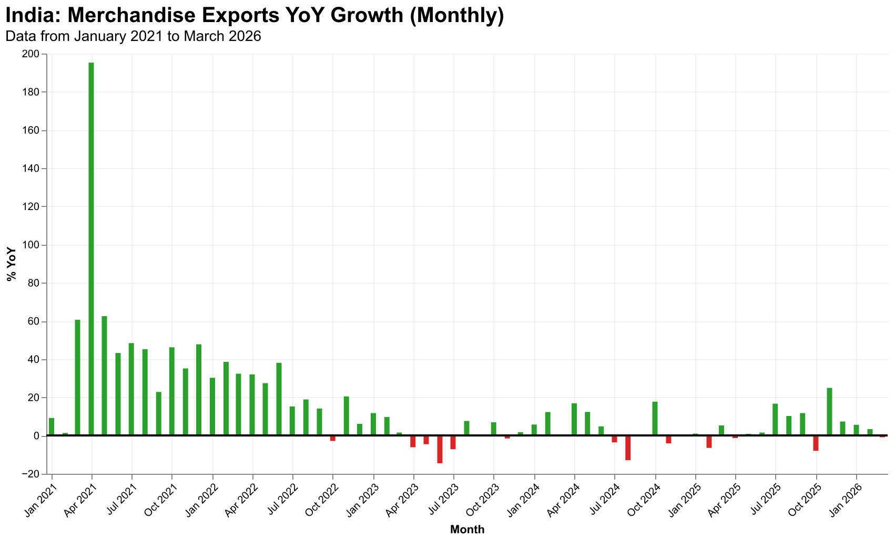

# Analysis of India's Export Performance: March 2026

**Date:** April 2026  
**Subject:** Formal Economic Review of India’s Merchandise Trade  
**Report ID:** INR-EXP-2026-M3  

---

## 1. Executive Summary

India's merchandise exports experienced a slight contraction in March 2026, with a year-on-year (YoY) decline of **-0.90%**. This performance marks a notable deceleration from the growth rates of 5.67% and 3.37% recorded in January and February 2026, respectively. The marginal dip is primarily attributed to heightened geopolitical volatility in West Asia and associated logistical bottlenecks in critical maritime corridors. Despite these challenges, the export sector demonstrated resilience, buoyed by sustained demand from North American markets and proactive fiscal interventions in the form of tariff rationalization.

---

## 2. Data Overview

The trade data for March 2026 indicates a pivot in the export trajectory that had characterized the early part of the first quarter. While the magnitude of the decline is relatively contained at -0.90%, the shift from positive territory reflects the increasing sensitivity of India's trade basket to external shocks.

*Figure 1: India's Merchandise Export Growth (YoY %) – Highlighting the March 2026 contraction relative to previous periods.*

As illustrated in the longitudinal data, the export performance in March represents the first YoY contraction since the final quarter of 2025. This suggests a tightening of global trade conditions despite a relatively stable domestic manufacturing environment.

---

## 3. Key Drivers of Decline

The observed decline in export realizations can be traced to a confluence of external and structural factors:

*   **Geopolitical Conflict in West Asia:** Renewed escalations in the West Asian region have induced a climate of uncertainty, leading to a "wait-and-watch" approach among global buyers and disrupting established trade settlements.
*   **Logistical Disruptions (Strait of Hormuz):** Security concerns in the Strait of Hormuz and surrounding maritime zones have necessitated the rerouting of shipments. This has not only extended lead times but has also significantly inflated freight insurance premiums and overall shipping costs, impacting the price-competitiveness of Indian goods.
*   **Sectoral Vulnerabilities:** Specifically, labor-intensive sectors such as gems and jewelry and certain segments of the petroleum product exports—which are heavily dependent on West Asian transit routes—faced significant headwinds during the month.

---

## 4. Mitigation Factors

The downturn was partially offset by several stabilizing forces that prevented a deeper contraction:

*   **Resilient US Demand:** The United States remains a bedrock of support for Indian exports. Steady demand for engineering goods, pharmaceuticals, and specialized electronics helped maintain volumes even as other regional markets faltered.
*   **Strategic Tariff Adjustments:** The Indian government's recent initiatives to reduce import duties on critical components and raw materials have lowered the cost of production for export-oriented units. These "input-side" benefits have allowed exporters to absorb some of the increased logistical costs without passing them entirely to the final consumer.

---

## 5. Strategic Outlook

Moving into the second quarter of 2026, the outlook for India's exports remains cautiously optimistic but subject to high-frequency risks. 

1.  **Near-Term Risk:** The primary risk factor remains the duration and intensity of the West Asian conflict. Continued maritime insecurity will likely keep freight costs elevated, potentially squeezing the margins of small and medium enterprise (SME) exporters.
2.  **Structural Tailwinds:** Over the medium term, India's ongoing negotiations for comprehensive Free Trade Agreements (FTAs) with European and Oceanic partners are expected to open new market frontiers.
3.  **Policy Recommendation:** Strategic focus should remain on enhancing the "Ease of Doing Exports" and diversifying logistics routes (such as the International North-South Transport Corridor) to reduce over-reliance on traditional maritime chokepoints.

In conclusion, while the -0.90% decline in March 2026 serves as a cautionary signal, the underlying fundamentals of the Indian export sector—supported by domestic policy support and diversified market access—remain robust.

---
*End of Report*
