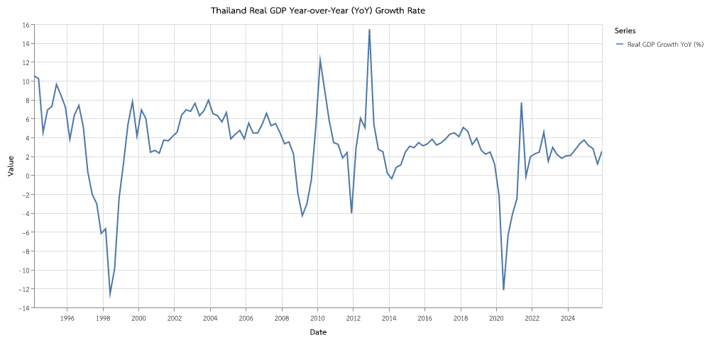

# Thailand Real GDP Growth Analysis (1993 - 2025)

## Executive Summary
This report analyzes the long-term year-over-year (YoY) growth of Thailand's Real Gross Domestic Product (GDP) from 1993 to Q4 2025. Using Chain Volume Measures (CVM), the analysis highlights the resilience and structural shifts in the Thai economy through multiple global and domestic economic shocks.

---

## 1. Historical Growth Trajectory

Thailand's economic history over the past three decades is marked by high growth periods punctuated by significant crises. The figure below visualizes the year-over-year quarterly real GDP growth rate.

---

## 2. Key Economic Shocks & Crises

The long-term trajectory of Thailand's GDP reveals four major contractionary episodes:

### A. The Asian Financial Crisis (1997 - 1998)
*   **Context:** Initiated by the devaluing of the Thai Baht in July 1997, this crisis caused severe contractions across all sectors.
*   **Impact:** Real GDP growth reached an all-time low of approximately **-12.5%** in mid-1998. The economy underwent major financial sector restructuring.

### B. The Global Financial Crisis (2008 - 2009)
*   **Context:** The collapse of the US subprime market led to a severe global trade freeze, drastically hitting Thai exports.
*   **Impact:** Real GDP contracted by over **-5.0%** in Q1 2009 due to a sharp drop in foreign demand.

### C. The Great Floods of 2011 (Q4 2011)
*   **Context:** Severe domestic flooding inundated major industrial estates in Central Thailand, halting supply chains.
*   **Impact:** GDP YoY growth plunged to **-4.7%** in Q4 2011, though it was followed by a dramatic V-shaped reconstruction-led bounce in 2012.

### D. The COVID-19 Pandemic (2020)
*   **Context:** Global travel restrictions decimated Thailand's vital tourism sector and disrupted manufacturing.
*   **Impact:** GDP contracted by **-12.1%** in Q2 2020, representing the worst contraction since the 1997 Asian Financial Crisis.

---

## 3. Recent Performance (2024 - 2025)

The Thai economy has been on a slow, grinding recovery path post-pandemic. Recent quarterly YoY growth rates are summarized below:

| Quarter | Real GDP Growth YoY (%) | Status |
| :--- | :---: | :--- |
| **Q1 2024** | 2.09% | Low-base recovery |
| **Q2 2024** | 2.69% | Service-led expansion |
| **Q3 2024** | 3.32% | Consumption bounce |
| **Q4 2024** | 3.72% | Export recovery |
| **Q1 2025** | 3.14% | Tourism peak season |
| **Q2 2025** | 2.82% | Moderate domestic demand |
| **Q3 2025** | 1.20% | Global trade slowdown |
| **Q4 2025** | 2.54% | Year-end tourism spike |

### Strategic Outlook
While the recovery continues with **2.54% growth in Q4 2025**, the structural challenges—namely an aging population, high household debt, and global export headwinds—continue to cap Thailand's potential growth rate compared to the pre-2000 era.

---

## Strategic Audit Trail
*   **Team Deployment:** Chief Economist, `data_transformer`, `viz_expert`, `report_writer`
*   **Data Source:** NESDC (Chain Volume Measures, CVM)
*   **Transformations:** Quarterly Year-over-Year (YoY) Percentage Change
*   **Primary Deliverables:** 
    *   Dataset: [thailand_gdp_growth.csv](file:///output/data/transformed/thailand_gdp_growth.csv)
    *   Chart: [thailand_gdp_growth_yoy.png](file:///output/chart/thailand_gdp_growth_yoy.png)
    *   Report: [Thailand_Real_GDP_Growth_Analysis.md](file:///output/report/Thailand_Real_GDP_Growth_Analysis.md)
*   **Registry Status:** Manifest updated in `database/PROJECT_STATE.json`
