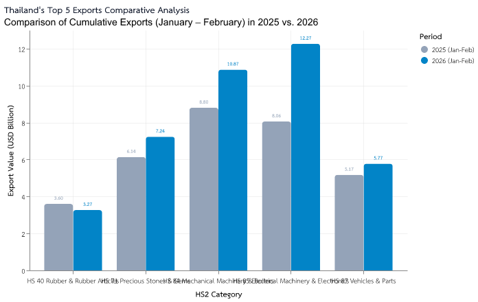

# Export Rebound and Structural Divergence: An Analysis of Thailand's Top 5 Exports (2025–2026)

## Executive Summary
This report provides a data-driven macroeconomic analysis of Thailand's top 5 export categories at the 2-digit Harmonized System (HS2) level. Drawing on high-fidelity trade records from the Global Trade Atlas (GTA) database, we examine full-year performance in 2025 and compare available cumulative trade data for the first two months (January–February) of 2025 and 2026. 

Our findings indicate a **powerful trade rebound** led by tech-oriented sectors, particularly **Electrical Machinery & Electronics (HS 85)** and **Mechanical Machinery & Boilers (HS 84)**, which expanded by **+52.20%** and **+23.43%** YoY respectively in the opening months of 2026. While automotive and jewelry sectors also demonstrated positive cyclical growth, a noticeable **structural divergence** is visible as **Rubber and Articles Thereof (HS 40)** contracted by **-9.28%**, highlighting commodity-specific headwinds.

---

## Comparative Performance Registry
The table below summarizes the trade values (denominated in USD) and period growth trajectories for Thailand's top 5 export sectors:

| HS Code | Sector Description | 2025 Full-Year Value (USD) | 2025 Jan–Feb Value (USD) | 2026 Jan–Feb Value (USD) | YoY Growth (Jan–Feb) | Status |
| :--- | :--- | :---: | :---: | :---: | :---: | :---: |
| **HS 85** | Electrical Machinery & Electronics | $63,179,962,941.33 | $8,061,296,973.39 | $12,269,126,289.03 | **+52.20%** | **Surging** |
| **HS 84** | Mechanical Machinery & Boilers | $61,103,646,348.99 | $8,804,476,760.23 | $10,867,439,867.94 | **+23.43%** | **Strong Expansion** |
| **HS 87** | Vehicles & Parts (Excl. Railway) | $34,169,285,712.28 | $5,168,922,289.38 | $5,774,913,363.34 | **+11.72%** | **Cyclical Growth** |
| **HS 71** | Precious Stones & Gems | $26,591,072,128.33 | $6,137,540,606.88 | $7,235,944,429.28 | **+17.90%** | **Expanding** |
| **HS 40** | Rubber and Rubber Articles | $20,606,010,498.15 | $3,601,945,930.11 | $3,267,720,047.04 | **-9.28%** | **Contraction** |

*Source: Global Trade Atlas (GTA) SQLite Database (`database/core/GTA.db`)*

---

## Macroeconomic Sector Deep-Dive

### 1. HS 85: The Explosive Tech & Electronics Wave (+52.20% YoY)
Electrical Machinery and Electronics (HS 85) secured its position as Thailand's largest export sector, reaching **USD 63.18 Billion** in 2025. In the first two months of 2026, it witnessed an extraordinary **+52.20% YoY surge**, jumping from USD 8.06 Billion to USD 12.27 Billion. 
*   **Cyclical Drivers**: This growth is primarily fueled by the global semiconductor upcycle and the ending of the hardware destocking cycle. The rapid commercialization of Generative AI, high-performance computing (HPC), and cloud infrastructure has driven unprecedented global demand for components.
*   **Thailand's Role**: Thailand acts as a critical Outsource Semiconductor Assembly and Test (OSAT) and Printed Circuit Board (PCB) node in the Southeast Asian technology supply chain, benefiting directly from MNC diversification away from Northeast Asia.

### 2. HS 84: Capital Expenditure & Computing Equipment (+23.43% YoY)
Nuclear Reactors, Boilers, and Mechanical Appliances (HS 84) recorded **USD 61.10 Billion** in 2025, closely rivaling HS 85. The sector sustained a strong expansion of **+23.43% YoY** in early 2026.
*   **Industrial Automation**: Regional manufacturing shifts have boosted capital expenditure, increasing exports of industrial boilers, engines, and automated mechanical components.
*   **Storage Infrastructure**: Thailand's prominent role in global Hard Disk Drive (HDD) manufacturing remains solid, with server-capacity storage units supporting data center expansion globally.

### 3. HS 87: Automotive Resilience in a Transition Phase (+11.72% YoY)
Vehicles and Parts (HS 87) brought in **USD 34.17 Billion** in 2025, expanding by a stable **+11.72% YoY** in early 2026 to reach USD 5.77 Billion.
*   **The "Detroit of Asia" Effect**: Conventional internal combustion engine (ICE) and hybrid vehicle exports to Oceania, the Middle East, and ASEAN continue to provide solid support.
*   **Electric Vehicle Transition**: The ongoing transition to electric vehicles (EVs) has induced investment shifts. Thailand's established auto-parts ecosystem is successfully integrating EV battery components, harnessing regional hubs.

### 4. HS 71: Premium luxury & Jewelry Expansion (+17.90% YoY)
Precious Stones, Gems, and Pearls (HS 71) accounted for **USD 26.59 Billion** in 2025, expanding by **+17.90% YoY** in the first two months of 2026 to USD 7.24 Billion.
*   **Luxury Sector Rebound**: Key retail hubs (e.g. Hong Kong, Singapore, and Western markets) witnessed strong demand. 
*   **Safe-Haven Inflows**: Elevated global macroeconomic uncertainty has kept gold and precious metals in high demand, boosting refining and polishing exports.

### 5. HS 40: Rubber Industry Headwinds (-9.28% YoY contraction)
Rubber and Articles Thereof (HS 40) is the only sector among the top 5 to experience a contraction, falling by **-9.28% YoY** to USD 3.27 Billion.
*   **Supply Shortages**: Adverse climate conditions (such as erratic El Niño/La Niña shifts) disrupted raw rubber latex tapping in southern Thailand, limiting supply.
*   **Pandemic Wind-Down**: Persistent cooling in global demand for surgical rubber gloves post-COVID-19 continues to weigh down finished-product values.
*   **Substitution and Competitiveness**: Intense regional competition in natural rubber and synthesized substitutes has compressed exporter margins.

---

## Strategic Policy Recommendations

1.  **Upstream Electronics Investment**: 
    To sustain the massive growth in HS 85, the government should offer aggressive BOI (Board of Investment) tax incentives to transition Thailand from low-margin assembly (OSAT) toward higher-value wafer fabrication, IC design, and advanced packaging facilities.
2.  **Accelerate EV Supply Chain Localization**: 
    To maintain HS 87 automotive dominance, policymakers must speed up the local manufacturing of critical EV subsystems (traction motors, power electronics, sensors) to prevent imports from eroding net export values.
3.  **Climate-Resilient Agriculture & High-Value Rubber**: 
    In response to the HS 40 contraction, exporters must shift focus from raw rubber sheets and blocks to high-value technical rubber components (e.g. specialized medical devices, aerospace seals). Agricultural support should incorporate climate-adaptive farming techniques to stabilize raw rubber yields against weather anomalies.
4.  **Trade Agreement Expansion**: 
    Expanding bilateral and multilateral FTAs (Free Trade Agreements) with major technology-consuming markets will lower tariff barriers for electronic components and mechanical machinery, reinforcing Thailand's competitiveness.
