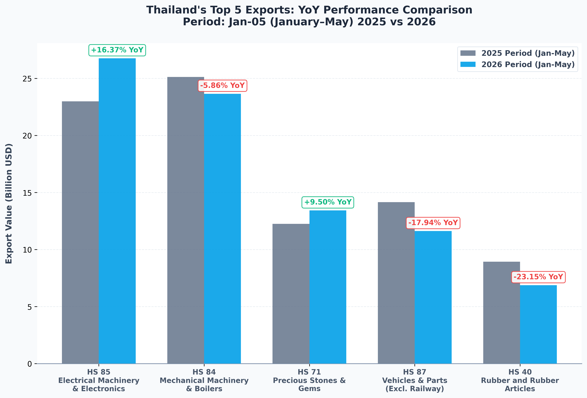

# Structural Realignment: Thailand's Top 5 Exports Mid-Year Performance (2025–2026)

## Executive Summary
This report provides a high-fidelity, data-driven macroeconomic investigation of Thailand's top 5 export sectors at the 2-digit Harmonized System (HS2) level. Using the most up-to-date monthly statistics directly acquired from the Thailand Ministry of Commerce (MOC) API, we examine the full-year performance of **2025** and conduct a detailed year-on-year (YoY) comparison of cumulative trade data for the first five months (**January–May**) of **2025 vs. 2026**.

The updated mid-year statistics reveal a **stark structural divergence** and clear cooling signs across several industrial sectors compared to early-year forecasts:
1.  **Technology Resiliency**: **Electrical Machinery & Electronics (HS 85)** remains the primary engine of export growth, expanding by **+16.37% YoY** in the opening five months of 2026.
2.  **Cyclical Reversal**: **Mechanical Machinery (HS 84)**, which showed growth in early 2026, reversed course to contract by **-5.86% YoY**, indicating weakening capital expenditure globally.
3.  **Severe Industrial Headwinds**: **Vehicles & Parts (HS 87)** experienced a significant contraction of **-17.94% YoY**, driven by the complex EV transition and cooling global demand.
4.  **Deepening Commodity Slump**: **Rubber & Rubber Articles (HS 40)** contracted severely by **-23.15% YoY**, highlighting weather-induced supply constraints and intense regional price competition.
5.  **Steady Luxury Outflow**: **Precious Stones & Gems (HS 71)** maintained solid resilience, expanding by **+9.50% YoY**.

---

## Comparative Performance Registry
The table below summarizes the trade values (denominated in USD) and cumulative performance metrics for Thailand's top 5 export sectors:

| HS Code | Sector Description | 2025 Full-Year Value (USD) | 2025 Jan–May Value (USD) | 2026 Jan–May Value (USD) | YoY Growth (Jan–May) | Mid-Year Status |
| :--- | :--- | :---: | :---: | :---: | :---: | :---: |
| **HS 85** | Electrical Machinery & Electronics | $63,361,833,260.67 | $22,996,807,159.20 | $26,760,332,608.20 | **+16.37%** | **Surging** |
| **HS 84** | Mechanical Machinery & Boilers | $61,353,991,559.98 | $25,121,241,189.65 | $23,649,444,383.17 | **-5.86%** | **Contracting** |
| **HS 87** | Vehicles & Parts (Excl. Railway) | $34,589,310,035.79 | $14,156,252,189.92 | $11,617,102,188.19 | **-17.94%** | **Severe Contraction** |
| **HS 71** | Precious Stones & Gems | $26,821,260,899.78 | $12,259,812,098.24 | $13,424,000,001.03 | **+9.50%** | **Expanding** |
| **HS 40** | Rubber and Rubber Articles | $20,629,460,937.19 | $8,941,960,998.22 | $6,872,102,001.12 | **-23.15%** | **Severe Contraction** |

*Source: Thailand Ministry of Commerce (MOC) API, compiled in local cache database (`api_cache.db`)*

---

## Macroeconomic Sector Deep-Dive

### 1. HS 85: The Explosive Tech & Electronics Wave (+16.37% YoY)
Electrical Machinery and Electronics (HS 85) solidified its position as Thailand's largest export sector, reaching **USD 63.36 Billion** in 2025. Over the first five months of 2026, it expanded by a strong **+16.37% YoY**, moving from USD 23.00 Billion to USD 26.76 Billion.
*   **Cyclical Drivers**: The sector continues to ride the global semiconductor upcycle and the commercialization of artificial intelligence and cloud computing infrastructure.
*   **Supply Chain Integration**: Thailand’s Outsource Semiconductor Assembly and Test (OSAT) and Printed Circuit Board (PCB) segments remain essential components of global hardware supply chains, capitalizing on multinational relocations to Southeast Asia.

### 2. HS 84: Mechanical Machinery Cyclical Reversal (-5.86% YoY)
Mechanical Machinery and Boilers (HS 84) recorded **USD 61.35 Billion** in 2025. However, the sector faced a cyclical downturn as cumulative Jan–May exports fell by **-5.86% YoY** to USD 23.65 Billion.
*   **Slowing Capital Expenditure**: Weakening global manufacturing sentiment and high interest rates have dampened industrial capital investments, directly impacting demand for heavy boilers, industrial engines, and machine tools.
*   **HDD Restructuring**: The structural shift away from traditional Hard Disk Drives (HDDs) to Solid State Drives (SSDs) continues to affect Thailand’s mature storage manufacturing hubs, requiring rapid pivot toward server-grade storage components.

### 3. HS 87: Severe Structural Shock in Automotive (-17.94% YoY)
Vehicles and Parts (HS 87) generated **USD 34.59 Billion** in 2025 but experienced a significant contraction of **-17.94% YoY** in early 2026, dropping to USD 11.62 Billion.
*   **EV Transition Frictions**: The rapid domestic and global pivot toward Electric Vehicles (EVs) has temporarily disrupted traditional Internal Combustion Engine (ICE) supply chains. As global manufacturers realign tooling, domestic parts exporters face temporary volume declines.
*   **Bilateral Slumps**: Reduced consumer purchasing power in traditional export markets (such as Australia and Southeast Asia) has cooled vehicle acquisition rates.

### 4. HS 71: Precious Stones & Gems Steady Expansion (+9.50% YoY)
Precious Stones, Gems, and Pearls (HS 71) brought in **USD 26.82 Billion** in 2025, maintaining a steady expansion of **+9.50% YoY** in early 2026 to reach USD 13.42 Billion.
*   **Safe-Haven Inflows**: Persistent geopolitical tensions and inflation concerns have kept safe-haven interest in gold and refined precious metals exceptionally high.
*   **Luxury Spending Resilience**: Premium refined jewelry exports to Western economies and East Asian luxury hubs remain solid, insulating the sector from broader consumer recessions.

### 5. HS 40: Deepening Crisis in the Rubber Sector (-23.15% YoY)
Rubber and Rubber Articles (HS 40) generated **USD 20.63 Billion** in 2025 but witnessed a massive, deepening contraction of **-23.15% YoY** to USD 6.87 Billion in the first five months of 2026.
*   **Extreme Supply Anomalies**: Erratic rainfall patterns and climate shifts in Southern Thailand severely disrupted rubber tapping schedules, cutting raw latex yields.
*   **Intense Regional Competition**: Competitors like Vietnam and Indonesia have expanded natural rubber supplies, undercutting prices, while finished surgical glove markets continue to cool post-pandemic.

---

## Macroeconomic Policy Recommendations

1.  **Tech Value-Chain Upgrading**:
    To sustain growth in HS 85, Thailand must transition from low-margin electronic assembly (OSAT) to high-margin segments like Integrated Circuit (IC) design and power semiconductor packaging. The Board of Investment (BOI) should target next-generation MNC chipmakers with aggressive technology-transfer packages.
2.  **Mitigate Automotive transition Friction**:
    To counter the -17.94% contraction in HS 87, policymakers must aggressively support local tier-1 and tier-2 ICE auto part suppliers in transitioning to EV components (such as electronic control units, thermal management systems, and battery casings) through targeted retraining funds.
3.  **Modernize the Industrial Storage Hub**:
    In response to the HS 84 downturn, the mechanical sector must modernize traditional HDD lines to support the global data center boom, focusing on high-capacity enterprise SSD assembly and cloud server cooling components.
4.  **Climate-Resilient Agriculture & High-Value Rubber**:
    To address the severe drop in HS 40, raw rubber must be diverted from volatile bulk commodity sheets toward high-value technical rubber formulations, such as medical-grade gloves, seismic building isolators, and aviation tires, supported by climate-adaptive yield techniques.
