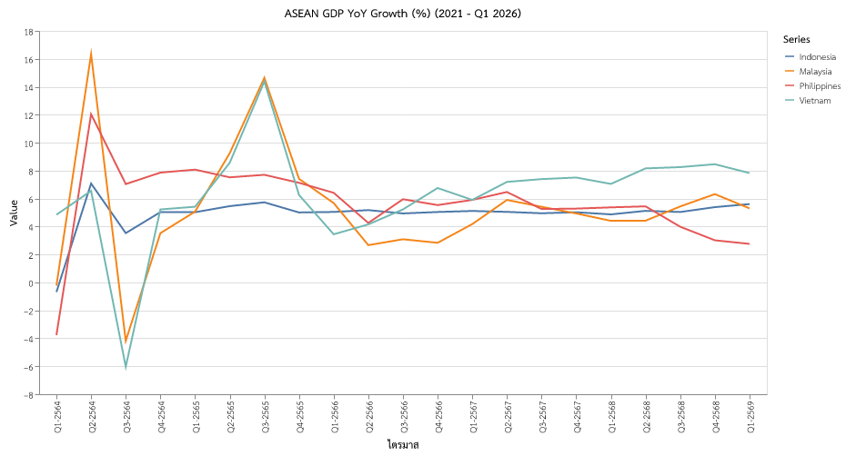

# ASEAN Economic Performance Report: The Great Divergence (Q1 2026)

## Executive Summary
The first quarter of 2026 has unveiled a stark "Great Divergence" within the ASEAN economic landscape. While regional giants like Vietnam are experiencing a high-tech manufacturing boom (7.83% growth), the Philippines has seen its growth momentum significantly curbed by persistent inflation and fiscal bottlenecks (2.76% growth). Overall, the region remains a global outlier for resilience, but the internal variance in growth drivers—ranging from AI/Semiconductors to domestic consumption—demands nuanced policy responses.

## Data & Methodology
This report synthesizes quarterly Year-on-Year (YoY) GDP growth data retrieved from the **CEIC Database**. 
- **Timeframe**: Q1 2021 to Q1 2026.
- **Scope**: Major ASEAN economies (Indonesia, Malaysia, Philippines, Vietnam).
- **Note**: Malaysia’s Q1 2026 figure (5.3%) reflects an **Advance Estimate** provided by the Department of Statistics Malaysia (DOSM).

## Regional Analysis: The Great Divergence

### 1. Vietnam: Riding the Silicon Wave
Vietnam continues to be the regional outperformer with a robust **7.83% YoY** growth. The primary catalyst is the global demand for **AI-related hardware and semiconductors**. The northern industrial clusters have become indispensable nodes in the global high-tech supply chain, attracting record levels of Foreign Direct Investment (FDI) as companies continue to diversify away from traditional manufacturing hubs.

### 2. Philippines: Consumption and Fiscal Headwinds
In contrast, the Philippines has slowed to a **2.76% YoY** expansion. This deceleration is primarily attributed to:
- **Inflationary Pressure**: High food and fuel prices have significantly dampened domestic consumption, which has historically been the engine of the Philippine economy.
- **Budgetary Constraints**: Execution delays in public infrastructure projects have hindered the government's ability to stimulate growth through its "Build-Better-More" initiative.

### 3. Indonesia & Malaysia: The Middle Path
- **Indonesia (5.61% YoY)**: Growth remains resilient, anchored by a strong domestic market and the successful "downstreaming" of natural resources, particularly in the nickel and battery materials sectors.
- **Malaysia (5.3% YoY)**: According to the **advance estimate**, Malaysia maintains a steady trajectory, supported by a recovery in international tourism and a rebound in the electronics export sector.

## Visual Summary

## Forecast Outlook & Recommendations
The divergence is expected to persist through the first half of 2026.
- **Technological Hubs**: Vietnam and Malaysia are likely to benefit from the ongoing "Super Cycle" in semiconductors.
- **Domestic-Facing Economies**: The Philippines and Indonesia will need to manage inflationary expectations carefully to protect consumer purchasing power.

**Policy Recommendations**:
1. **Vietnam**: Accelerate skilled labor training to meet the demands of the high-tech sector.
2. **Philippines**: Focus on resolving supply-side bottlenecks in the food sector to ease inflationary pressures.
3. **Regional**: Strengthen intra-ASEAN trade to hedge against potential external shocks in global demand.

---
**Prepared by**: Senior Economic Editor  
**Date**: May 10, 2026  
**Source**: CEIC, DOSM Advance Estimates
