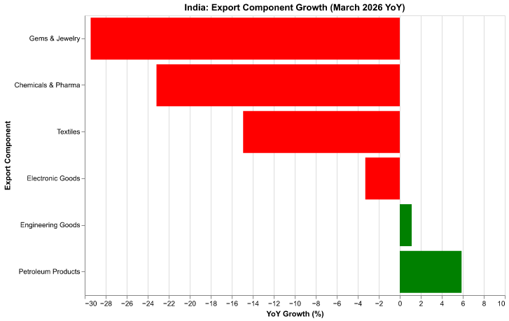

# Analysis of India's Export Performance: March 2026 (Data-Driven Update)

**Date:** April 2026  
**Subject:** Sectoral Decomposition of India’s Merchandise Trade Performance  
**Report ID:** INR-EXP-2026-M3-DD  

---

## 1. Executive Summary

India's merchandise exports in March 2026 registered a modest year-on-year (YoY) contraction of **-0.90%**. While the headline figure suggests a relatively stable environment, a granular sectoral decomposition reveals significant divergence across key export categories. This report synthesizes quantitative data with qualitative news context to highlight the disparate impacts of global geopolitical tensions and supply chain disruptions. The findings indicate that while traditional labor-intensive and chemical sectors bore the brunt of external shocks, energy and engineering goods maintained a surprising degree of resilience.

---

## 2. Overall Export Trajectory

The -0.90% YoY decline in March 2026 follows a period of robust growth in the early months of the year (5.67% in January and 3.37% in February). This shift into negative territory signifies a pivot in the global trade landscape for Indian goods, largely driven by external headwinds rather than a weakening of domestic production capacity.

---

## 3. Sectoral Breakdown: Laggards and Leaders

The aggregate performance masks a stark contrast between sectors. The following analysis identifies the primary contributors to the March contraction and those that provided a stabilizing floor.

### 3.1 Major Laggards: The High-Sensitivity Categories
Three key sectors experienced double-digit declines, significantly weighing down the national average:
*   **Gems & Jewelry:** Contracted by **-29.43% YoY**. This sector, historically sensitive to global luxury demand and West Asian transit security, was the most severely impacted.
*   **Chemicals & Pharmaceuticals:** Declined by **-23.17% YoY**. The substantial drop suggests supply chain bottlenecks in the sourcing of intermediates and elevated logistics costs for hazardous or time-sensitive materials.
*   **Textiles:** Fell by **-14.92% YoY**, reflecting both competitive pressures and the impact of increased freight costs on low-margin commodities.

### 3.2 Resilient Sectors: Strategic Stability
Despite the prevailing headwinds, two critical sectors remained in positive territory:
*   **Petroleum Products:** Grew by **+5.88% YoY**. This resilience is particularly noteworthy given the regional tensions in West Asia.
*   **Engineering Goods:** Recorded a growth of **+1.13% YoY**, continuing to serve as a bedrock for Indian merchandise trade.

*Figure 1: Sectoral Year-on-Year Growth Rates (March 2026) – Contrasting the contraction in luxury and chemical goods against the resilience in energy and engineering.*

---

## 4. Analytical Synthesis: News Context vs. Data Realities

A comparison of the quantitative sectoral data with qualitative news reports regarding the West Asia conflict and maritime logistical bottlenecks yields several critical insights:

### 4.1 The Disproportionate Burden on High-Value and Chemical Goods
Qualitative reports correctly identified the **West Asia conflict** and **Hormuz-related logistics** as primary headwinds. The data confirms that **Gems & Jewelry** and **Chemicals** bore the brunt of this contraction. The steep decline in Gems & Jewelry (-29.43%) aligns with the "wait-and-watch" sentiment and insurance premium hikes noted in regional reports.

### 4.2 The Anomaly of Petroleum Resilience
Interestingly, **Petroleum Products** showed surprising resilience with a +5.88% YoY growth, despite being the sector most logically exposed to West Asian maritime risks. This outperformance is likely attributable to:
1.  **Sustained Global Pricing:** High global energy prices helping to maintain export value even if volumes were strained.
2.  **Supply Route Diversification:** Successful utilization of alternate supply routes or long-term contracts that bypassed the immediate conflict zones.
3.  **Strategic Positioning:** India's role as a major refiner for global markets ensuring continued demand from non-conflicting regions (e.g., Europe and North America).

---

## 5. Strategic Conclusion & Recommendations

The March 2026 data-driven analysis underscores that India's export challenge is not uniform. The contraction is concentrated in high-value, logistics-sensitive, and labor-intensive sectors.

*   **Mitigation Strategy:** For sectors like Gems & Jewelry and Textiles, there is an urgent need for government support in the form of freight subsidies or export insurance waivers to offset the temporary spike in logistical costs.
*   **Diversification:** The resilience of Engineering Goods and Petroleum Products suggests that India's move toward higher-value manufacturing and strategic energy exports is providing a necessary buffer against regional geopolitical shocks.
*   **Outlook:** While the headline decline is marginal, the depth of the contraction in core sectors necessitates a cautious approach for Q2 2026, with a focus on securing maritime trade corridors and reducing the "geopolitical premium" on Indian goods.

---
*End of Report*
