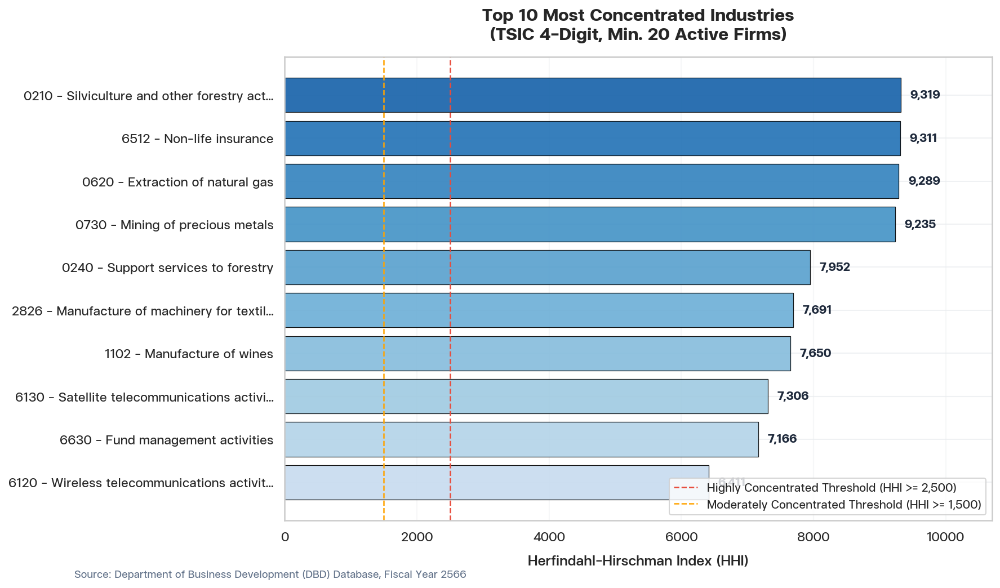
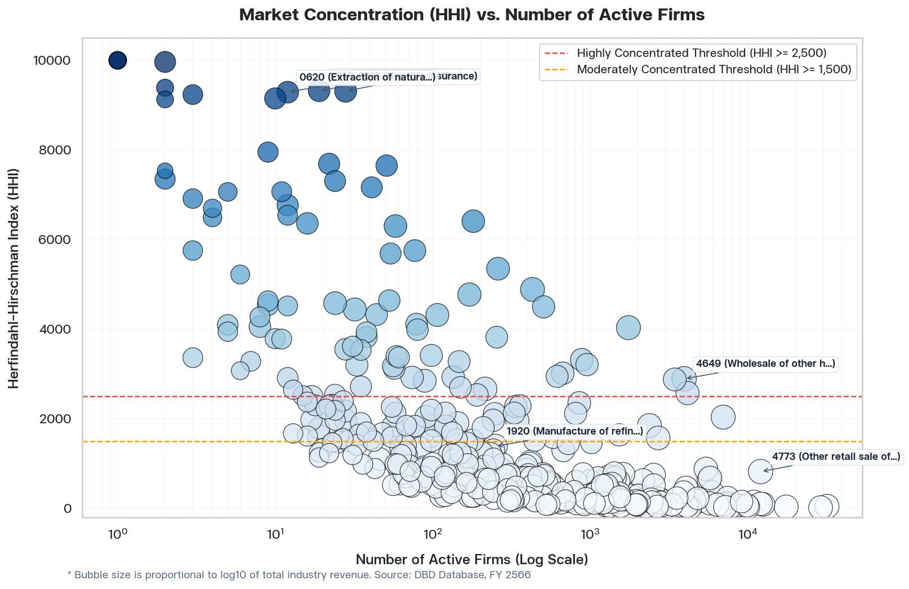

# Thailand Industrial Market Concentration Analysis

## Executive Summary
This report presents an empirical analysis of market concentration and competitive structure in the Thai economy for the fiscal year 2566 B.E. (2023). Utilizing the Department of Business Development (DBD) database, we compute the Herfindahl-Hirschman Index (HHI) and Concentration Ratios (CR1, CR4, CR8) for **422** industries at the 4-digit Thailand Standard Industrial Classification (TSIC) level. The study encompasses **690,955** active firms, of which **507,474** reported positive operating revenue from sales or services.

Key structural takeaways include:
*   **Market Concentration Profile**: Out of 422 industries, **87** (20.6%) are classified as **highly concentrated** (HHI $\ge$ 2,500), **23** (5.5%) are **moderately concentrated** (1,500 $\le$ HHI < 2,500), and **312** (73.9%) are **competitive** (HHI < 1,500).
*   **Infrastructure Monopolies**: Gaseous fuel distribution (TSIC 3520), steam supply (TSIC 3530), crude extraction (TSIC 0610), and air transport (TSIC 5120) represent the most concentrated sectors with HHI values exceeding 5,500.
*   **Concentration in Major Sectors**: The retail sector is highly competitive (TSIC 4773, HHI = 822.4), while wholesale household goods (TSIC 4649) displays substantial concentration (HHI = 2,893.2) dominated by a few massive players.

The complete dataset is stored in [hhi_tsic4.csv](file:///c:/Users/nattasit/OneDrive - nesdc.go.th/NESDC/MyAI/data-analysis/output/data/hhi_tsic4.csv).

For data quality assurance, the 18 active firms that reported negative operating revenues (which were excluded from HHI share computations) have been logged in [negative_revenue_firms_2566.csv](file:///c:/Users/nattasit/OneDrive - nesdc.go.th/NESDC/MyAI/data-analysis/output/data/negative_revenue_firms_2566.csv).

---

## 📈 Industry Concentration Visualizations

To visualize the market structure, we have generated two charts located in the `output/chart/` folder:

### 1. Top 10 Most Concentrated Industries
This chart highlights the sectors with the lowest competitive pressure, filtering for industries with at least 20 active firms to exclude small-sample anomalies. The red dashed line denotes the standard regulatory threshold of 2,500 HHI.

### 2. Market Concentration vs. Firm Count
This scatter plot maps the HHI of all 422 industries against their active firm count (on a log scale). The size of each bubble corresponds to the log-revenue of that industry, allowing a dual evaluation of market size and market concentration.

---

## 📊 Detailed Concentration Tables

### 1. Highly Concentrated Industries (HHI $\ge$ 2,500) with $\ge$ 20 Active Firms
The following table lists the top 10 most concentrated sectors in the Thai economy with a substantial firm population:

| TSIC | Industry Description (EN) | HHI | CR1 | CR4 | CR8 | Active Firms | Total Revenue (THB) |
|---|---|---|---|---|---|---|---|
| **3520** | Manufacture of gas; distribution of gaseous fuels | **8,944.9** | 94.4% | 99.4% | 99.8% | 27 | 37,288,272,328.09 |
| **0510** | Mining of hard coal | **8,879.3** | 94.2% | 94.7% | 96.0% | 34 | 436,547,402.16 |
| **3530** | Steam and air conditioning supply | **8,298.1** | 91.0% | 96.0% | 97.4% | 33 | 43,267,863,607.72 |
| **0610** | Extraction of crude petroleum | **7,820.6** | 88.3% | 99.8% | 100.0% | 20 | 1,061,048,460.52 |
| **1910** | Manufacture of coke oven products | **6,423.8** | 79.9% | 100.0% | 100.0% | 28 | 134,310,035.79 |
| **1200** | Manufacture of tobacco products | **6,056.4** | 76.5% | 98.9% | 99.9% | 25 | 1,162,185,152.01 |
| **5120** | Air transport | **5,595.6** | 71.9% | 94.8% | 97.7% | 100 | 179,036,929,483.92 |
| **2011** | Manufacture of basic chemicals | **5,417.8** | 71.3% | 89.2% | 93.3% | 400 | 832,238,819,006.18 |
| **6010** | Satellite telecommunications activities | **5,385.0** | 71.5% | 98.1% | 99.3% | 80 | 19,091,739,788.67 |
| **6411** | Central banking | **5,116.7** | 71.4% | 93.3% | 95.8% | 61 | 306,478,574.63 |

### 2. Large Scale Industries (>500 Billion THB Revenue)
This table details the concentration structure of the largest sectors driving Thailand's GDP:

| TSIC | Industry Description (EN) | Total Revenue (THB) | HHI | CR1 | CR4 | CR8 | Active Firms |
|---|---|---|---|---|---|---|---|
| **4649** | Wholesale of other household goods | 3,227,923,713,158.60 | **2,893.2** | 52.8% | 60.5% | 66.8% | 4,926 |
| **4773** | Other retail sale of new goods in specialized stores | 2,628,473,268,985.15 | **822.4** | 24.3% | 46.5% | 55.4% | 14,091 |
| **1920** | Manufacture of refined petroleum products | 2,340,422,697,328.93 | **1,386.0** | 30.1% | 69.3% | 94.4% | 360 |
| **2910** | Manufacture of motor vehicles | 1,830,321,064,853.02 | **1,271.0** | 28.5% | 66.8% | 85.9% | 277 |
| **2930** | Manufacture of parts and accessories for motor vehicles | 1,679,154,243,979.52 | **148.7** | 6.8% | 19.3% | 29.5% | 1,739 |
| **4663** | Wholesale of construction materials, hardware, plumbing | 1,029,915,221,411.39 | **134.1** | 6.8% | 18.0% | 26.5% | 9,935 |
| **4100** | Construction of buildings | 924,964,286,220.08 | **37.0** | 2.5% | 8.8% | 14.2% | 18,970 |
| **2011** | Manufacture of basic chemicals | 832,238,819,006.18 | **5,417.8** | 71.3% | 89.2% | 93.3% | 400 |
| **4690** | Non-specialized wholesale trade | 772,019,252,654.85 | **359.8** | 13.9% | 27.2% | 37.6% | 4,683 |
| **6419** | Other monetary intermediation (Commercial Banking) | 682,752,994,228.48 | **1,299.7** | 25.1% | 68.7% | 90.7% | 376 |

---

## 🔍 Methodological Notes
1.  **Definitions & Classifications**: Industries are classified using the 4-digit level of TSIC (obtained by slicing the first 4 characters of the 5-digit `รหัสวัตถุประสงค์`).
2.  **Data Inclusions**: Only corporate entities registered as active (`สถานะนิติบุคคล = '1'`) with valid, non-null financial statements filed for the fiscal year 2566 are included.
3.  **HHI Formula**:
    $$HHI = \sum_{i=1}^N s_i^2$$
    where $s_i$ is the market share of firm $i$ as a percentage of total industry revenue. HHI values range from near 0 (perfect competition) to 10,000 (monopoly).
4.  **Concentration Thresholds (US DOJ/FTC Standards)**:
    *   **Unconcentrated Markets**: HHI < 1,500
    *   **Moderately Concentrated Markets**: 1,500 $\le$ HHI < 2,500
    *   **Highly Concentrated Markets**: HHI $\ge$ 2,500
