# Thailand CPI Forecasting Report (Long-Range Scenario)

> **Pipeline**: `energy_price_forecast_LR` | **Forecast Horizon**: June 2026 – December 2031  
> **Source**: CEIC API (Thailand NSO CPI Data) | **Model**: auto-ARIMA / ARIMAX (LR)  
> **Generated**: 12 June 2026

---

## Executive Summary

As of **May 2026**, Thailand's Headline CPI index stands at **103.44** (2023 = 100),
with a year-on-year growth rate of **+2.89%**.

The NESDC auto-ARIMA models, using the custom long-range Dubai spot price forecast as an exogenous variable, project Headline CPI growth to **recover to 2.60%** in 2026, before stabilizing at **1.72%** by 2031. Core inflation is projected to stay extremely stable under this baseline, hovering around the 0.9–1.0% range.

**Table 1: Annual CPI YoY Growth — Historical (2021–2025) & Forecast (2026–2031)**

|   date |   Headline (%) |   Core (%) |   Raw Food (%) |   Energy (%) |
|-------:|---------------:|-----------:|---------------:|-------------:|
|   2021 |           1.09 |       0.27 |          -1.24 |        10.78 |
|   2022 |           5.84 |       3.05 |           6.46 |        22.79 |
|   2023 |           1.28 |       1.30 |           2.60 |        -0.51 |
|   2024 |           0.44 |       0.55 |           0.26 |         0.10 |
|   2025 |          -0.05 |       0.79 |          -0.63 |        -4.14 |
|   2026 |           2.60 |       2.03 |           0.36 |         8.78 |
|   2027 |           2.06 |       3.04 |           1.53 |        -1.82 |
|   2028 |           1.27 |       1.75 |           1.38 |        -1.30 |
|   2029 |           1.57 |       1.90 |           1.36 |         0.06 |
|   2030 |           1.60 |       1.99 |           1.34 |        -0.17 |
|   2031 |           1.72 |       2.04 |           1.31 |         0.49 |

*Source: CEIC API & NESDC auto_ARIMA Forecast Model (LR), 2021-2031.*

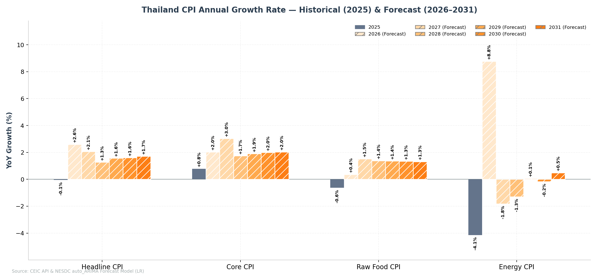
**Figure 1: Annual YoY Growth Rate by CPI Aggregate — Historical and Forecast (2021–2031)**

---

## 1. CPI Overview

### 1.1 Monthly CPI Index Level

The following charts show the historical monthly CPI index levels for each composite (2021–latest actual). All indices are rebased to 2023 = 100.

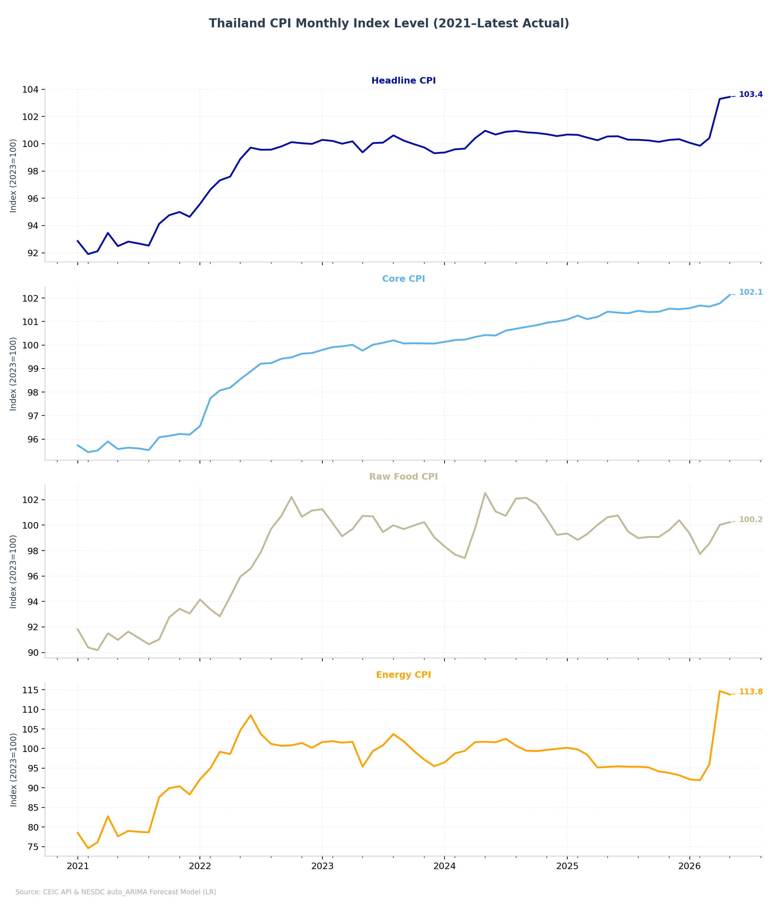
**Figure 2: Thailand CPI Monthly Index Level by Composite (2021–Latest Actual, 2023 = 100)**

### 1.2 Monthly YoY Growth

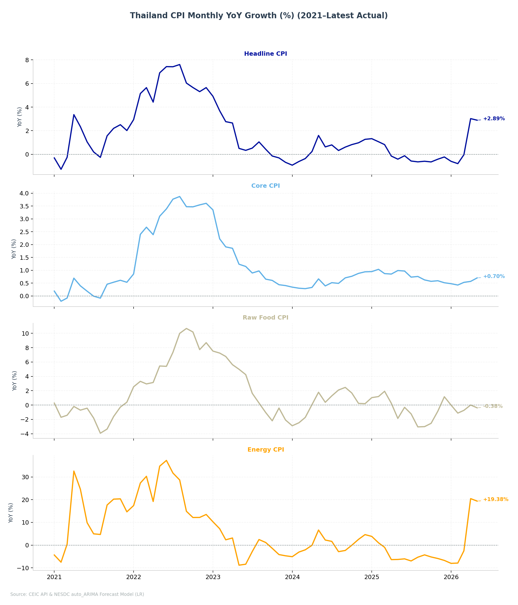
**Figure 3: Thailand CPI Monthly Year-on-Year Growth (%) by Composite (2021–Latest Actual)**

---

### 1.3 CPI Weight Composition

The pie chart below shows the share of each composite group in the total CPI basket, based on the most recent available weights (as of **May 2026**).

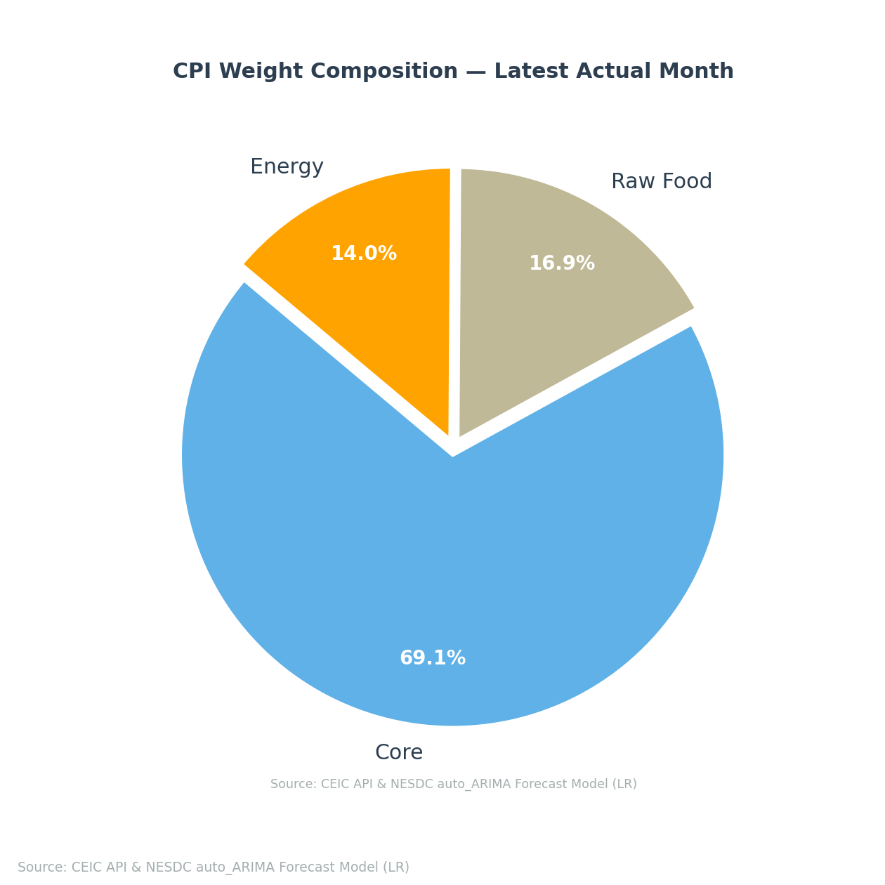
**Figure 4: CPI Weight Composition — Core, Raw Food, and Energy (Latest Month)**

**Table 2: CPI Component Weights — Sorted by Share (Latest Month)**

|    | Component                             |   Weight | Group    |
|---:|:--------------------------------------|---------:|:---------|
|  0 | Housing Furnishing ex Utility         |    19.46 | Core     |
|  1 | Prepared Food                         |    16.65 | Core     |
|  2 | Transport Communication ex Motor Fuel |    14.41 | Core     |
|  3 | Transport Communication Motor Fuel    |     9.53 | Energy   |
|  4 | Meats Poultry Fish                    |     7.02 | Raw Food |
|  5 | Medical Personal Care                 |     6.12 | Core     |
|  6 | Vegetables Fruits                     |     4.79 | Raw Food |
|  7 | Housing Furnishing Utility            |     4.46 | Energy   |
|  8 | Recreation Reading Education Religion |     3.96 | Core     |
|  9 | Rice Flour Cereal                     |     3.40 | Raw Food |
| 10 | Non Alcoholic Beverages               |     3.30 | Core     |
| 11 | Apparel Footwears                     |     2.02 | Core     |
| 12 | Eggs Dairy Products                   |     1.70 | Raw Food |
| 13 | Tobacco Alcoholic Beverages           |     1.21 | Core     |
| 14 | Seasoning Condiments                  |     1.14 | Core     |
| 15 | Sugar Product                         |     0.84 | Core     |

*Source: CEIC API & NESDC Calculation, 2026.*

---

### 1.4 Contribution to Growth

The following charts decompose the Headline CPI's YoY growth into contributions from each composite group and individual component.

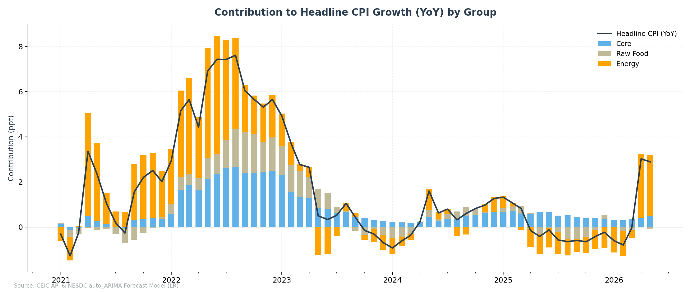
**Figure 5: Contribution to Headline CPI YoY Growth by Group (Core / Raw Food / Energy)**

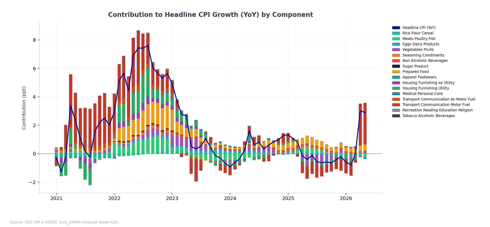
**Figure 6: Contribution to Headline CPI YoY Growth by Individual Component**

---

## 2. CPI Forecasting

### 2.1 Monthly Forecast

The component-level monthly forecast charts are provided in **Appendix B**. The charts below focus on the composite-level monthly forecast.

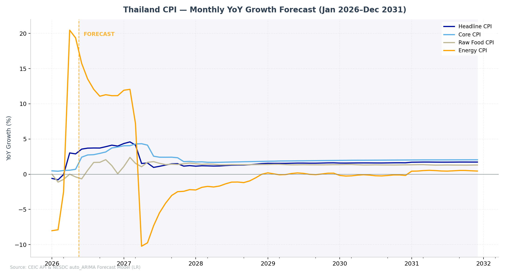
**Figure 7: Monthly CPI YoY Growth Forecast — Headline, Core, Raw Food, Energy (Jan 2026–Dec 2031)**

**Table 3: Monthly CPI YoY Growth Forecast (Jan 2026–Dec 2031)**

| date     |   Headline (%) |   Core (%) |   Raw Food (%) |   Energy (%) |
|:---------|---------------:|-----------:|---------------:|-------------:|
| Jan 2026 |          -0.60 |       0.48 |          -0.00 |        -8.02 |
| Feb 2026 |          -0.79 |       0.42 |          -1.12 |        -7.89 |
| Mar 2026 |          -0.04 |       0.53 |          -0.74 |        -2.49 |
| Apr 2026 |           3.02 |       0.57 |           0.00 |        20.47 |
| May 2026 |           2.89 |       0.70 |          -0.38 |        19.38 |
| Jun 2026 |           3.57 |       2.42 |          -0.66 |        15.74 |
| Jul 2026 |           3.70 |       2.73 |           0.55 |        13.54 |
| Aug 2026 |           3.72 |       2.78 |           1.67 |        12.06 |
| Sep 2026 |           3.72 |       2.96 |           1.69 |        11.08 |
| Oct 2026 |           3.91 |       3.16 |           2.07 |        11.29 |
| Nov 2026 |           4.13 |       3.73 |           1.22 |        11.16 |
| Dec 2026 |           4.00 |       3.86 |           0.06 |        11.16 |
| Jan 2027 |           4.36 |       4.04 |           1.09 |        11.93 |
| Feb 2027 |           4.59 |       4.05 |           2.39 |        12.06 |
| Mar 2027 |           4.14 |       4.30 |           1.54 |         7.22 |
| Apr 2027 |           1.53 |       4.33 |           1.06 |       -10.23 |
| May 2027 |           1.60 |       4.13 |           1.69 |        -9.75 |
| Jun 2027 |           0.97 |       2.56 |           1.79 |        -7.33 |
| Jul 2027 |           1.12 |       2.42 |           1.55 |        -5.48 |
| Aug 2027 |           1.30 |       2.41 |           1.37 |        -4.11 |
| Sep 2027 |           1.48 |       2.42 |           1.42 |        -3.02 |
| Oct 2027 |           1.50 |       2.34 |           1.39 |        -2.48 |
| Nov 2027 |           1.15 |       1.79 |           1.48 |        -2.43 |
| Dec 2027 |           1.22 |       1.82 |           1.58 |        -2.19 |
| Jan 2028 |           1.15 |       1.73 |           1.49 |        -2.24 |
| Feb 2028 |           1.20 |       1.76 |           1.40 |        -1.86 |
| Mar 2028 |           1.18 |       1.70 |           1.45 |        -1.73 |
| Apr 2028 |           1.16 |       1.69 |           1.41 |        -1.81 |
| May 2028 |           1.17 |       1.69 |           1.33 |        -1.68 |
| Jun 2028 |           1.23 |       1.71 |           1.34 |        -1.36 |
| Jul 2028 |           1.29 |       1.73 |           1.36 |        -1.12 |
| Aug 2028 |           1.29 |       1.75 |           1.36 |        -1.11 |
| Sep 2028 |           1.30 |       1.77 |           1.36 |        -1.19 |
| Oct 2028 |           1.35 |       1.79 |           1.35 |        -0.95 |
| Nov 2028 |           1.42 |       1.80 |           1.36 |        -0.50 |
| Dec 2028 |           1.50 |       1.82 |           1.38 |        -0.01 |
| Jan 2029 |           1.55 |       1.84 |           1.38 |         0.19 |
| Feb 2029 |           1.54 |       1.85 |           1.41 |         0.05 |
| Mar 2029 |           1.54 |       1.88 |           1.41 |        -0.08 |
| Apr 2029 |           1.54 |       1.88 |           1.36 |        -0.05 |
| May 2029 |           1.56 |       1.89 |           1.33 |         0.10 |
| Jun 2029 |           1.58 |       1.90 |           1.34 |         0.18 |
| Jul 2029 |           1.58 |       1.91 |           1.35 |         0.12 |
| Aug 2029 |           1.57 |       1.92 |           1.34 |        -0.02 |
| Sep 2029 |           1.57 |       1.93 |           1.34 |        -0.06 |
| Oct 2029 |           1.58 |       1.94 |           1.33 |         0.03 |
| Nov 2029 |           1.61 |       1.95 |           1.34 |         0.14 |
| Dec 2029 |           1.62 |       1.95 |           1.36 |         0.15 |
| Jan 2030 |           1.58 |       1.96 |           1.36 |        -0.17 |
| Feb 2030 |           1.58 |       1.97 |           1.38 |        -0.26 |
| Mar 2030 |           1.59 |       1.98 |           1.38 |        -0.23 |
| Apr 2030 |           1.60 |       1.99 |           1.34 |        -0.13 |
| May 2030 |           1.61 |       1.99 |           1.31 |        -0.08 |
| Jun 2030 |           1.60 |       1.99 |           1.32 |        -0.13 |
| Jul 2030 |           1.60 |       2.00 |           1.33 |        -0.22 |
| Aug 2030 |           1.60 |       2.00 |           1.32 |        -0.24 |
| Sep 2030 |           1.61 |       2.01 |           1.32 |        -0.18 |
| Oct 2030 |           1.62 |       2.01 |           1.31 |        -0.11 |
| Nov 2030 |           1.63 |       2.02 |           1.32 |        -0.10 |
| Dec 2030 |           1.62 |       2.02 |           1.33 |        -0.17 |
| Jan 2031 |           1.71 |       2.02 |           1.34 |         0.43 |
| Feb 2031 |           1.71 |       2.03 |           1.36 |         0.45 |
| Mar 2031 |           1.73 |       2.03 |           1.36 |         0.52 |
| Apr 2031 |           1.73 |       2.03 |           1.32 |         0.55 |
| May 2031 |           1.72 |       2.03 |           1.29 |         0.52 |
| Jun 2031 |           1.71 |       2.04 |           1.30 |         0.46 |
| Jul 2031 |           1.71 |       2.04 |           1.31 |         0.44 |
| Aug 2031 |           1.72 |       2.04 |           1.30 |         0.48 |
| Sep 2031 |           1.73 |       2.04 |           1.29 |         0.53 |
| Oct 2031 |           1.73 |       2.04 |           1.29 |         0.53 |
| Nov 2031 |           1.72 |       2.05 |           1.30 |         0.48 |
| Dec 2031 |           1.72 |       2.05 |           1.31 |         0.45 |

*Source: NESDC auto_ARIMA Forecast Model (LR), 2026-2031.*

---

### 2.2 Quarterly Forecast

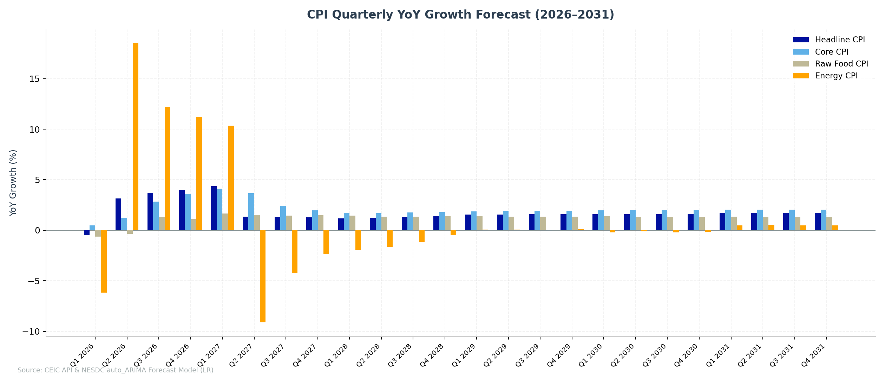
**Figure 8: Quarterly CPI YoY Growth Forecast — Composite Aggregates (2026–2031)**

**Table 4: Quarterly CPI YoY Growth Forecast (2026–2031)**

|         |   Headline (%) |   Core (%) |   Raw Food (%) |   Energy (%) |
|:--------|---------------:|-----------:|---------------:|-------------:|
| Q1 2026 |          -0.48 |       0.48 |          -0.62 |        -6.16 |
| Q2 2026 |           3.16 |       1.23 |          -0.35 |        18.52 |
| Q3 2026 |           3.72 |       2.82 |           1.30 |        12.23 |
| Q4 2026 |           4.01 |       3.58 |           1.11 |        11.20 |
| Q1 2027 |           4.36 |       4.13 |           1.67 |        10.36 |
| Q2 2027 |           1.36 |       3.67 |           1.51 |        -9.12 |
| Q3 2027 |           1.30 |       2.41 |           1.44 |        -4.21 |
| Q4 2027 |           1.29 |       1.98 |           1.48 |        -2.37 |
| Q1 2028 |           1.18 |       1.73 |           1.45 |        -1.94 |
| Q2 2028 |           1.19 |       1.70 |           1.36 |        -1.62 |
| Q3 2028 |           1.29 |       1.75 |           1.36 |        -1.14 |
| Q4 2028 |           1.42 |       1.80 |           1.37 |        -0.49 |
| Q1 2029 |           1.54 |       1.86 |           1.40 |         0.05 |
| Q2 2029 |           1.56 |       1.89 |           1.35 |         0.08 |
| Q3 2029 |           1.57 |       1.92 |           1.34 |         0.01 |
| Q4 2029 |           1.60 |       1.95 |           1.34 |         0.10 |
| Q1 2030 |           1.59 |       1.97 |           1.37 |        -0.22 |
| Q2 2030 |           1.60 |       1.99 |           1.32 |        -0.11 |
| Q3 2030 |           1.60 |       2.00 |           1.32 |        -0.21 |
| Q4 2030 |           1.62 |       2.01 |           1.32 |        -0.13 |
| Q1 2031 |           1.72 |       2.03 |           1.35 |         0.46 |
| Q2 2031 |           1.72 |       2.03 |           1.30 |         0.51 |
| Q3 2031 |           1.72 |       2.04 |           1.30 |         0.48 |
| Q4 2031 |           1.73 |       2.05 |           1.30 |         0.49 |

*Source: NESDC auto_ARIMA Forecast Model (LR) & QE Resampling, 2026-2031.*

---

### 2.3 Annual Forecast

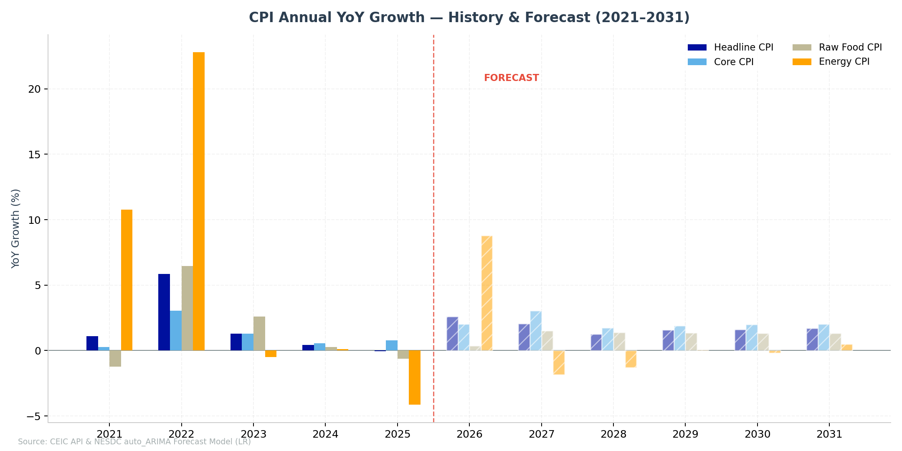
**Figure 9: Annual CPI YoY Growth — Historical and Forecast (2021–2031)**

**Table 5: Annual CPI YoY Growth — Historical and Forecast (2021–2031)**

|   date |   Headline (%) |   Core (%) |   Raw Food (%) |   Energy (%) |
|-------:|---------------:|-----------:|---------------:|-------------:|
|   2021 |           1.09 |       0.27 |          -1.24 |        10.78 |
|   2022 |           5.84 |       3.05 |           6.46 |        22.79 |
|   2023 |           1.28 |       1.30 |           2.60 |        -0.51 |
|   2024 |           0.44 |       0.55 |           0.26 |         0.10 |
|   2025 |          -0.05 |       0.79 |          -0.63 |        -4.14 |
|   2026 |           2.60 |       2.03 |           0.36 |         8.78 |
|   2027 |           2.06 |       3.04 |           1.53 |        -1.82 |
|   2028 |           1.27 |       1.75 |           1.38 |        -1.30 |
|   2029 |           1.57 |       1.90 |           1.36 |         0.06 |
|   2030 |           1.60 |       1.99 |           1.34 |        -0.17 |
|   2031 |           1.72 |       2.04 |           1.31 |         0.49 |

*Source: NESDC auto_ARIMA Forecast Model (LR), 2021-2031.*

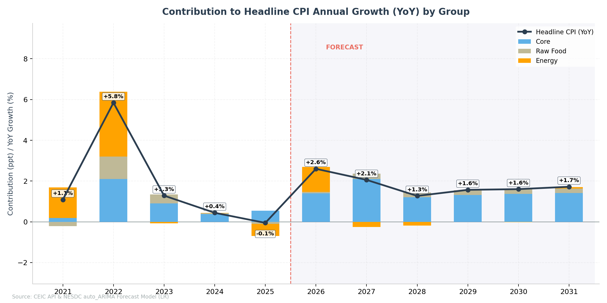
**Figure 10: Contribution to Headline CPI Annual YoY Growth by Group — Historical and Forecast (2021–2031)**

---

## Appendix

### Appendix A: CPI Weight Changes Over Time

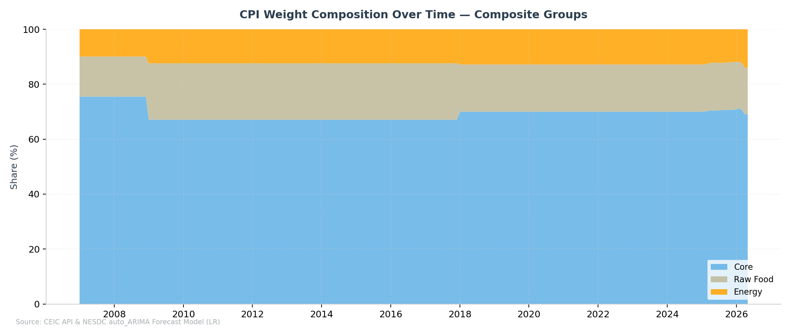
**Figure 11: 100% Area Chart — CPI Weight by Composite Group Over Time**

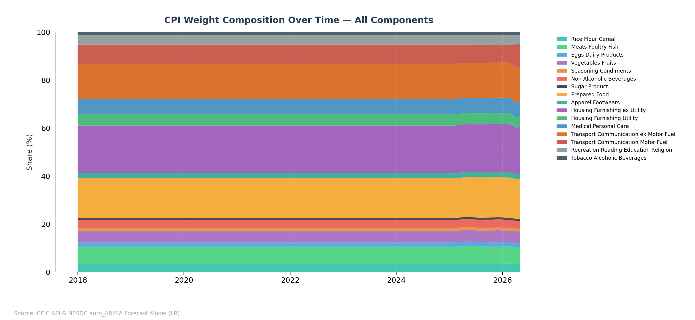
**Figure 12: 100% Area Chart — CPI Weight by Individual Component Over Time (2018–Latest Actual)**

---

### Appendix B: CPI and Growth by Component

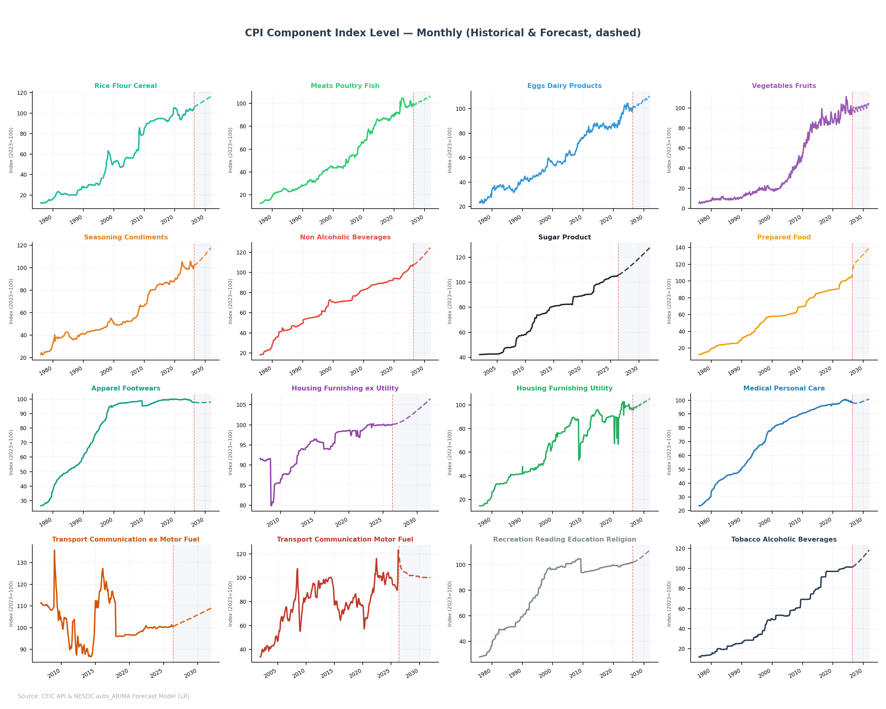
**Figure 13: Monthly CPI Index Level by Component (Historical & Forecast, dashed line = forecast)**

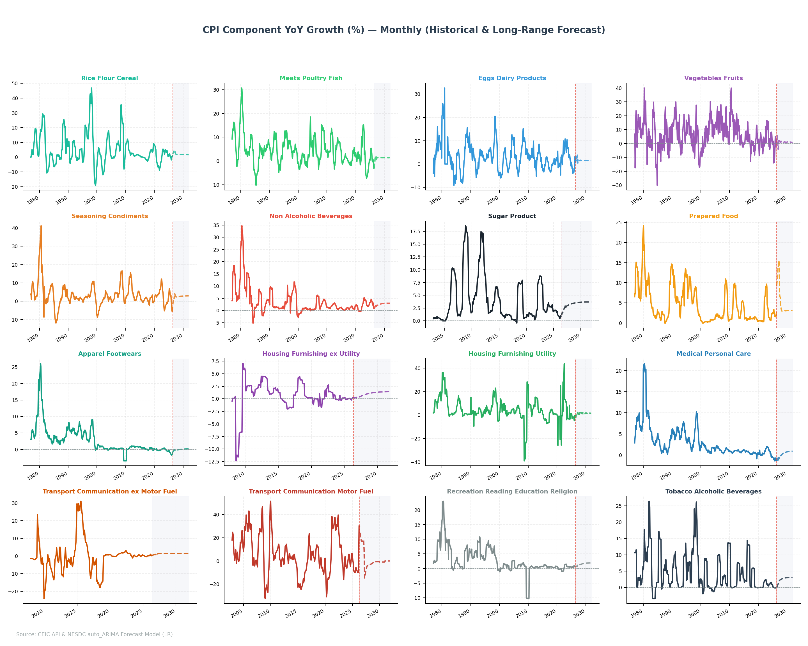
**Figure 14: YoY Growth (%) by Individual CPI Component — Monthly (Historical & Forecast)**

**Table 6: Monthly Component YoY Growth (%) — Jan 2026 to Dec 2031**

| date     |   Rice Flour Cereal |   Meats Poultry Fish |   Eggs Dairy Products |   Vegetables Fruits |   Seasoning Condiments |   Non Alcoholic Beverages |   Sugar Product |   Prepared Food |   Apparel Footwears |   Housing Furnishing ex Utility |   Housing Furnishing Utility |   Medical Personal Care |   Transport Communication ex Motor Fuel |   Transport Communication Motor Fuel |   Recreation Reading Education Religion |   Tobacco Alcoholic Beverages |
|:---------|--------------------:|---------------------:|----------------------:|--------------------:|-----------------------:|--------------------------:|----------------:|----------------:|--------------------:|--------------------------------:|-----------------------------:|------------------------:|----------------------------------------:|-------------------------------------:|----------------------------------------:|------------------------------:|
| Jan 2026 |               -0.40 |                 0.72 |                 -1.73 |               -0.11 |                  -1.75 |                      2.49 |            0.85 |            1.73 |               -1.69 |                           -0.15 |                        -4.67 |                   -1.32 |                                    0.53 |                               -10.13 |                                    0.74 |                         -0.12 |
| Feb 2026 |                0.42 |                -0.72 |                 -2.92 |               -2.38 |                  -4.97 |                      3.07 |            0.53 |            1.54 |               -1.50 |                           -0.24 |                        -4.66 |                   -0.74 |                                    0.45 |                                -9.96 |                                    0.85 |                         -0.03 |
| Mar 2026 |                0.22 |                -0.58 |                 -0.49 |               -1.89 |                  -5.55 |                      1.56 |            0.42 |            1.68 |               -1.47 |                            0.05 |                        -3.14 |                   -1.04 |                                    1.02 |                                -2.10 |                                    0.65 |                         -0.07 |
| Apr 2026 |                0.28 |                -1.62 |                  3.18 |                1.29 |                  -4.66 |                      1.35 |            0.97 |            2.31 |               -1.23 |                            0.17 |                        -0.16 |                   -0.82 |                                    0.13 |                                30.23 |                                    0.55 |                         -0.07 |
| May 2026 |                0.90 |                -3.13 |                  0.65 |                2.74 |                  -3.52 |                      0.79 |            0.88 |            2.63 |               -0.91 |                            0.23 |                        -0.39 |                   -1.17 |                                    0.33 |                                29.45 |                                    0.76 |                         -0.07 |
| Jun 2026 |                2.30 |                -3.04 |                  1.07 |                0.18 |                  -1.72 |                      0.92 |            1.09 |            9.25 |               -0.83 |                            0.31 |                        -0.93 |                   -1.11 |                                    0.42 |                                24.23 |                                    0.68 |                          0.04 |
| Jul 2026 |                2.82 |                -2.15 |                  0.59 |                3.28 |                  -0.14 |                      0.96 |            1.18 |           10.19 |               -0.54 |                            0.16 |                        -2.10 |                   -0.67 |                                    0.57 |                                21.58 |                                    0.76 |                          0.21 |
| Aug 2026 |                3.20 |                -1.36 |                  1.51 |                5.60 |                   0.80 |                      1.46 |            1.63 |           10.26 |               -0.52 |                            0.15 |                        -1.84 |                   -1.13 |                                    0.63 |                                19.25 |                                    0.77 |                          0.42 |
| Sep 2026 |                3.75 |                -0.21 |                  1.74 |                2.99 |                   0.88 |                      1.31 |            1.59 |           10.63 |               -0.27 |                            0.25 |                        -0.17 |                   -0.70 |                                    0.73 |                                16.81 |                                    0.85 |                          0.58 |
| Oct 2026 |                3.27 |                 1.33 |                  1.50 |                2.45 |                   0.60 |                      1.50 |            1.82 |           11.46 |               -0.28 |                            0.17 |                         0.87 |                   -1.05 |                                    0.95 |                                16.92 |                                    0.68 |                          0.76 |
| Nov 2026 |                4.41 |                 1.00 |                  3.26 |               -1.44 |                   1.37 |                      1.90 |            2.08 |           13.86 |               -0.14 |                            0.13 |                         0.67 |                   -1.25 |                                    0.73 |                                16.94 |                                    0.73 |                          0.94 |
| Dec 2026 |                4.41 |                 0.44 |                  2.21 |               -4.24 |                   2.74 |                      1.94 |            2.36 |           13.73 |               -0.07 |                            0.34 |                         1.02 |                   -0.99 |                                    0.99 |                                16.64 |                                    0.60 |                          1.13 |
| Jan 2027 |                3.59 |                 0.97 |                  1.97 |               -0.95 |                   2.27 |                      1.85 |            2.46 |           14.42 |               -0.13 |                            0.35 |                         0.74 |                   -0.75 |                                    0.88 |                                18.24 |                                    0.85 |                          1.31 |
| Feb 2027 |                3.45 |                 1.82 |                  3.81 |                2.09 |                   4.09 |                      1.27 |            2.68 |           14.69 |               -0.15 |                            0.42 |                         1.38 |                   -1.31 |                                    0.76 |                                18.20 |                                    0.83 |                          1.50 |
| Mar 2027 |                3.27 |                 0.78 |                  2.66 |                1.08 |                   3.50 |                      2.13 |            3.04 |           15.47 |               -0.19 |                            0.42 |                         2.12 |                   -0.51 |                                    0.40 |                                 9.61 |                                    1.13 |                          1.70 |
| Apr 2027 |                3.52 |                 0.18 |                  0.37 |                0.77 |                   3.10 |                      1.63 |            2.63 |           14.90 |               -0.29 |                            0.49 |                         2.43 |                   -0.80 |                                    1.34 |                               -14.68 |                                    1.14 |                          1.90 |
| May 2027 |                2.77 |                 1.10 |                  1.35 |                1.87 |                   2.56 |                      2.04 |            2.79 |           13.99 |               -0.36 |                            0.38 |                         0.70 |                   -0.56 |                                    1.42 |                               -13.67 |                                    0.92 |                          2.11 |
| Jun 2027 |                2.17 |                 1.50 |                  1.61 |                1.98 |                   2.46 |                      2.11 |            2.89 |            7.30 |               -0.33 |                            0.44 |                         0.70 |                   -0.46 |                                    1.43 |                               -10.44 |                                    0.95 |                          2.20 |
| Jul 2027 |                1.99 |                 1.40 |                  1.63 |                1.39 |                   2.46 |                      2.14 |            2.95 |            6.59 |               -0.30 |                            0.50 |                         1.98 |                   -0.33 |                                    1.43 |                                -8.41 |                                    1.01 |                          2.26 |
| Aug 2027 |                1.84 |                 1.34 |                  1.54 |                0.97 |                   2.40 |                      2.17 |            3.01 |            6.47 |               -0.27 |                            0.56 |                         2.50 |                   -0.31 |                                    1.43 |                                -6.77 |                                    1.07 |                          2.31 |
| Sep 2027 |                1.80 |                 1.43 |                  1.51 |                1.09 |                   2.35 |                      2.21 |            3.06 |            6.38 |               -0.24 |                            0.61 |                         2.17 |                   -0.22 |                                    1.43 |                                -5.16 |                                    1.12 |                          2.36 |
| Oct 2027 |                1.76 |                 1.44 |                  1.55 |                0.98 |                   2.31 |                      2.25 |            3.10 |            5.96 |               -0.22 |                            0.66 |                         1.09 |                   -0.13 |                                    1.44 |                                -4.00 |                                    1.17 |                          2.41 |
| Nov 2027 |                1.75 |                 1.42 |                  1.44 |                1.37 |                   2.36 |                      2.31 |            3.15 |            3.76 |               -0.19 |                            0.71 |                         0.79 |                   -0.09 |                                    1.44 |                                -3.80 |                                    1.22 |                          2.46 |
| Dec 2027 |                1.74 |                 1.43 |                  1.53 |                1.71 |                   2.46 |                      2.38 |            3.19 |            3.77 |               -0.17 |                            0.75 |                         1.34 |                   -0.03 |                                    1.44 |                                -3.69 |                                    1.26 |                          2.50 |
| Jan 2028 |                1.73 |                 1.38 |                  1.55 |                1.42 |                   2.44 |                      2.44 |            3.22 |            3.37 |               -0.15 |                            0.79 |                         2.23 |                    0.02 |                                    1.44 |                                -4.14 |                                    1.30 |                          2.54 |
| Feb 2028 |                1.73 |                 1.39 |                  1.43 |                1.15 |                   2.59 |                      2.50 |            3.26 |            3.38 |               -0.13 |                            0.83 |                         2.28 |                    0.05 |                                    1.44 |                                -3.65 |                                    1.34 |                          2.57 |
| Mar 2028 |                1.73 |                 1.41 |                  1.53 |                1.25 |                   2.57 |                      2.54 |            3.29 |            3.05 |               -0.11 |                            0.87 |                         1.60 |                    0.17 |                                    1.44 |                                -3.18 |                                    1.39 |                          2.61 |
| Apr 2028 |                1.72 |                 1.38 |                  1.67 |                1.13 |                   2.56 |                      2.57 |            3.32 |            2.95 |               -0.09 |                            0.90 |                         0.93 |                    0.19 |                                    1.44 |                                -3.02 |                                    1.42 |                          2.64 |
| May 2028 |                1.72 |                 1.37 |                  1.57 |                0.89 |                   2.54 |                      2.59 |            3.35 |            2.92 |               -0.08 |                            0.94 |                         1.09 |                    0.24 |                                    1.44 |                                -2.88 |                                    1.44 |                          2.67 |
| Jun 2028 |                1.72 |                 1.37 |                  1.54 |                0.92 |                   2.56 |                      2.60 |            3.38 |            2.93 |               -0.06 |                            0.97 |                         1.78 |                    0.28 |                                    1.45 |                                -2.74 |                                    1.47 |                          2.70 |
| Jul 2028 |                1.71 |                 1.38 |                  1.53 |                1.01 |                   2.58 |                      2.61 |            3.40 |            2.93 |               -0.04 |                            1.00 |                         2.23 |                    0.37 |                                    1.45 |                                -2.59 |                                    1.50 |                          2.73 |
| Aug 2028 |                1.71 |                 1.38 |                  1.51 |                0.98 |                   2.59 |                      2.62 |            3.43 |            2.94 |               -0.03 |                            1.02 |                         1.90 |                    0.36 |                                    1.45 |                                -2.44 |                                    1.53 |                          2.76 |
| Sep 2028 |                1.71 |                 1.40 |                  1.50 |                0.97 |                   2.61 |                      2.64 |            3.45 |            2.96 |               -0.02 |                            1.05 |                         1.25 |                    0.44 |                                    1.45 |                                -2.28 |                                    1.56 |                          2.78 |
| Oct 2028 |                1.71 |                 1.43 |                  1.52 |                0.92 |                   2.63 |                      2.67 |            3.47 |            2.98 |               -0.00 |                            1.07 |                         1.02 |                    0.43 |                                    1.45 |                                -1.83 |                                    1.58 |                          2.80 |
| Nov 2028 |                1.70 |                 1.42 |                  1.54 |                0.96 |                   2.65 |                      2.70 |            3.49 |            2.99 |                0.01 |                            1.10 |                         1.44 |                    0.44 |                                    1.45 |                                -1.37 |                                    1.60 |                          2.82 |
| Dec 2028 |                1.70 |                 1.42 |                  1.55 |                1.01 |                   2.67 |                      2.73 |            3.51 |            3.00 |                0.02 |                            1.12 |                         1.99 |                    0.50 |                                    1.45 |                                -0.90 |                                    1.62 |                          2.84 |
| Jan 2029 |                1.70 |                 1.38 |                  1.55 |                1.08 |                   2.69 |                      2.77 |            3.52 |            3.02 |                0.03 |                            1.14 |                         2.03 |                    0.55 |                                    1.46 |                                -0.64 |                                    1.65 |                          2.86 |
| Feb 2029 |                1.70 |                 1.38 |                  1.57 |                1.14 |                   2.71 |                      2.80 |            3.54 |            3.03 |                0.04 |                            1.16 |                         1.55 |                    0.51 |                                    1.46 |                                -0.64 |                                    1.67 |                          2.88 |
| Mar 2029 |                1.70 |                 1.40 |                  1.58 |                1.13 |                   2.72 |                      2.82 |            3.55 |            3.06 |                0.05 |                            1.18 |                         1.13 |                    0.61 |                                    1.46 |                                -0.64 |                                    1.69 |                          2.90 |
| Apr 2029 |                1.69 |                 1.37 |                  1.54 |                1.03 |                   2.74 |                      2.83 |            3.57 |            3.06 |                0.06 |                            1.20 |                         1.24 |                    0.59 |                                    1.46 |                                -0.64 |                                    1.71 |                          2.91 |
| May 2029 |                1.69 |                 1.36 |                  1.53 |                0.95 |                   2.75 |                      2.84 |            3.58 |            3.04 |                0.06 |                            1.21 |                         1.71 |                    0.64 |                                    1.46 |                                -0.64 |                                    1.71 |                          2.93 |
| Jun 2029 |                1.69 |                 1.36 |                  1.52 |                0.97 |                   2.76 |                      2.84 |            3.59 |            3.05 |                0.07 |                            1.23 |                         1.99 |                    0.66 |                                    1.46 |                                -0.64 |                                    1.73 |                          2.94 |
| Jul 2029 |                1.69 |                 1.37 |                  1.51 |                1.01 |                   2.77 |                      2.84 |            3.60 |            3.05 |                0.08 |                            1.24 |                         1.76 |                    0.68 |                                    1.46 |                                -0.64 |                                    1.74 |                          2.95 |
| Aug 2029 |                1.68 |                 1.38 |                  1.48 |                0.97 |                   2.78 |                      2.84 |            3.61 |            3.06 |                0.09 |                            1.26 |                         1.33 |                    0.70 |                                    1.46 |                                -0.64 |                                    1.76 |                          2.96 |
| Sep 2029 |                1.68 |                 1.39 |                  1.48 |                0.95 |                   2.80 |                      2.85 |            3.62 |            3.07 |                0.09 |                            1.27 |                         1.19 |                    0.71 |                                    1.46 |                                -0.64 |                                    1.77 |                          2.97 |
| Oct 2029 |                1.68 |                 1.41 |                  1.49 |                0.89 |                   2.81 |                      2.86 |            3.63 |            3.08 |                0.10 |                            1.28 |                         1.47 |                    0.73 |                                    1.47 |                                -0.64 |                                    1.78 |                          2.98 |
| Nov 2029 |                1.68 |                 1.41 |                  1.51 |                0.92 |                   2.82 |                      2.88 |            3.64 |            3.08 |                0.11 |                            1.29 |                         1.83 |                    0.75 |                                    1.47 |                                -0.64 |                                    1.79 |                          2.99 |
| Dec 2029 |                1.67 |                 1.40 |                  1.52 |                0.97 |                   2.82 |                      2.90 |            3.64 |            3.09 |                0.11 |                            1.31 |                         1.85 |                    0.76 |                                    1.47 |                                -0.64 |                                    1.80 |                          3.00 |
| Jan 2030 |                1.67 |                 1.37 |                  1.52 |                1.03 |                   2.83 |                      2.92 |            3.65 |            3.10 |                0.12 |                            1.32 |                         1.53 |                    0.77 |                                    1.47 |                                -0.96 |                                    1.82 |                          3.01 |
| Feb 2030 |                1.67 |                 1.38 |                  1.53 |                1.10 |                   2.84 |                      2.94 |            3.65 |            3.10 |                0.12 |                            1.33 |                         1.25 |                    0.79 |                                    1.47 |                                -0.96 |                                    1.83 |                          3.02 |
| Mar 2030 |                1.67 |                 1.39 |                  1.54 |                1.08 |                   2.85 |                      2.94 |            3.66 |            3.12 |                0.12 |                            1.33 |                         1.33 |                    0.80 |                                    1.47 |                                -0.96 |                                    1.84 |                          3.03 |
| Apr 2030 |                1.66 |                 1.37 |                  1.52 |                0.99 |                   2.86 |                      2.95 |            3.66 |            3.11 |                0.13 |                            1.34 |                         1.65 |                    0.81 |                                    1.47 |                                -0.96 |                                    1.85 |                          3.03 |
| May 2030 |                1.66 |                 1.35 |                  1.50 |                0.91 |                   2.86 |                      2.94 |            3.67 |            3.10 |                0.13 |                            1.35 |                         1.82 |                    0.82 |                                    1.47 |                                -0.96 |                                    1.85 |                          3.04 |
| Jun 2030 |                1.66 |                 1.36 |                  1.49 |                0.93 |                   2.87 |                      2.94 |            3.67 |            3.11 |                0.14 |                            1.36 |                         1.67 |                    0.83 |                                    1.47 |                                -0.96 |                                    1.85 |                          3.04 |
| Jul 2030 |                1.66 |                 1.36 |                  1.48 |                0.97 |                   2.87 |                      2.94 |            3.67 |            3.10 |                0.14 |                            1.37 |                         1.38 |                    0.84 |                                    1.47 |                                -0.96 |                                    1.86 |                          3.05 |
| Aug 2030 |                1.66 |                 1.37 |                  1.46 |                0.93 |                   2.88 |                      2.94 |            3.68 |            3.11 |                0.14 |                            1.37 |                         1.29 |                    0.85 |                                    1.47 |                                -0.96 |                                    1.87 |                          3.05 |
| Sep 2030 |                1.65 |                 1.38 |                  1.45 |                0.91 |                   2.88 |                      2.94 |            3.68 |            3.11 |                0.15 |                            1.38 |                         1.49 |                    0.86 |                                    1.48 |                                -0.96 |                                    1.88 |                          3.06 |
| Oct 2030 |                1.65 |                 1.40 |                  1.47 |                0.85 |                   2.89 |                      2.95 |            3.68 |            3.11 |                0.15 |                            1.39 |                         1.72 |                    0.87 |                                    1.48 |                                -0.96 |                                    1.88 |                          3.06 |
| Nov 2030 |                1.65 |                 1.40 |                  1.48 |                0.89 |                   2.89 |                      2.96 |            3.68 |            3.12 |                0.15 |                            1.39 |                         1.72 |                    0.87 |                                    1.48 |                                -0.96 |                                    1.89 |                          3.07 |
| Dec 2030 |                1.65 |                 1.39 |                  1.49 |                0.93 |                   2.90 |                      2.97 |            3.68 |            3.12 |                0.16 |                            1.40 |                         1.51 |                    0.88 |                                    1.48 |                                -0.96 |                                    1.89 |                          3.07 |
| Jan 2031 |                1.64 |                 1.36 |                  1.50 |                0.99 |                   2.90 |                      2.98 |            3.68 |            3.12 |                0.16 |                            1.40 |                         1.33 |                    0.89 |                                    1.48 |                                -0.00 |                                    1.90 |                          3.07 |
| Feb 2031 |                1.64 |                 1.37 |                  1.51 |                1.05 |                   2.90 |                      2.99 |            3.69 |            3.12 |                0.16 |                            1.41 |                         1.39 |                    0.89 |                                    1.48 |                                -0.00 |                                    1.91 |                          3.08 |
| Mar 2031 |                1.64 |                 1.38 |                  1.52 |                1.04 |                   2.91 |                      2.99 |            3.69 |            3.13 |                0.16 |                            1.41 |                         1.60 |                    0.90 |                                    1.48 |                                -0.00 |                                    1.91 |                          3.08 |
| Apr 2031 |                1.64 |                 1.36 |                  1.50 |                0.95 |                   2.91 |                      2.99 |            3.69 |            3.13 |                0.16 |                            1.42 |                         1.71 |                    0.90 |                                    1.48 |                                -0.00 |                                    1.92 |                          3.08 |
| May 2031 |                1.64 |                 1.34 |                  1.48 |                0.88 |                   2.91 |                      2.99 |            3.69 |            3.12 |                0.17 |                            1.42 |                         1.60 |                    0.91 |                                    1.48 |                                -0.00 |                                    1.92 |                          3.08 |
| Jun 2031 |                1.63 |                 1.35 |                  1.47 |                0.89 |                   2.91 |                      2.98 |            3.69 |            3.12 |                0.17 |                            1.43 |                         1.41 |                    0.91 |                                    1.48 |                                -0.00 |                                    1.92 |                          3.08 |
| Jul 2031 |                1.63 |                 1.35 |                  1.46 |                0.93 |                   2.91 |                      2.98 |            3.69 |            3.12 |                0.17 |                            1.43 |                         1.35 |                    0.92 |                                    1.48 |                                -0.00 |                                    1.92 |                          3.08 |
| Aug 2031 |                1.63 |                 1.36 |                  1.44 |                0.89 |                   2.92 |                      2.98 |            3.69 |            3.11 |                0.17 |                            1.43 |                         1.49 |                    0.92 |                                    1.48 |                                -0.00 |                                    1.92 |                          3.09 |
| Sep 2031 |                1.63 |                 1.37 |                  1.43 |                0.88 |                   2.92 |                      2.98 |            3.68 |            3.11 |                0.17 |                            1.44 |                         1.64 |                    0.92 |                                    1.48 |                                -0.00 |                                    1.93 |                          3.09 |
| Oct 2031 |                1.62 |                 1.39 |                  1.44 |                0.82 |                   2.92 |                      2.98 |            3.68 |            3.12 |                0.17 |                            1.44 |                         1.63 |                    0.93 |                                    1.48 |                                -0.00 |                                    1.93 |                          3.09 |
| Nov 2031 |                1.62 |                 1.39 |                  1.46 |                0.85 |                   2.92 |                      2.99 |            3.68 |            3.12 |                0.17 |                            1.44 |                         1.49 |                    0.93 |                                    1.48 |                                -0.00 |                                    1.93 |                          3.09 |
| Dec 2031 |                1.62 |                 1.38 |                  1.47 |                0.90 |                   2.92 |                      3.00 |            3.68 |            3.12 |                0.18 |                            1.44 |                         1.37 |                    0.93 |                                    1.48 |                                -0.00 |                                    1.94 |                          3.09 |

*Source: NESDC auto_ARIMA Forecast Model (LR), 2026-2031.*

**Table 7: Quarterly Component YoY Growth (%) — 2026 to 2031**

| date     |   Rice Flour Cereal |   Meats Poultry Fish |   Eggs Dairy Products |   Vegetables Fruits |   Seasoning Condiments |   Non Alcoholic Beverages |   Sugar Product |   Prepared Food |   Apparel Footwears |   Housing Furnishing ex Utility |   Housing Furnishing Utility |   Medical Personal Care |   Transport Communication ex Motor Fuel |   Transport Communication Motor Fuel |   Recreation Reading Education Religion |   Tobacco Alcoholic Beverages |
|:---------|--------------------:|---------------------:|----------------------:|--------------------:|-----------------------:|--------------------------:|----------------:|----------------:|--------------------:|--------------------------------:|-----------------------------:|------------------------:|----------------------------------------:|-------------------------------------:|----------------------------------------:|------------------------------:|
| Mar 2026 |                0.08 |                -0.20 |                 -1.72 |               -1.45 |                  -4.11 |                      2.37 |            0.60 |            1.65 |               -1.55 |                           -0.11 |                        -4.16 |                   -1.03 |                                    0.67 |                                -7.43 |                                    0.75 |                         -0.07 |
| Jun 2026 |                1.16 |                -2.60 |                  1.62 |                1.40 |                  -3.31 |                      1.02 |            0.98 |            4.74 |               -0.99 |                            0.23 |                        -0.49 |                   -1.03 |                                    0.29 |                                27.97 |                                    0.66 |                         -0.03 |
| Sep 2026 |                3.26 |                -1.25 |                  1.28 |                3.95 |                   0.51 |                      1.24 |            1.47 |           10.36 |               -0.44 |                            0.19 |                        -1.37 |                   -0.83 |                                    0.64 |                                19.21 |                                    0.80 |                          0.40 |
| Dec 2026 |                4.03 |                 0.92 |                  2.32 |               -1.12 |                   1.57 |                      1.78 |            2.09 |           13.02 |               -0.16 |                            0.21 |                         0.85 |                   -1.10 |                                    0.89 |                                16.84 |                                    0.67 |                          0.95 |
| Mar 2027 |                3.44 |                 1.19 |                  2.81 |                0.72 |                   3.28 |                      1.75 |            2.73 |           14.86 |               -0.16 |                            0.40 |                         1.41 |                   -0.86 |                                    0.68 |                                15.22 |                                    0.94 |                          1.50 |
| Jun 2027 |                2.82 |                 0.93 |                  1.11 |                1.54 |                   2.70 |                      1.93 |            2.77 |           11.95 |               -0.33 |                            0.44 |                         1.27 |                   -0.61 |                                    1.40 |                               -12.97 |                                    1.00 |                          2.07 |
| Sep 2027 |                1.88 |                 1.39 |                  1.56 |                1.15 |                   2.40 |                      2.17 |            3.01 |            6.48 |               -0.27 |                            0.56 |                         2.22 |                   -0.29 |                                    1.43 |                                -6.80 |                                    1.06 |                          2.31 |
| Dec 2027 |                1.75 |                 1.43 |                  1.51 |                1.35 |                   2.37 |                      2.31 |            3.15 |            4.49 |               -0.19 |                            0.70 |                         1.07 |                   -0.09 |                                    1.44 |                                -3.83 |                                    1.21 |                          2.45 |
| Mar 2028 |                1.73 |                 1.40 |                  1.50 |                1.28 |                   2.53 |                      2.49 |            3.26 |            3.27 |               -0.13 |                            0.83 |                         2.04 |                    0.08 |                                    1.44 |                                -3.66 |                                    1.35 |                          2.57 |
| Jun 2028 |                1.72 |                 1.37 |                  1.59 |                0.98 |                   2.55 |                      2.59 |            3.35 |            2.93 |               -0.08 |                            0.93 |                         1.27 |                    0.24 |                                    1.44 |                                -2.88 |                                    1.44 |                          2.67 |
| Sep 2028 |                1.71 |                 1.39 |                  1.51 |                0.99 |                   2.59 |                      2.62 |            3.43 |            2.94 |               -0.03 |                            1.02 |                         1.79 |                    0.39 |                                    1.45 |                                -2.44 |                                    1.53 |                          2.76 |
| Dec 2028 |                1.70 |                 1.42 |                  1.54 |                0.96 |                   2.65 |                      2.70 |            3.49 |            2.99 |                0.01 |                            1.10 |                         1.48 |                    0.46 |                                    1.45 |                                -1.37 |                                    1.60 |                          2.82 |
| Mar 2029 |                1.70 |                 1.39 |                  1.57 |                1.12 |                   2.71 |                      2.80 |            3.54 |            3.04 |                0.04 |                            1.16 |                         1.57 |                    0.55 |                                    1.46 |                                -0.64 |                                    1.67 |                          2.88 |
| Jun 2029 |                1.69 |                 1.37 |                  1.53 |                0.98 |                   2.75 |                      2.83 |            3.58 |            3.05 |                0.06 |                            1.21 |                         1.64 |                    0.63 |                                    1.46 |                                -0.64 |                                    1.72 |                          2.93 |
| Sep 2029 |                1.68 |                 1.38 |                  1.49 |                0.98 |                   2.78 |                      2.84 |            3.61 |            3.06 |                0.09 |                            1.26 |                         1.43 |                    0.69 |                                    1.46 |                                -0.64 |                                    1.76 |                          2.96 |
| Dec 2029 |                1.68 |                 1.41 |                  1.51 |                0.93 |                   2.82 |                      2.88 |            3.63 |            3.08 |                0.11 |                            1.29 |                         1.72 |                    0.74 |                                    1.47 |                                -0.64 |                                    1.79 |                          2.99 |
| Mar 2030 |                1.67 |                 1.38 |                  1.53 |                1.07 |                   2.84 |                      2.93 |            3.65 |            3.11 |                0.12 |                            1.33 |                         1.37 |                    0.79 |                                    1.47 |                                -0.96 |                                    1.83 |                          3.02 |
| Jun 2030 |                1.66 |                 1.36 |                  1.51 |                0.94 |                   2.86 |                      2.94 |            3.67 |            3.11 |                0.13 |                            1.35 |                         1.71 |                    0.82 |                                    1.47 |                                -0.96 |                                    1.85 |                          3.04 |
| Sep 2030 |                1.66 |                 1.37 |                  1.47 |                0.94 |                   2.88 |                      2.94 |            3.68 |            3.11 |                0.14 |                            1.37 |                         1.39 |                    0.85 |                                    1.47 |                                -0.96 |                                    1.87 |                          3.05 |
| Dec 2030 |                1.65 |                 1.40 |                  1.48 |                0.89 |                   2.89 |                      2.96 |            3.68 |            3.12 |                0.15 |                            1.39 |                         1.65 |                    0.87 |                                    1.48 |                                -0.96 |                                    1.89 |                          3.07 |
| Mar 2031 |                1.64 |                 1.37 |                  1.51 |                1.03 |                   2.90 |                      2.99 |            3.69 |            3.12 |                0.16 |                            1.41 |                         1.44 |                    0.89 |                                    1.48 |                                -0.00 |                                    1.91 |                          3.08 |
| Jun 2031 |                1.64 |                 1.35 |                  1.48 |                0.90 |                   2.91 |                      2.99 |            3.69 |            3.12 |                0.17 |                            1.42 |                         1.57 |                    0.91 |                                    1.48 |                                -0.00 |                                    1.92 |                          3.08 |
| Sep 2031 |                1.63 |                 1.36 |                  1.44 |                0.90 |                   2.92 |                      2.98 |            3.69 |            3.11 |                0.17 |                            1.43 |                         1.49 |                    0.92 |                                    1.48 |                                -0.00 |                                    1.92 |                          3.09 |
| Dec 2031 |                1.62 |                 1.39 |                  1.46 |                0.86 |                   2.92 |                      2.99 |            3.68 |            3.12 |                0.17 |                            1.44 |                         1.50 |                    0.93 |                                    1.48 |                                -0.00 |                                    1.93 |                          3.09 |

*Source: NESDC auto_ARIMA Forecast Model (LR) & QE Resampling, 2026-2031.*

**Table 8: Annual Component YoY Growth (%) — 2021 to 2031**

|      |   Rice Flour Cereal |   Meats Poultry Fish |   Eggs Dairy Products |   Vegetables Fruits |   Seasoning Condiments |   Non Alcoholic Beverages |   Sugar Product |   Prepared Food |   Apparel Footwears |   Housing Furnishing ex Utility |   Housing Furnishing Utility |   Medical Personal Care |   Transport Communication ex Motor Fuel |   Transport Communication Motor Fuel |   Recreation Reading Education Religion |   Tobacco Alcoholic Beverages |
|-----:|--------------------:|---------------------:|----------------------:|--------------------:|-----------------------:|--------------------------:|----------------:|----------------:|--------------------:|--------------------------------:|-----------------------------:|------------------------:|----------------------------------------:|-------------------------------------:|----------------------------------------:|------------------------------:|
| 2021 |               -6.71 |                 0.80 |                  0.68 |               -0.42 |                   4.30 |                     -0.24 |            0.98 |            0.44 |               -0.26 |                           -0.55 |                        -7.33 |                    0.23 |                                    1.29 |                                24.59 |                                   -0.44 |                          0.28 |
| 2022 |               -0.91 |                11.64 |                  6.91 |                4.21 |                   8.64 |                      2.81 |            7.53 |            7.31 |                0.04 |                            1.62 |                        20.79 |                    1.12 |                                    2.05 |                                23.93 |                                    0.23 |                          2.01 |
| 2023 |                4.06 |                -2.41 |                  7.49 |                7.84 |                  -2.16 |                      3.72 |            2.51 |            3.11 |                0.24 |                            0.58 |                         3.89 |                    1.58 |                                    0.14 |                                -2.94 |                                    0.96 |                          0.80 |
| 2024 |                2.73 |                -2.82 |                  2.27 |                2.28 |                  -0.56 |                      2.28 |            2.81 |            1.42 |               -0.40 |                           -0.03 |                        -0.85 |                    0.11 |                                    0.20 |                                 0.67 |                                    0.55 |                          1.23 |
| 2025 |                0.47 |                 2.53 |                 -2.41 |               -5.25 |                   3.54 |                      3.57 |            1.74 |            2.45 |               -0.94 |                            0.02 |                        -1.24 |                   -0.83 |                                    0.03 |                                -5.87 |                                    0.55 |                          0.07 |
| 2026 |                2.12 |                -0.80 |                  0.87 |                0.66 |                  -1.37 |                      1.60 |            1.28 |            7.46 |               -0.79 |                            0.13 |                        -1.32 |                   -1.00 |                                    0.63 |                                13.85 |                                    0.72 |                          0.31 |
| 2027 |                2.46 |                 1.23 |                  1.74 |                1.19 |                   2.69 |                      2.04 |            2.91 |            9.25 |               -0.24 |                            0.52 |                         1.49 |                   -0.46 |                                    1.24 |                                -3.10 |                                    1.05 |                          2.09 |
| 2028 |                1.72 |                 1.39 |                  1.54 |                1.05 |                   2.58 |                      2.60 |            3.38 |            3.03 |               -0.06 |                            0.97 |                         1.64 |                    0.29 |                                    1.45 |                                -2.59 |                                    1.48 |                          2.71 |
| 2029 |                1.69 |                 1.39 |                  1.52 |                1.00 |                   2.76 |                      2.84 |            3.59 |            3.06 |                0.07 |                            1.23 |                         1.59 |                    0.66 |                                    1.46 |                                -0.64 |                                    1.73 |                          2.94 |
| 2030 |                1.66 |                 1.38 |                  1.50 |                0.96 |                   2.87 |                      2.94 |            3.67 |            3.11 |                0.14 |                            1.36 |                         1.53 |                    0.83 |                                    1.47 |                                -0.96 |                                    1.86 |                          3.04 |
| 2031 |                1.63 |                 1.37 |                  1.47 |                0.92 |                   2.91 |                      2.99 |            3.68 |            3.12 |                0.17 |                            1.43 |                         1.50 |                    0.91 |                                    1.48 |                                -0.00 |                                    1.92 |                          3.08 |

*Source: NESDC auto_ARIMA Forecast Model (LR), 2021-2031.*

---

### Appendix C: Dubai Crude Oil Price Assumption

The long-range CPI forecasting pipeline uses a custom long-range Dubai crude oil price forecast as an exogenous variable. Below are the monthly and annual price assumptions used in the ARIMAX model.

**Table 9: Monthly Dubai Crude Oil Price Assumption (June 2026 – December 2031)**

| date     |   Dubai Crude Price (USD/bbl) |
|:---------|------------------------------:|
| Jun 2026 |                         97.60 |
| Jul 2026 |                         95.05 |
| Aug 2026 |                         92.40 |
| Sep 2026 |                         88.75 |
| Oct 2026 |                         85.03 |
| Nov 2026 |                         84.10 |
| Dec 2026 |                         83.07 |
| Jan 2027 |                         82.24 |
| Feb 2027 |                         80.98 |
| Mar 2027 |                         79.70 |
| Apr 2027 |                         79.35 |
| May 2027 |                         79.02 |
| Jun 2027 |                         78.62 |
| Jul 2027 |                         78.19 |
| Aug 2027 |                         77.75 |
| Sep 2027 |                         77.23 |
| Oct 2027 |                         75.78 |
| Nov 2027 |                         74.31 |
| Dec 2027 |                         72.83 |
| Jan 2028 |                         70.00 |
| Feb 2028 |                         70.00 |
| Mar 2028 |                         70.00 |
| Apr 2028 |                         70.00 |
| May 2028 |                         70.00 |
| Jun 2028 |                         70.00 |
| Jul 2028 |                         70.00 |
| Aug 2028 |                         70.00 |
| Sep 2028 |                         70.00 |
| Oct 2028 |                         70.00 |
| Nov 2028 |                         70.00 |
| Dec 2028 |                         70.00 |
| Jan 2029 |                         68.00 |
| Feb 2029 |                         68.00 |
| Mar 2029 |                         68.00 |
| Apr 2029 |                         68.00 |
| May 2029 |                         68.00 |
| Jun 2029 |                         68.00 |
| Jul 2029 |                         68.00 |
| Aug 2029 |                         68.00 |
| Sep 2029 |                         68.00 |
| Oct 2029 |                         68.00 |
| Nov 2029 |                         68.00 |
| Dec 2029 |                         68.00 |
| Jan 2030 |                         65.00 |
| Feb 2030 |                         65.00 |
| Mar 2030 |                         65.00 |
| Apr 2030 |                         65.00 |
| May 2030 |                         65.00 |
| Jun 2030 |                         65.00 |
| Jul 2030 |                         65.00 |
| Aug 2030 |                         65.00 |
| Sep 2030 |                         65.00 |
| Oct 2030 |                         65.00 |
| Nov 2030 |                         65.00 |
| Dec 2030 |                         65.00 |
| Jan 2031 |                         65.00 |
| Feb 2031 |                         65.00 |
| Mar 2031 |                         65.00 |
| Apr 2031 |                         65.00 |
| May 2031 |                         65.00 |
| Jun 2031 |                         65.00 |
| Jul 2031 |                         65.00 |
| Aug 2031 |                         65.00 |
| Sep 2031 |                         65.00 |
| Oct 2031 |                         65.00 |
| Nov 2031 |                         65.00 |
| Dec 2031 |                         65.00 |

*Source: NESDC Energy Price Forecasting Pipeline (LR), 2026-2031.*

**Table 10: Annual Dubai Crude Oil Price Assumption (2021 – 2031)**

|   date |   Dubai Crude Price (USD/bbl) |
|-------:|------------------------------:|
|   2021 |                         69.23 |
|   2022 |                         96.29 |
|   2023 |                         82.11 |
|   2024 |                         79.62 |
|   2025 |                         69.44 |
|   2026 |                         91.17 |
|   2027 |                         78.00 |
|   2028 |                         70.00 |
|   2029 |                         68.00 |
|   2030 |                         65.00 |

*Source: NESDC Energy Price Forecasting Pipeline (LR), 2021-2031.*

---

### Appendix D: Model Summary by Component

#### Rice Flour Cereal

```
                               SARIMAX Results                                
==============================================================================
Dep. Variable:                      y   No. Observations:                  605
Model:               SARIMAX(2, 1, 1)   Log Likelihood                -584.033
Date:                Fri, 12 Jun 2026   AIC                           1178.066
Time:                        12:43:42   BIC                           1200.084
Sample:                    01-01-1976   HQIC                          1186.634
                         - 05-01-2026                                         
Covariance Type:                  opg                                         
==============================================================================
                 coef    std err          z      P>|z|      [0.025      0.975]
------------------------------------------------------------------------------
intercept      0.1161      0.060      1.933      0.053      -0.002       0.234
ar.L1          0.0147      0.069      0.213      0.831      -0.121       0.150
ar.L2          0.2334      0.050      4.699      0.000       0.136       0.331
ma.L1          0.6864      0.069      9.904      0.000       0.551       0.822
sigma2         0.4046      0.006     69.683      0.000       0.393       0.416
===================================================================================
Ljung-Box (L1) (Q):                   0.04   Jarque-Bera (JB):             73376.09
Prob(Q):                              0.84   Prob(JB):                         0.00
Heteroskedasticity (H):               3.68   Skew:                             4.47
Prob(H) (two-sided):                  0.00   Kurtosis:                        56.25
===================================================================================

Warnings:
[1] Covariance matrix calculated using the outer product of gradients (complex-step).
```

#### Meats Poultry Fish

```
                                      SARIMAX Results                                       
============================================================================================
Dep. Variable:                                    y   No. Observations:                  605
Model:             SARIMAX(2, 1, 2)x(1, 0, [1], 12)   Log Likelihood                -556.782
Date:                              Fri, 12 Jun 2026   AIC                           1129.563
Time:                                      12:44:02   BIC                           1164.792
Sample:                                  01-01-1976   HQIC                          1143.273
                                       - 05-01-2026                                         
Covariance Type:                                opg                                         
==============================================================================
                 coef    std err          z      P>|z|      [0.025      0.975]
------------------------------------------------------------------------------
intercept      0.0143      0.018      0.774      0.439      -0.022       0.050
ar.L1         -0.6293      0.212     -2.973      0.003      -1.044      -0.214
ar.L2         -0.3261      0.078     -4.202      0.000      -0.478      -0.174
ma.L1          0.9480      0.213      4.459      0.000       0.531       1.365
ma.L2          0.4874      0.059      8.250      0.000       0.372       0.603
ar.S.L12       0.9445      0.044     21.345      0.000       0.858       1.031
ma.S.L12      -0.8484      0.059    -14.290      0.000      -0.965      -0.732
sigma2         0.3679      0.007     55.470      0.000       0.355       0.381
===================================================================================
Ljung-Box (L1) (Q):                   0.01   Jarque-Bera (JB):             87450.05
Prob(Q):                              0.93   Prob(JB):                         0.00
Heteroskedasticity (H):              16.94   Skew:                             3.80
Prob(H) (two-sided):                  0.00   Kurtosis:                        61.46
===================================================================================

Warnings:
[1] Covariance matrix calculated using the outer product of gradients (complex-step).
```

#### Eggs Dairy Products

```
                                     SARIMAX Results                                      
==========================================================================================
Dep. Variable:                                  y   No. Observations:                  605
Model:             SARIMAX(0, 1, 1)x(2, 0, 1, 12)   Log Likelihood                -695.464
Date:                            Fri, 12 Jun 2026   AIC                           1402.928
Time:                                    12:44:15   BIC                           1429.350
Sample:                                01-01-1976   HQIC                          1413.211
                                     - 05-01-2026                                         
Covariance Type:                              opg                                         
==============================================================================
                 coef    std err          z      P>|z|      [0.025      0.975]
------------------------------------------------------------------------------
intercept      0.0039      0.005      0.821      0.412      -0.005       0.013
ma.L1          0.2479      0.029      8.439      0.000       0.190       0.306
ar.S.L12       0.8975      0.043     20.823      0.000       0.813       0.982
ar.S.L24       0.0713      0.033      2.186      0.029       0.007       0.135
ma.S.L12      -0.8845      0.045    -19.487      0.000      -0.974      -0.796
sigma2         0.5802      0.017     33.221      0.000       0.546       0.614
===================================================================================
Ljung-Box (L1) (Q):                   1.53   Jarque-Bera (JB):              2208.78
Prob(Q):                              0.22   Prob(JB):                         0.00
Heteroskedasticity (H):               1.72   Skew:                             0.50
Prob(H) (two-sided):                  0.00   Kurtosis:                        12.32
===================================================================================

Warnings:
[1] Covariance matrix calculated using the outer product of gradients (complex-step).
```

#### Vegetables Fruits

```
                                     SARIMAX Results                                      
==========================================================================================
Dep. Variable:                                  y   No. Observations:                  605
Model:             SARIMAX(1, 1, 2)x(1, 0, 2, 12)   Log Likelihood               -1131.594
Date:                            Fri, 12 Jun 2026   AIC                           2277.189
Time:                                    12:44:57   BIC                           2308.014
Sample:                                01-01-1976   HQIC                          2289.185
                                     - 05-01-2026                                         
Covariance Type:                              opg                                         
==============================================================================
                 coef    std err          z      P>|z|      [0.025      0.975]
------------------------------------------------------------------------------
ar.L1          0.5457      0.089      6.134      0.000       0.371       0.720
ma.L1         -0.5334      0.093     -5.728      0.000      -0.716      -0.351
ma.L2         -0.1920      0.031     -6.178      0.000      -0.253      -0.131
ar.S.L12       0.9695      0.018     54.409      0.000       0.935       1.004
ma.S.L12      -0.9434      0.037    -25.295      0.000      -1.017      -0.870
ma.S.L24       0.1020      0.030      3.420      0.001       0.044       0.160
sigma2         2.4454      0.087     28.094      0.000       2.275       2.616
===================================================================================
Ljung-Box (L1) (Q):                   0.01   Jarque-Bera (JB):               451.11
Prob(Q):                              0.94   Prob(JB):                         0.00
Heteroskedasticity (H):              23.80   Skew:                             0.33
Prob(H) (two-sided):                  0.00   Kurtosis:                         7.18
===================================================================================

Warnings:
[1] Covariance matrix calculated using the outer product of gradients (complex-step).
```

#### Seasoning Condiments

```
                                     SARIMAX Results                                      
==========================================================================================
Dep. Variable:                                  y   No. Observations:                  605
Model:             SARIMAX(3, 1, 0)x(1, 0, 0, 12)   Log Likelihood                -433.325
Date:                            Fri, 12 Jun 2026   AIC                            878.651
Time:                                    12:45:12   BIC                            905.072
Sample:                                01-01-1976   HQIC                           888.933
                                     - 05-01-2026                                         
Covariance Type:                              opg                                         
==============================================================================
                 coef    std err          z      P>|z|      [0.025      0.975]
------------------------------------------------------------------------------
intercept      0.0640      0.028      2.295      0.022       0.009       0.119
ar.L1          0.3038      0.023     13.150      0.000       0.259       0.349
ar.L2         -0.0278      0.018     -1.562      0.118      -0.063       0.007
ar.L3          0.2022      0.026      7.820      0.000       0.152       0.253
ar.S.L12       0.0755      0.034      2.205      0.027       0.008       0.143
sigma2         0.2457      0.005     49.253      0.000       0.236       0.255
===================================================================================
Ljung-Box (L1) (Q):                   0.07   Jarque-Bera (JB):             53897.01
Prob(Q):                              0.79   Prob(JB):                         0.00
Heteroskedasticity (H):               0.91   Skew:                            -2.85
Prob(H) (two-sided):                  0.49   Kurtosis:                        48.93
===================================================================================

Warnings:
[1] Covariance matrix calculated using the outer product of gradients (complex-step).
```

#### Non Alcoholic Beverages

```
                               SARIMAX Results                                
==============================================================================
Dep. Variable:                      y   No. Observations:                  605
Model:               SARIMAX(3, 1, 2)   Log Likelihood                -320.841
Date:                Fri, 12 Jun 2026   AIC                            655.681
Time:                        12:45:24   BIC                            686.506
Sample:                    01-01-1976   HQIC                           667.677
                         - 05-01-2026                                         
Covariance Type:                  opg                                         
==============================================================================
                 coef    std err          z      P>|z|      [0.025      0.975]
------------------------------------------------------------------------------
intercept      0.0371      0.009      4.232      0.000       0.020       0.054
ar.L1          1.7515      0.040     43.936      0.000       1.673       1.830
ar.L2         -1.0829      0.065    -16.718      0.000      -1.210      -0.956
ar.L3          0.0787      0.037      2.112      0.035       0.006       0.152
ma.L1         -1.6545      0.033    -50.591      0.000      -1.719      -1.590
ma.L2          0.9615      0.032     30.287      0.000       0.899       1.024
sigma2         0.1695      0.004     38.215      0.000       0.161       0.178
===================================================================================
Ljung-Box (L1) (Q):                   0.00   Jarque-Bera (JB):             22249.48
Prob(Q):                              0.95   Prob(JB):                         0.00
Heteroskedasticity (H):               0.20   Skew:                             4.20
Prob(H) (two-sided):                  0.00   Kurtosis:                        31.52
===================================================================================

Warnings:
[1] Covariance matrix calculated using the outer product of gradients (complex-step).
```

#### Sugar Product

```
                               SARIMAX Results                                
==============================================================================
Dep. Variable:                      y   No. Observations:                  294
Model:               SARIMAX(1, 1, 0)   Log Likelihood                -207.263
Date:                Fri, 12 Jun 2026   AIC                            420.526
Time:                        12:45:26   BIC                            431.567
Sample:                    12-01-2001   HQIC                           424.948
                         - 05-01-2026                                         
Covariance Type:                  opg                                         
==============================================================================
                 coef    std err          z      P>|z|      [0.025      0.975]
------------------------------------------------------------------------------
intercept      0.1468      0.062      2.381      0.017       0.026       0.268
ar.L1          0.3203      0.033      9.762      0.000       0.256       0.385
sigma2         0.2409      0.010     24.679      0.000       0.222       0.260
===================================================================================
Ljung-Box (L1) (Q):                   0.01   Jarque-Bera (JB):             10323.91
Prob(Q):                              0.93   Prob(JB):                         0.00
Heteroskedasticity (H):               2.76   Skew:                             4.41
Prob(H) (two-sided):                  0.00   Kurtosis:                        30.71
===================================================================================

Warnings:
[1] Covariance matrix calculated using the outer product of gradients (complex-step).
```

#### Prepared Food

```
                                      SARIMAX Results                                       
============================================================================================
Dep. Variable:                                    y   No. Observations:                  605
Model:             SARIMAX(1, 1, 2)x(1, 0, [1], 12)   Log Likelihood                 -95.507
Date:                              Fri, 12 Jun 2026   AIC                            205.013
Time:                                      12:45:55   BIC                            235.838
Sample:                                  01-01-1976   HQIC                           217.009
                                       - 05-01-2026                                         
Covariance Type:                                opg                                         
==============================================================================
                 coef    std err          z      P>|z|      [0.025      0.975]
------------------------------------------------------------------------------
intercept      0.0140      0.011      1.249      0.212      -0.008       0.036
ar.L1          0.7863      0.083      9.494      0.000       0.624       0.949
ma.L1         -0.4830      0.084     -5.759      0.000      -0.647      -0.319
ma.L2         -0.0859      0.050     -1.726      0.084      -0.183       0.012
ar.S.L12       0.5862      0.252      2.325      0.020       0.092       1.080
ma.S.L12      -0.4899      0.270     -1.816      0.069      -1.019       0.039
sigma2         0.0803      0.002     53.089      0.000       0.077       0.083
===================================================================================
Ljung-Box (L1) (Q):                   0.00   Jarque-Bera (JB):             57048.88
Prob(Q):                              0.99   Prob(JB):                         0.00
Heteroskedasticity (H):               3.71   Skew:                             4.78
Prob(H) (two-sided):                  0.00   Kurtosis:                        49.64
===================================================================================

Warnings:
[1] Covariance matrix calculated using the outer product of gradients (complex-step).
```

#### Apparel Footwears

```
                               SARIMAX Results                                
==============================================================================
Dep. Variable:                      y   No. Observations:                  605
Model:               SARIMAX(1, 2, 2)   Log Likelihood                 -46.176
Date:                Fri, 12 Jun 2026   AIC                            100.352
Time:                        12:45:59   BIC                            117.959
Sample:                    01-01-1976   HQIC                           107.205
                         - 05-01-2026                                         
Covariance Type:                  opg                                         
==============================================================================
                 coef    std err          z      P>|z|      [0.025      0.975]
------------------------------------------------------------------------------
ar.L1         -0.9742      0.046    -21.212      0.000      -1.064      -0.884
ma.L1          0.0633      0.058      1.100      0.271      -0.049       0.176
ma.L2         -0.8511      0.059    -14.346      0.000      -0.967      -0.735
sigma2         0.0680      0.001     98.386      0.000       0.067       0.069
===================================================================================
Ljung-Box (L1) (Q):                   0.80   Jarque-Bera (JB):            112574.87
Prob(Q):                              0.37   Prob(JB):                         0.00
Heteroskedasticity (H):               0.21   Skew:                            -3.23
Prob(H) (two-sided):                  0.00   Kurtosis:                        69.63
===================================================================================

Warnings:
[1] Covariance matrix calculated using the outer product of gradients (complex-step).
```

#### Housing Furnishing ex Utility

```
                               SARIMAX Results                                
==============================================================================
Dep. Variable:                      y   No. Observations:                  233
Model:               SARIMAX(0, 1, 0)   Log Likelihood                -301.473
Date:                Fri, 12 Jun 2026   AIC                            604.946
Time:                        12:46:00   BIC                            608.393
Sample:                    01-01-2007   HQIC                           606.336
                         - 05-01-2026                                         
Covariance Type:                  opg                                         
==============================================================================
                 coef    std err          z      P>|z|      [0.025      0.975]
------------------------------------------------------------------------------
sigma2         0.7874      0.009     87.378      0.000       0.770       0.805
===================================================================================
Ljung-Box (L1) (Q):                   0.00   Jarque-Bera (JB):            171274.48
Prob(Q):                              0.98   Prob(JB):                         0.00
Heteroskedasticity (H):               0.08   Skew:                            -9.72
Prob(H) (two-sided):                  0.00   Kurtosis:                       134.68
===================================================================================

Warnings:
[1] Covariance matrix calculated using the outer product of gradients (complex-step).
```

#### Housing Furnishing Utility

```
                               SARIMAX Results                                
==============================================================================
Dep. Variable:                      y   No. Observations:                  605
Model:               SARIMAX(3, 1, 4)   Log Likelihood               -1406.414
Date:                Fri, 12 Jun 2026   AIC                           2830.827
Time:                        12:46:22   BIC                           2870.459
Sample:                    01-01-1976   HQIC                          2846.251
                         - 05-01-2026                                         
Covariance Type:                  opg                                         
==============================================================================
                 coef    std err          z      P>|z|      [0.025      0.975]
------------------------------------------------------------------------------
intercept      0.2621      0.286      0.918      0.359      -0.298       0.822
ar.L1          0.0158      0.081      0.195      0.846      -0.143       0.175
ar.L2         -0.3086      0.058     -5.365      0.000      -0.421      -0.196
ar.L3         -0.7263      0.070    -10.341      0.000      -0.864      -0.589
ma.L1         -0.1045      0.086     -1.219      0.223      -0.273       0.064
ma.L2          0.1702      0.060      2.818      0.005       0.052       0.289
ma.L3          0.8491      0.062     13.665      0.000       0.727       0.971
ma.L4         -0.1066      0.030     -3.513      0.000      -0.166      -0.047
sigma2         6.1419      0.112     54.868      0.000       5.923       6.361
===================================================================================
Ljung-Box (L1) (Q):                   0.00   Jarque-Bera (JB):            138270.82
Prob(Q):                              0.96   Prob(JB):                         0.00
Heteroskedasticity (H):              19.86   Skew:                            -4.59
Prob(H) (two-sided):                  0.00   Kurtosis:                        76.55
===================================================================================

Warnings:
[1] Covariance matrix calculated using the outer product of gradients (complex-step).
```

#### Medical Personal Care

```
                                     SARIMAX Results                                      
==========================================================================================
Dep. Variable:                                  y   No. Observations:                  605
Model:             SARIMAX(0, 2, 2)x(0, 0, 2, 12)   Log Likelihood                 -11.284
Date:                            Fri, 12 Jun 2026   AIC                             32.568
Time:                                    12:46:34   BIC                             54.578
Sample:                                01-01-1976   HQIC                            41.134
                                     - 05-01-2026                                         
Covariance Type:                              opg                                         
==============================================================================
                 coef    std err          z      P>|z|      [0.025      0.975]
------------------------------------------------------------------------------
ma.L1         -1.0062      0.043    -23.603      0.000      -1.090      -0.923
ma.L2          0.0875      0.042      2.088      0.037       0.005       0.170
ma.S.L12       0.1207      0.039      3.070      0.002       0.044       0.198
ma.S.L24       0.0940      0.051      1.846      0.065      -0.006       0.194
sigma2         0.0606      0.001     81.245      0.000       0.059       0.062
===================================================================================
Ljung-Box (L1) (Q):                   0.00   Jarque-Bera (JB):             96084.27
Prob(Q):                              0.97   Prob(JB):                         0.00
Heteroskedasticity (H):               0.41   Skew:                             4.78
Prob(H) (two-sided):                  0.00   Kurtosis:                        64.10
===================================================================================

Warnings:
[1] Covariance matrix calculated using the outer product of gradients (complex-step).
```

#### Transport Communication ex Motor Fuel

```
                               SARIMAX Results                                
==============================================================================
Dep. Variable:                      y   No. Observations:                  233
Model:               SARIMAX(2, 0, 0)   Log Likelihood                -566.719
Date:                Fri, 12 Jun 2026   AIC                           1141.437
Time:                        12:46:37   BIC                           1155.241
Sample:                    01-01-2007   HQIC                          1147.004
                         - 05-01-2026                                         
Covariance Type:                  opg                                         
==============================================================================
                 coef    std err          z      P>|z|      [0.025      0.975]
------------------------------------------------------------------------------
intercept      5.3349      2.367      2.254      0.024       0.696       9.974
ar.L1          1.0468      0.031     33.542      0.000       0.986       1.108
ar.L2         -0.0989      0.038     -2.618      0.009      -0.173      -0.025
sigma2         7.5120      0.170     44.181      0.000       7.179       7.845
===================================================================================
Ljung-Box (L1) (Q):                   0.01   Jarque-Bera (JB):             16829.73
Prob(Q):                              0.94   Prob(JB):                         0.00
Heteroskedasticity (H):               0.01   Skew:                             3.17
Prob(H) (two-sided):                  0.00   Kurtosis:                        44.15
===================================================================================

Warnings:
[1] Covariance matrix calculated using the outer product of gradients (complex-step).
```

#### Transport Communication Motor Fuel

```
                               SARIMAX Results                                
==============================================================================
Dep. Variable:                      y   No. Observations:                  221
Model:               SARIMAX(1, 1, 1)   Log Likelihood                -559.240
Date:                Fri, 12 Jun 2026   AIC                           1126.479
Time:                        12:46:41   BIC                           1140.054
Sample:                    01-01-2008   HQIC                          1131.961
                         - 05-01-2026                                         
Covariance Type:                  opg                                         
====================================================================================
                       coef    std err          z      P>|z|      [0.025      0.975]
------------------------------------------------------------------------------------
exog_dubai_crude     0.3252      0.012     26.957      0.000       0.302       0.349
ar.L1                0.6831      0.160      4.282      0.000       0.370       0.996
ma.L1               -0.8552      0.133     -6.442      0.000      -1.115      -0.595
sigma2               9.4429      0.464     20.354      0.000       8.534      10.352
===================================================================================
Ljung-Box (L1) (Q):                   0.00   Jarque-Bera (JB):             23606.76
Prob(Q):                              0.99   Prob(JB):                         0.00
Heteroskedasticity (H):               2.97   Skew:                             4.16
Prob(H) (two-sided):                  0.00   Kurtosis:                        53.06
===================================================================================

Warnings:
[1] Covariance matrix calculated using the outer product of gradients (complex-step).
```

#### Recreation Reading Education Religion

```
                                     SARIMAX Results                                      
==========================================================================================
Dep. Variable:                                  y   No. Observations:                  605
Model:             SARIMAX(1, 2, 1)x(1, 0, 1, 12)   Log Likelihood                -541.526
Date:                            Fri, 12 Jun 2026   AIC                           1093.053
Time:                                    12:47:11   BIC                           1115.062
Sample:                                01-01-1976   HQIC                          1101.619
                                     - 05-01-2026                                         
Covariance Type:                              opg                                         
==============================================================================
                 coef    std err          z      P>|z|      [0.025      0.975]
------------------------------------------------------------------------------
ar.L1          0.0792      0.036      2.206      0.027       0.009       0.150
ma.L1         -0.9848      0.016    -60.671      0.000      -1.017      -0.953
ar.S.L12       0.7496      0.161      4.662      0.000       0.434       1.065
ma.S.L12      -0.6759      0.190     -3.560      0.000      -1.048      -0.304
sigma2         0.3509      0.004     93.354      0.000       0.344       0.358
===================================================================================
Ljung-Box (L1) (Q):                   0.00   Jarque-Bera (JB):            874047.04
Prob(Q):                              0.97   Prob(JB):                         0.00
Heteroskedasticity (H):               0.08   Skew:                            -8.64
Prob(H) (two-sided):                  0.00   Kurtosis:                       188.71
===================================================================================

Warnings:
[1] Covariance matrix calculated using the outer product of gradients (complex-step).
```

#### Tobacco Alcoholic Beverages

```
                               SARIMAX Results                                
==============================================================================
Dep. Variable:                      y   No. Observations:                  605
Model:               SARIMAX(0, 1, 1)   Log Likelihood                -489.607
Date:                Fri, 12 Jun 2026   AIC                            985.214
Time:                        12:47:13   BIC                            998.425
Sample:                    01-01-1976   HQIC                           990.355
                         - 05-01-2026                                         
Covariance Type:                  opg                                         
==============================================================================
                 coef    std err          z      P>|z|      [0.025      0.975]
------------------------------------------------------------------------------
intercept      0.1479      0.055      2.689      0.007       0.040       0.256
ma.L1          0.2997      0.021     14.424      0.000       0.259       0.340
sigma2         0.2962      0.006     53.516      0.000       0.285       0.307
===================================================================================
Ljung-Box (L1) (Q):                   0.07   Jarque-Bera (JB):             94553.84
Prob(Q):                              0.80   Prob(JB):                         0.00
Heteroskedasticity (H):               4.99   Skew:                             6.47
Prob(H) (two-sided):                  0.00   Kurtosis:                        62.91
===================================================================================

Warnings:
[1] Covariance matrix calculated using the outer product of gradients (complex-step).
```


---
*Report generated by NESDC CPI Forecasting Pipeline (LR) (`src/pipeline/energy_price_forecast_LR/`)*
