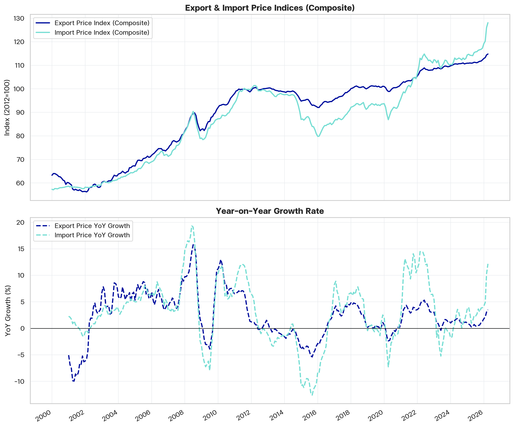
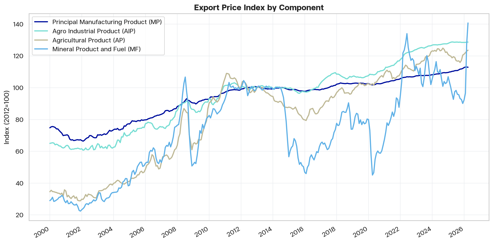
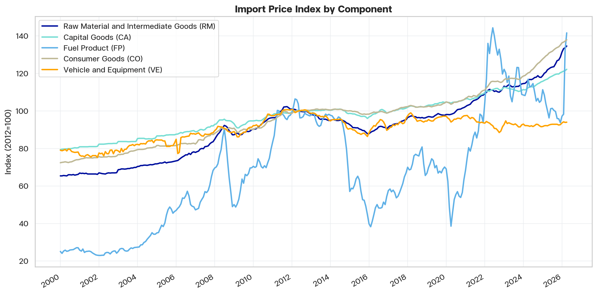
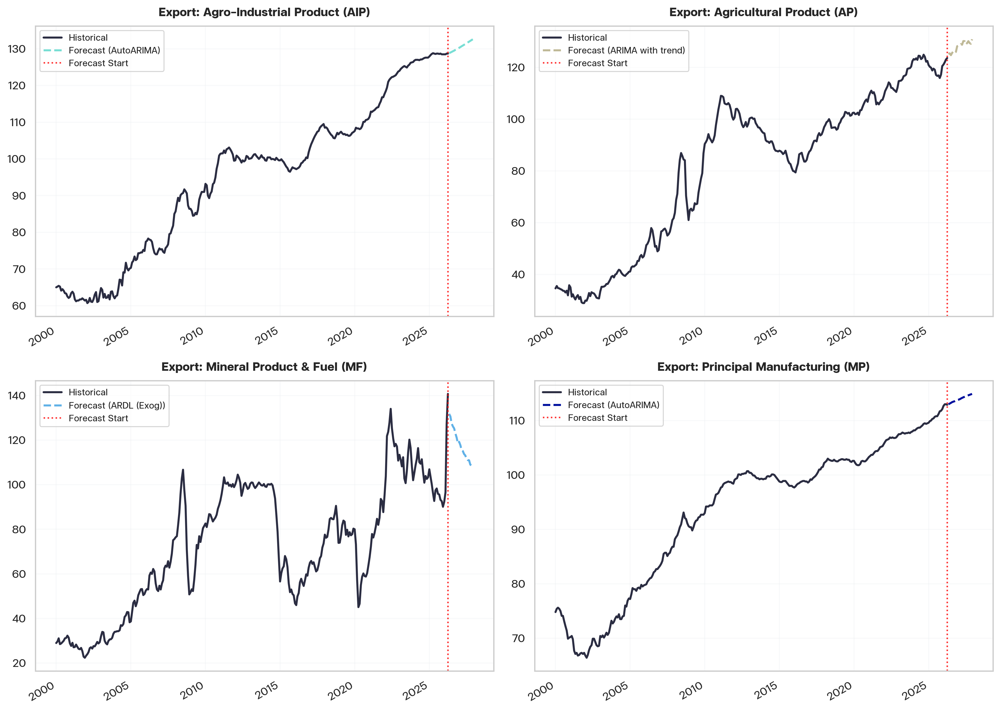
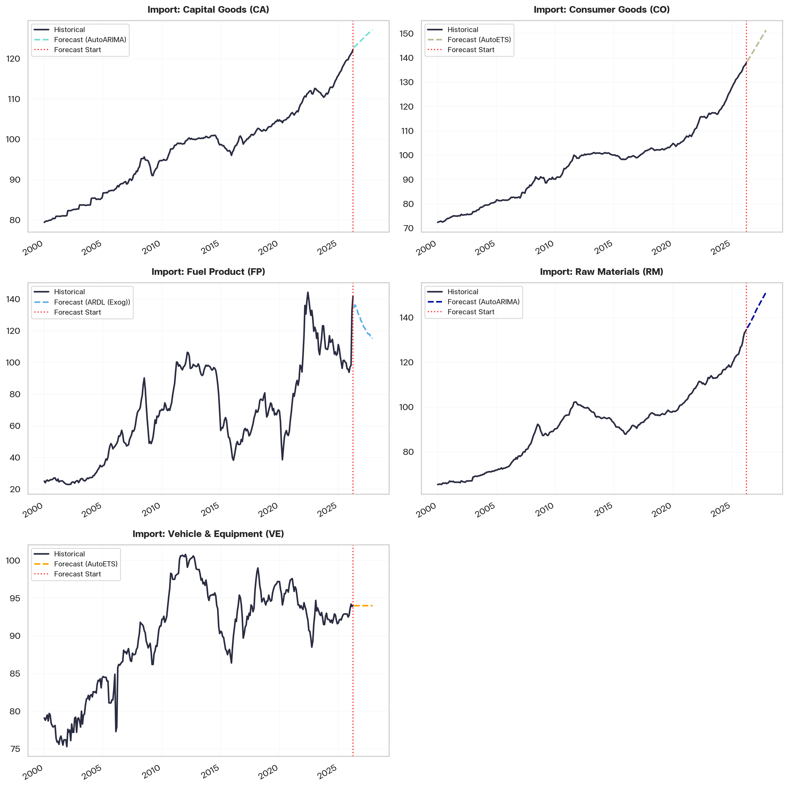
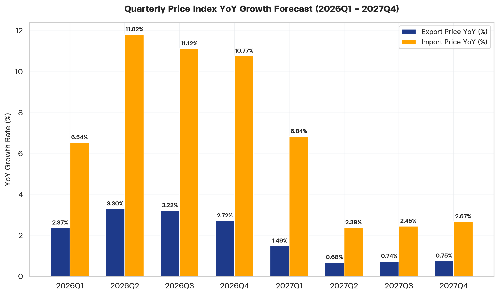
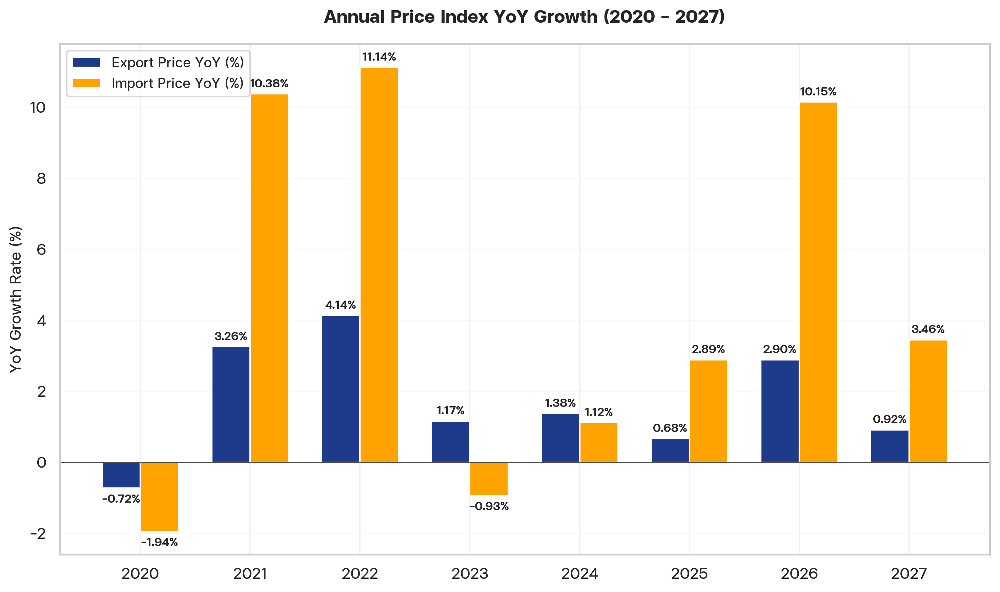
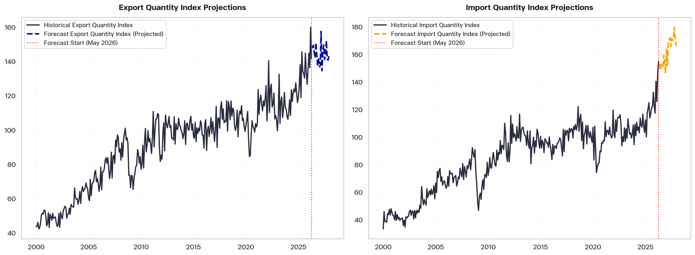

# Macroeconomic Outlook: Thailand Export & Import Price Projections (2026–2027)

## Executive Summary
This report provides a formal macroeconomic analysis of Thailand's export and import price developments, presenting medium-term projections through December 2027. Our methodology integrates high-frequency statistical forecasts (AutoARIMA and AutoETS) with exogenous econometric modeling (Autoregressive Distributed Lag - ARDL) that captures global commodity price dynamics—specifically linking energy-related indices to the forecasted path of Dubai Crude oil.

Key findings indicate a period of **relative stability and moderate expansion** in both trade indexes over the forecast horizon:
1. **Export Prices**: Projected to rise steadily from **114.67** in May 2026 to **116.00** by December 2027, representing a modest annual price expansion of **+0.91%** in 2027. This trajectory is anchored by the resilience of the Principal Manufacturing (MP) sector, which commands an **80.84%** share of the export basket.
2. **Import Prices**: Projected to increase from **127.68** in May 2026 to **133.38** by December 2027, yielding an annual price growth of **+3.45%** in 2027.
3. **Terms of Trade Implications**: Because import prices are forecasted to expand at a faster rate than export prices (primarily driven by raw materials and capital goods), Thailand is expected to face a mild **deterioration in its terms of trade**, highlighting the need for structural supply-chain adjustments and hedging of energy inputs.

---

## 1. Historical Context & Structural Composition
Thailand's trade pricing dynamics are structurally asymmetric, heavily dominated by distinct sub-components.

**Figure 1: Historical Year-on-Year composite export and import price index growth rates.**

### Splicing and Basket Weights
To resolve discrepancies between historical chain-weighted index series, we use spliced composite indexes with the latest weights updated as of **April 2026**:

*   **Export Weight Structure**: Spliced composite prices are heavily dependent on **Principal Manufacturing (MP)** at **80.84%**, followed by **Agricultural Products (AP)** at **8.19%**, **Agro-Industrial Products (AIP)** at **7.03%**, and **Mineral Fuel (MF)** at **3.94%**.
*   **Import Weight Structure**: The import basket is more diversified but concentrated in inputs: **Raw Materials (RM)** at **42.19%**, **Capital Goods (CA)** at **25.70%**, **Fuel Product (FP)** at **17.69%**, **Consumer Goods (CO)** at **10.91%**, and **Vehicle & Equipment (VE)** at **3.51%**.

**Figure 2: Historical monthly export price index trends decomposed by sub-component.**

**Figure 3: Historical monthly import price index trends decomposed by sub-component.**

---

## 2. Modeling & Forecasting Methodology
To satisfy the competitive forecasting mandate, we evaluate both univariate and multivariate econometric structures.

### Exogenous Energy-Linkage
Univariate models often generate naive flat forecasts for highly volatile commodity sectors. To capture the cyclical and structural changes in energy prices, we run a competitive validation for **Export Mineral Fuel (MF)** and **Import Fuel (FP)** using forecasted **Dubai Crude Spot Prices** as an exogenous regressor.

We run an **Expanding Rolling Window** validation starting in **January 2023** and ending in **April 2025** to select the model with the lowest 12-month-ahead out-of-sample Root Mean Squared Error (RMSE).

### Out-of-Sample Performance (12-Month-Ahead RMSE)

**Table 1: Out-of-Sample Model Selection Performance — 12-Month-Ahead RMSE by Trade Price Component**

| Component | Selected Model | Method Type | 12-Month-Ahead Validation RMSE | Model/Lag Order Details |
| :--- | :--- | :--- | :---: | :--- |
| **Export: Agro-Industrial (AIP)** | AutoARIMA | Univariate | 1.3112 | AutoARIMA (seasonal search) |
| **Export: Agricultural (AP)** | ARIMA with trend | Univariate (Override) | 7.1771 | ARIMA(2,1,0)x(2,1,0)12 with drift |
| **Export: Mineral Fuel (MF)** | **ARDL (Exog: Dubai)** | Exogenous | **5.4335** | ARDL (lags=12, order=1) (Wins over ARIMAX RMSE: 8.43) |
| **Export: Principal Manuf (MP)** | AutoARIMA | Univariate | 1.1575 | AutoARIMA (seasonal search) |
| **Import: Capital Goods (CA)** | AutoARIMA | Univariate | 3.0628 | AutoARIMA (seasonal search) |
| **Import: Consumer Goods (CO)** | AutoETS | Univariate | 4.7128 | AutoETS (seasonal search) |
| **Import: Fuel Product (FP)** | **ARDL (Exog: Dubai)** | Exogenous | **7.4199** | ARDL (lags=12, order=1) (Wins over ARIMAX RMSE: 8.14) |
| **Import: Raw Materials (RM)** | AutoARIMA | Univariate | 4.7882 | AutoARIMA (seasonal search) |
| **Import: Vehicle & Equipment (VE)** | AutoETS | Univariate | 1.1737 | AutoETS (seasonal search) |

> [!NOTE]
> Integrating the forecasted path of Dubai Crude Spot Price as an exogenous regressor drastically reduces the out-of-sample prediction error for energy-linked sectors compared to traditional univariate alternatives.

---

## 3. Medium-Term Projections (2026–2027)

Monthly component projections are aggregated into the official Bank of Thailand (BOT) series using spliced indices.

**Figure 4: Forecasted monthly export price index by sub-component through December 2027.**

**Figure 5: Forecasted monthly import price index by sub-component through December 2027.**

### Quarterly Volume-Weighted Projections
In national accounting, arithmetic averages fail to capture variations in monthly trade volumes. We apply standard **Volume-Weighted Resampling** to calculate the quarterly indicators.

The table below presents the quarterly price index projections and their corresponding Year-on-Year (YoY) growth rates from Q1-2026 to Q4-2027:

**Table 2: Quarterly Volume-Weighted Export and Import Price Index Projections with YoY Growth Rates (2026Q1–2027Q4)**

| Quarter | Export Price Index | Import Price Index | Export YoY Growth (%) | Import YoY Growth (%) | Export Quantity | Import Quantity |
| :--- | :---: | :---: | :---: | :---: | :---: | :---: |
| **2026Q1** | 113.5673 | 121.9410 | 2.37% | 6.54% | 147.1257 | 137.4790 |
| **2026Q2** | 114.7403 | 128.0816 | 3.30% | 11.82% | 146.3626 | 152.2791 |
| **2026Q3** | 114.8185 | 128.8727 | 3.22% | 11.12% | 146.3801 | 151.8458 |
| **2026Q4** | 114.9768 | 129.4755 | 2.72% | 10.77% | 141.1005 | 153.4805 |
| **2027Q1** | 115.2563 | 130.2808 | 1.49% | 6.84% | 144.0694 | 161.1075 |
| **2027Q2** | 115.5216 | 131.1368 | 0.68% | 2.39% | 143.5017 | 169.7970 |
| **2027Q3** | 115.6664 | 132.0326 | 0.74% | 2.45% | 145.7304 | 171.0080 |
| **2027Q4** | 115.8436 | 132.9387 | 0.75% | 2.67% | 141.9528 | 172.6664 |

*Note: YoY growth rate for quarter t is computed relative to quarter t-4 (the same quarter in the previous year).*

**Figure 6: Quarterly Year-on-Year export and import price index growth forecast (2026Q1–2027Q4).**

### Annual Forecast & YoY Growth (2020–2027)
The table below displays the annual resampled indicators from 2020 to 2027 along with their Year-on-Year (YoY) growth rates:

**Table 3: Annual Export and Import Price Index Projections with YoY Growth Rates (2020–2027)**

| Year | Export Price Index | Import Price Index | Export YoY Growth (%) | Import YoY Growth (%) | Export Quantity | Import Quantity |
| :--- | :---: | :---: | :---: | :---: | :---: | :---: |
| **2020** | 100.2237 | 91.3370 | -0.72% | -1.94% | 99.4817 | 89.7428 |
| **2021** | 103.4929 | 100.8188 | 3.26% | 10.38% | 114.8380 | 103.9786 |
| **2022** | 107.7802 | 112.0472 | 4.14% | 11.14% | 116.2180 | 106.4968 |
| **2023** | 109.0402 | 111.0042 | 1.17% | -0.93% | 113.0959 | 103.4397 |
| **2024** | 110.5468 | 112.2515 | 1.38% | 1.12% | 118.1204 | 107.9830 |
| **2025** | 111.2976 | 115.4985 | 0.68% | 2.89% | 132.2392 | 118.5694 |
| **2026** | 114.5204 | 127.2243 | 2.90% | 10.15% | 145.2422 | 148.7711 |
| **2027** | 115.5713 | 131.6206 | 0.92% | 3.46% | 143.8136 | 168.6447 |

*Note: YoY growth rate for year t is computed relative to year t-1.*

**Figure 7: Annual Year-on-Year export and import price index growth forecast (2020–2027).**

---

## 4. Policy & Strategic Implications
The projected price paths carry significant implications for Thailand's external stability and trade performance:

1.  **Terms of Trade Deterioration**:
    With import prices rising at roughly three times the rate of export prices in 2027 (+3.45% vs. +0.91%), the terms of trade will weaken. Thailand will have to export a larger volume of goods to purchase the same volume of imports, putting pressure on the current account balance.
2.  **Raw Material Cost Pressures**:
    Since Raw Materials (RM) represent **42.19%** of imports, the upward trend in import prices will raise domestic manufacturing input costs. This may compress operating margins for downstream export manufacturing unless local supply chains are strengthened.
3.  **Strategic Energy Hedging**:
    The exogenous ARDL models show that import Fuel Products (FP) and export Mineral Fuel (MF) are closely cointegrated with Dubai crude prices. Companies and public utilities should employ active hedging strategies to mitigate expected price fluctuations and protect the balance of payments.
4.  **Manufacturing Value-Chain Upgrading**:
    Given the heavy concentration in Principal Manufacturing exports (80.84%), enhancing the technology and value-added profile of manufactured exports is the only long-term countermeasure to offset rising import prices.

---

## Appendix: Quantity Index Forecast Projections
To resample the monthly price indexes to quarterly and annual periods using volume weights, we forecast the real **Export and Import Quantity Indexes** directly using seasonal Auto-ARIMA models.

These quantity projections represent the underlying physical trade volumes and are used as weights to calculate the volume-weighted composites.

**Figure 8: Forecasted export and import quantity index projections used as volume weights for quarterly and annual resampling.**
