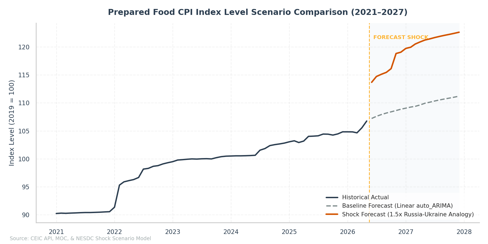
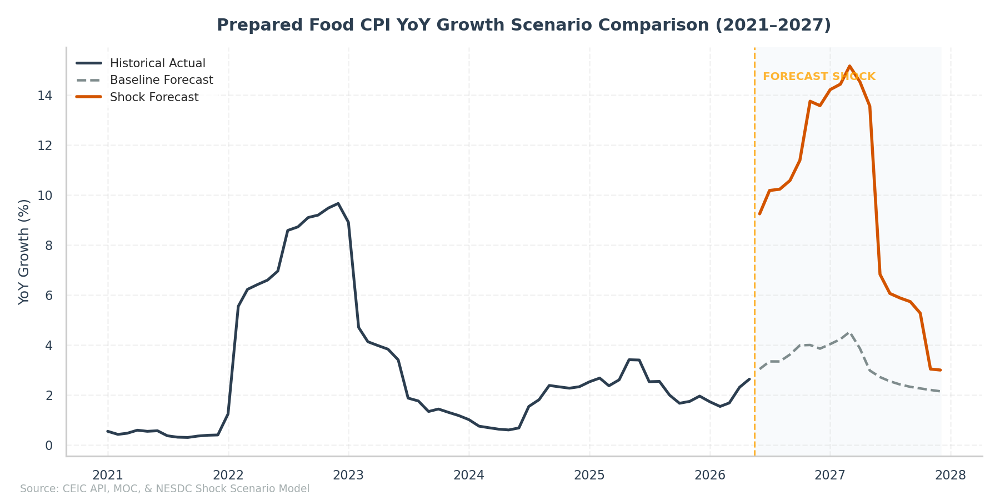

# Prepared Food Price Shock Scenario Analysis (Iran War Oil Spike)
**NESDC Special Economic Brief** | Date: June 14, 2026

## 1. Executive Summary

This special economic brief analyzes the potential non-linear price transmission from the recent **Iran war geopolitical oil price shock** to Thailand's domestic **Prepared Food CPI** index, and its subsequent pass-through to aggregate Headline and Core inflation.

Geopolitical escalations in March 2026 caused Dubai Crude spot prices to spike by **88.6% MoM** (from $68.27/bbl to $128.78/bbl). While standard univariate linear models (such as auto-ARIMA) project a smooth, linear upward trend for Prepared Food prices, historical evidence shows that major oil shocks trigger sharp, non-linear jumps due to rapid increases in transportation, logistics, agricultural input, and packaging costs.

Using a **1.5x Dampened Scaling** model calibrated on the 2022 Russia-Ukraine oil shock, we estimate:
* **Immediate Prepared Food Surge**: A sharp **6.49% MoM jump** in Prepared Food CPI in **June 2026** (the first forecast month), shifting the index level from `106.75` in May to `113.68`. Under baseline linear models, the index was projected to rise to only `107.21` (+0.43% MoM).
* **Peaking YoY Inflation**: Prepared Food YoY growth is projected to peak at **13.75% YoY** in **November 2026** (vs. baseline forecast of `4.00%`).
* **Substantial Headline Inflation Impact**: Headline CPI inflation jumps from a baseline forecast of **2.66% YoY** to **3.73% YoY** in June 2026 (+1.07ppt), peaking at **4.15% YoY** in November 2026 (vs. baseline `2.46%`, a +1.69ppt increase).
* **Core CPI Push**: Core inflation is pushed up by **0.26ppt** in the long term, finishing December 2027 at **1.04% YoY** (vs. baseline `0.78%`).

---

## 2. Methodology & Assumptions

Standard linear forecasting models fail to capture the asymmetric and non-linear "step-ups" characteristic of consumer food prices during energy crises. Food vendors and food processing companies typically hold prices constant during mild oil fluctuations, but execute sharp, discrete price hikes when oil prices cross psychological threshold levels (such as $100/bbl).

To capture this behavior, we implement a **Historical Analogy Calibration (Scenario Multiplier)**:
1. **Calibration Event**: The 2022 Russia-Ukraine oil price spike, where Dubai crude increased by **32.9%** (from $83.46/bbl to $110.89/bbl). This oil shock triggered an initial **4.32% MoM jump** in Prepared Food CPI within one month, followed by an 11-month persistent propagation period, accumulating an **8.70% total increase**.
2. **Dampened Scaling**: The March 2026 oil spike (+88.6% MoM to $128.78/bbl) represents a much larger nominal shock. However, domestic price controls on essential cooking ingredients (e.g., palm oil, sugar) and electricity subsidies prevent a purely linear transmission. We therefore apply a **1.5x scaling multiplier** to the 2022 shock profile (rather than a raw 2.7x linear multiplier).
3. **Shock Equation**:
   $$\text{MoM shock}_t = 1.5 \times \text{MoM change 2022}_{(t - t_{shock})}$$
   for $t$ from June 2026 to April 2027.
4. **Composites Re-aggregation**: Under the shock scenario, Headline and Core CPI are re-weighted at each monthly period using the official component weights:
   $$\text{CPI Aggregate}_t = \frac{\sum_c \text{Index}_{c, t} \times \text{Weight}_{c, t}}{\sum_c \text{Weight}_{c, t}}$$
   where $c$ represents the components in the respective group, substituting the shocked index for Prepared Food.

---

## 3. Visualizations

The non-linear transmission creates a distinct step-up in index levels and growth rates compared to the linear baseline model.

**Figure 1: Prepared Food CPI Index Level Scenario Comparison (2021–2027)**

---

**Figure 2: Prepared Food CPI YoY Growth Scenario Comparison (2021–2027)**

---

**Figure 3: Headline and Core CPI Aggregate Inflation Impact (YoY %)**

---

## 4. Scenario Comparison Tables

The following tables show the index levels and YoY growth rates under the Baseline and Shock scenarios.

**Table 1: Prepared Food CPI Scenario Comparison (Index & YoY)**
| Month | Baseline Index | Shock Index | Index Diff | Baseline YoY | Shock YoY | YoY Diff (ppt) |
|-------|----------------|-------------|------------|--------------|-----------|----------------|
| May 2026 | 106.75 | 106.75 | +0.00 | 2.63% | 2.63% | +0.00ppt |
| Jun 2026 | 107.21 | 113.67 | +6.46 | 3.04% | 9.25% | +6.21ppt |
| Jul 2026 | 107.59 | 114.71 | +7.12 | 3.34% | 10.18% | +6.84ppt |
| Aug 2026 | 107.91 | 115.11 | +7.20 | 3.34% | 10.23% | +6.89ppt |
| Sep 2026 | 108.18 | 115.45 | +7.27 | 3.62% | 10.58% | +6.96ppt |
| Oct 2026 | 108.39 | 116.11 | +7.72 | 3.99% | 11.39% | +7.40ppt |
| Nov 2026 | 108.63 | 118.82 | +10.19 | 4.00% | 13.75% | +9.75ppt |
| Dec 2026 | 108.86 | 119.05 | +10.19 | 3.85% | 13.58% | +9.72ppt |
| Jun 2027 | 110.12 | 121.43 | +11.31 | 2.72% | 6.83% | +4.11ppt |
| Dec 2027 | 111.20 | 122.62 | +11.43 | 2.15% | 3.00% | +0.85ppt |

**Table 2: Headline CPI Inflation Impact (Index & YoY)**
| Month | Baseline Index | Shock Index | Index Diff | Baseline YoY | Shock YoY | YoY Diff (ppt) |
|-------|----------------|-------------|------------|--------------|-----------|----------------|
| May 2026 | 103.44 | 103.44 | +0.00 | 2.89% | 2.89% | +0.00ppt |
| Jun 2026 | 103.20 | 104.27 | +1.08 | 2.63% | 3.70% | +1.07ppt |
| Jul 2026 | 103.05 | 104.23 | +1.19 | 2.74% | 3.92% | +1.18ppt |
| Aug 2026 | 102.99 | 104.19 | +1.20 | 2.70% | 3.89% | +1.19ppt |
| Sep 2026 | 102.91 | 104.12 | +1.21 | 2.66% | 3.87% | +1.21ppt |
| Oct 2026 | 102.86 | 104.15 | +1.28 | 2.72% | 4.00% | +1.28ppt |
| Nov 2026 | 102.74 | 104.43 | +1.70 | 2.45% | 4.14% | +1.69ppt |
| Dec 2026 | 102.58 | 104.28 | +1.70 | 2.24% | 3.93% | +1.69ppt |
| Jun 2027 | 102.92 | 104.81 | +1.88 | -0.27% | 0.51% | +0.78ppt |
| Dec 2027 | 103.08 | 104.99 | +1.90 | 0.49% | 0.68% | +0.19ppt |

**Table 3: Core CPI Inflation Impact (Index & YoY)**
| Month | Baseline Index | Shock Index | Index Diff | Baseline YoY | Shock YoY | YoY Diff (ppt) |
|-------|----------------|-------------|------------|--------------|-----------|----------------|
| May 2026 | 102.13 | 102.13 | +0.00 | 0.70% | 0.70% | +0.00ppt |
| Jun 2026 | 102.28 | 103.84 | +1.56 | 0.89% | 2.42% | +1.54ppt |
| Jul 2026 | 102.40 | 104.11 | +1.72 | 1.03% | 2.73% | +1.69ppt |
| Aug 2026 | 102.52 | 104.25 | +1.73 | 1.05% | 2.76% | +1.71ppt |
| Sep 2026 | 102.61 | 104.36 | +1.75 | 1.19% | 2.92% | +1.73ppt |
| Oct 2026 | 102.69 | 104.55 | +1.86 | 1.26% | 3.09% | +1.83ppt |
| Nov 2026 | 102.77 | 105.23 | +2.45 | 1.21% | 3.63% | +2.42ppt |
| Dec 2026 | 102.85 | 105.30 | +2.46 | 1.31% | 3.72% | +2.42ppt |
| Jun 2027 | 103.29 | 106.01 | +2.73 | 0.98% | 2.10% | +1.11ppt |
| Dec 2027 | 103.65 | 106.40 | +2.75 | 0.78% | 1.04% | +0.26ppt |

**Table 4: Annual YoY Inflation Growth Scenario Comparison (History & Forecasts)**
| Year | Prepared Food Baseline | Prepared Food Shock | Prepared Food Diff | Headline Baseline | Headline Shock | Headline Diff | Core Baseline | Core Shock | Core Diff |
|------|------------------------|---------------------|--------------------|-------------------|----------------|---------------|---------------|------------|-----------|
| 2021 | 0.44% | 0.44% | +0.00ppt | 1.09% | 1.09% | +0.00ppt | 0.27% | 0.27% | +0.00ppt |
| 2022 | 7.31% | 7.31% | +0.00ppt | 5.84% | 5.84% | +0.00ppt | 3.05% | 3.05% | +0.00ppt |
| 2023 | 3.11% | 3.11% | +0.00ppt | 1.28% | 1.28% | +0.00ppt | 1.30% | 1.30% | +0.00ppt |
| 2024 | 1.42% | 1.42% | +0.00ppt | 0.44% | 0.44% | +0.00ppt | 0.55% | 0.55% | +0.00ppt |
| 2025 | 2.45% | 2.45% | +0.00ppt | -0.05% | -0.05% | +0.00ppt | 0.79% | 0.79% | +0.00ppt |
| 2026 | 2.93% | 7.43% | +4.50ppt | 1.88% | 2.66% | +0.78ppt | 0.89% | 2.00% | +1.11ppt |
| 2027 | 3.01% | 8.74% | +5.73ppt | 0.59% | 1.64% | +1.05ppt | 1.03% | 2.55% | +1.51ppt |

---

## 5. Policy Implications

1. **Second-Round Pass-Through Risks**: Prepared food has a heavy weight of **15.8%** in the total CPI basket. A large jump in this component directly drives headline inflation, potentially triggering wage-price spiral expectations.
2. **Subsidies & Interventions**: Direct interventions on raw food ingredients (wheat, meats) might be more cost-effective in dampening headline inflation than general energy subsidies, as food prices exhibit extreme downward rigidity once hiked.
3. **Monetary Policy Stance**: Although Core CPI (excluding energy and raw food) is impacted moderately (+0.26ppt), the Headline CPI breach of 4% YoY in late 2026 may prompt the central bank to maintain a restrictive policy rate.
