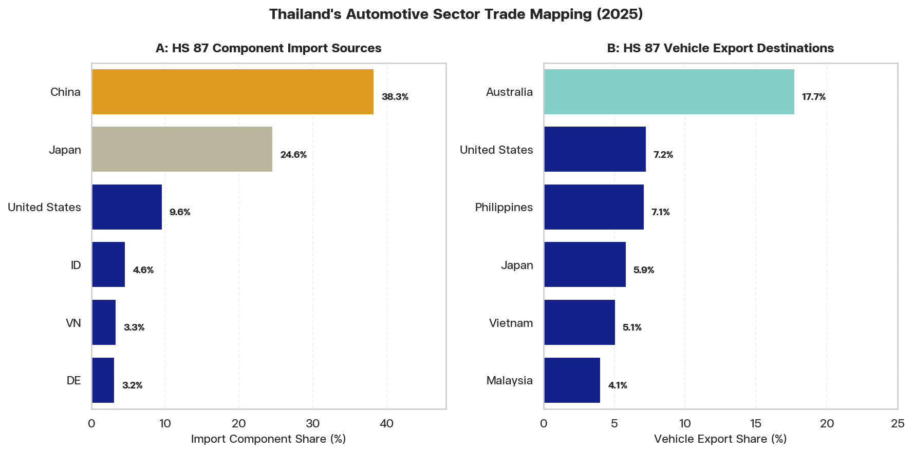
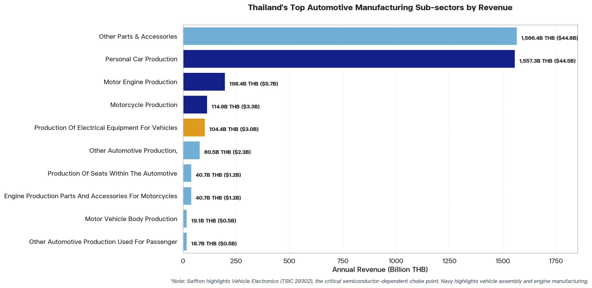

# Economic Dependencies Mitigation: Automotive Exports Group Brief
## Geopolitical Disruption Scenario: Naval Blockade of Taiwan and Impact on Thailand's Automotive Industry

**Date:** June 11, 2026  
**Group Topic:** Automotive Exports  
**Prepared for:** Small Group Activity Presentation  

---

### Executive Summary
This briefing document provides a focused, data-driven analysis of the vulnerabilities and mitigation options for Thailand's automotive sector (HS 87) under a hypothetical naval blockade of Taiwan. Combining trade transaction data from `GTA.db` and corporate registry statistics of **2,551 active Thai firms** from `DBD.db`, we analyze the structural mismatch between Thailand's input dependencies and export destinations. We drill down into the 15 specific sub-sectors of the domestic automotive industry and trace the direct transmission pathways of a semiconductor shock through the parts supply chain. Finally, we propose concrete policy options for immediate and long-term risk mitigation.

---

### Section 1: Situational Analysis (The Trade Structure & Vehicle Types)

Thailand is the "Detroit of Asia," boasting a massive automotive manufacturing sector (HS 87) that exported **$34.17 billion** in finished vehicles and parts in 2025. However, the sector is structurally vulnerable due to a clear mismatch between its component supply sources and its final export markets.

*   **Export Sub-products (Vehicles vs. Components)**: Thailand's automotive exports consist of three main categories:
    1.  **Finished Vehicles (CBU - Completely Built Up)**: Dominated by **1-Ton Pickup Trucks** (a segment where Thailand is a global manufacturing base) and **Eco-Cars** (passenger cars), exported globally.
    2.  **Motorcycles and Parts**: A large regional export hub supplying finished motorcycles (CBU) and replacement components to ASEAN and European markets.
    3.  **Automotive Parts & Accessories (CKD/OES)**: Chassis, body panels, gearboxes, brakes, and electrical wiring harnesses shipped to regional assembly hubs.
*   **Supply Side (Component Imports)**: Thailand's automotive assembly relies heavily on East Asian components. In 2025, Thailand imported **$11.97 billion** in automotive inputs. **China** ($4.58 billion, **38.3%** share) and **Japan** ($2.94 billion, **24.6%** share) together supply **62.9%** of all imported parts, engines, and EV battery packs.
*   **Demand Side (Vehicle Exports)**: Thailand's finished vehicle exports are highly dependent on ocean shipping routes. The single largest customer is **Australia**, absorbing **$6.06 billion** (**17.7%** share) of exports, followed by the **United States** ($2.48 billion, **7.2%**) and the **Philippines** ($2.43 billion, **7.1%**).


**Figure 1: Thailand's Automotive Sector Trade Mapping (2025)**

As shown in Figure 1, the supply side is concentrated in China and Japan, while the demand side is dispersed globally across Oceania, North America, and ASEAN, making it highly dependent on long-distance maritime transport.

---

### Section 2: Thailand's Domestic Automotive Industry Micro-structure

To understand how global supply shocks propagate locally, we analyze the registry data of Thai firms from the Department of Business Development (`DBD.db`). Thailand's domestic automotive manufacturing sector is composed of **2,551 active firms** generating a combined annual revenue of **3,723.18 Billion THB** (~$106.38 Billion USD) and holding **2,242.06 Billion THB** in assets.

**Table 1: Thailand's Automotive Manufacturing Sub-sectors (Detailed Breakdown)**

| TSIC | TSIC Sub-sector Description | Number of Firms | Total Revenue (Billion THB) | Total Assets (Billion THB) | Total Revenue (Billion USD) | Total Assets (Billion USD) |
| :---: | :--- | :---: | :---: | :---: | :---: | :---: |
| 29309 | Other Parts and Accessories Manufacturing | 1,626 | 1,566.43 | 1,208.37 | 44.76 | 34.52 |
| 29102 | Personal Car Assembly and Production | 80 | 1,557.29 | 648.09 | 44.49 | 18.52 |
| 29101 | Motor Vehicle Engine Manufacturing | 28 | 198.36 | 72.97 | 5.67 | 2.08 |
| 30911 | Motorcycle Production and Assembly | 58 | 114.90 | 66.57 | 3.28 | 1.90 |
| 29302 | Electrical and Electronic Equipment for Vehicles | 55 | 104.40 | 90.26 | 2.98 | 2.58 |
| 29109 | Other Automotive Assembly (N.E.C.) | 139 | 80.48 | 54.61 | 2.30 | 1.56 |
| 29301 | Production of Seats within Automotives | 63 | 40.70 | 31.87 | 1.16 | 0.91 |
| 30912 | Motorcycle Engine Parts and Accessories | 176 | 40.66 | 37.80 | 1.16 | 1.08 |
| 29201 | Motor Vehicle Body Manufacturing | 113 | 19.14 | 20.78 | 0.55 | 0.59 |
| 29104 | Other Passenger Automotive Production | 22 | 18.70 | 15.32 | 0.53 | 0.44 |
| 29202 | Production of Trailers and Semi-trailers | 73 | 17.83 | 16.71 | 0.51 | 0.48 |
| 30990 | Other Transportation Equipment (N.E.C.) | 65 | 8.89 | 7.17 | 0.25 | 0.20 |
| 30921 | Bicycle Production | 56 | 3.10 | 4.49 | 0.09 | 0.13 |
| 29203 | Production of Cargo Cabinets | 63 | 2.05 | 1.94 | 0.06 | 0.06 |
| 29103 | 1 Ton Pickup Truck Production | 8 | 0.23 | 0.18 | 0.01 | 0.01 |
| 30922 | Car Production for Disabled People | 2 | <0.01 | 0.00 | <0.01 | <0.01 |
| **Total**| **Automotive & Motorcycle Manufacturing** | **2,551** | **3,723.18** | **2,242.06** | **106.38** | **64.06** |
*Source: Department of Business Development (DBD) Firm Registry SQL Database - Compiled June 2026. Note: USD values converted at 1 USD = 35 THB. Individual sub-sectors might not sum exactly to totals due to rounding.*

#### Key Classifications & Industry Insights:
1.  **Pickup Truck Registry Anomaly**: Although Thailand is a global powerhouse in **1-Ton Pickup Truck** manufacturing, TSIC `29103` shows only **8 firms** and **0.23 Billion THB** in revenue. This is because major multinational assemblers (Toyota, Isuzu, Mitsubishi, Ford) that build both passenger cars and pickup trucks are registered under the broader **Personal Car Assembly (TSIC 29102)** or **Other Automotive Assembly (TSIC 29109)** codes. TSIC `29103` only captures small-scale niche builders and pickup truck modifiers.
2.  **Concentration of Economic Value**: The automotive industry's revenue is heavily concentrated in two sectors: **Other Parts & Accessories (TSIC 29309)** (42.1% share) and **Personal Car Assembly (TSIC 29102)** (41.8% share). Together, they represent **83.9%** of the industry's total revenue.


**Figure 2: Thailand's Automotive Manufacturing Sub-sectors by Revenue**

---

### Section 3: Geopolitical Blockade Risks (The "Dual-Squeeze" & Semiconductor Pathway)

A blockade of Taiwan would trigger a severe supply-and-demand squeeze on Thailand's automotive sector.

#### 1. The Semiconductor Transmission Pathway (Supply-Side Shock)
While finished cars and parts represent mechanical assembly, modern vehicles are essentially computers on wheels, requiring hundreds of semiconductors. A blockade of Taiwan would instantly cut off advanced wafers and legacy-node microcontrollers from TSMC. The shock would propagate through the domestic value chain in three stages:
```mermaid
graph TD
    A["Taiwan Strait Blockade (TSMC Wafer Cutoff)"] -->|Immediate Halt| B["TSIC 29302: Vehicle Electronics (55 Firms, 104B THB)"]
    B -->|Component Depletion (2-4 Weeks)| C["TSIC 29102: Personal Car Assembly (80 Plants, 1,557B THB)"]
    B -->|Component Depletion (2-4 Weeks)| D["TSIC 29103: Pickup Truck Production (8 Plants)"]
    C & D -->|Order Cancellations (JIT Freeze)| E["TSIC 29309: Parts & Accessories (1,626 Firms, 1,566B THB)"]
    E -->|Severe Cash Flow Crisis| F["SME Insolvency & Mass Manufacturing Layoffs"]
```
*   **Stage 1 - The Electronic Choke Point**: The **55 vehicle electronics manufacturers (TSIC 29302)** generating **104.40 Billion THB** ($2.98 billion) in revenue would halt operations within days as their microchip stocks deplete.
*   **Stage 2 - Downstream Assembly Freeze**: Thailand's **80 passenger car plants (TSIC 29102)** and pickup lines would grind to a complete halt within **2 to 4 weeks** because finished vehicles cannot be completed without engine control units (ECUs), sensor modules, and safety electronics.
*   **Stage 3 - SME Parts Supplier Crash**: The assembly freeze would halt all orders to the **1,626 parts and accessories manufacturers (TSIC 29309)**. Unlike large automotive MNCs, these Tier-2 and Tier-3 domestic SMEs operate with tight cash flows and zero inventory buffers under Just-In-Time (JIT) scheduling. The sudden freeze would trigger widespread bankruptcies and threaten the livelihoods of hundreds of thousands of auto workers.

#### 2. Demand-Side Squeeze (Market Access)
*   **Shipping Detours & Freight Rate Spikes**: closing the Taiwan Strait and converting the South China Sea into a war zone would force vehicle carriers to detour through the Lombok or Makassar Straits. This adds **10 to 15 days** of transit time, causing massive vessel shortages and doubling freight costs.
*   **Export Competitiveness Collapse**: Skyrocketing war-risk insurance premiums and container shortages would make finished vehicle exports to Australia ($6.06B) and the US ($2.48B) economically unviable.

---

### Section 4: Mitigation Strategies

To hedge against a total collapse of Thailand's **$34.17 billion** automotive exports, a combination of short-term crisis management and long-term structural diversification is required.

#### 1. Short-Term Options (0–12 Months)
*   **Establish Strategic Component Reserves**: Partner with the Thai Automotive Industry Association to build national stockpiles of critical vehicle microcontrollers, ECUs, and raw metal alloys.
*   **ASEAN Parts Integration (AICO)**: Leverage the ASEAN Industrial Cooperation (AICO) scheme to swap and source basic vehicle components within the region (e.g., Malaysia and Indonesia), bypassing East Asian shipping lanes.
*   **National War-Risk Underwriting Pool**: Establish a government-backed maritime insurance fund to subsidize war-risk premiums for vessels carrying essential automotive exports to Oceania and North America.

#### 2. Long-Term Options (1–5 Years)
*   **Accelerate Domestic Semiconductor Packaging**: Offer BOI incentives (tax holidays) to attract legacy-node semiconductor fabrication and OSAT (Outsourced Semiconductor Assembly and Test) facilities to relocate to Thailand.
*   **Domestic Raw Material Processing**: Subsidize domestic steel alloy processing, aluminum die-casting, and rubber vulcanization plants to localize raw inputs for Tier-2/3 parts manufacturers.
*   **EEC EV Supply Chain Integration**: Mandate that foreign EV manufacturers build battery cell manufacturing facilities domestically rather than importing completed battery packs from China.

---

### 📥 Download Raw Datasets (Embedded CSVs)

You can download the raw datasets utilized in this report directly from this self-contained HTML file by clicking the buttons below:

*   **Thailand's Automotive Component Imports (2025)**: [Download CSV](../../output/data/taiwan_blockade_impact/th_automotive_imports_2025.csv){download="th_automotive_imports_2025.csv" class="download-btn"}
*   **Thailand's Automotive Vehicle Exports (2025)**: [Download CSV](../../output/data/taiwan_blockade_impact/th_automotive_exports_2025.csv){download="th_automotive_exports_2025.csv" class="download-btn"}
*   **Thailand's Detailed Automotive Sub-sectors (DBD)**: [Download CSV](../../output/data/taiwan_blockade_impact/th_detailed_auto_subsectors.csv){download="th_detailed_auto_subsectors.csv" class="download-btn"}
