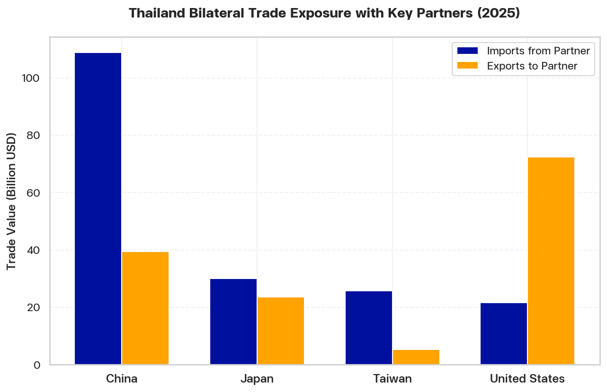
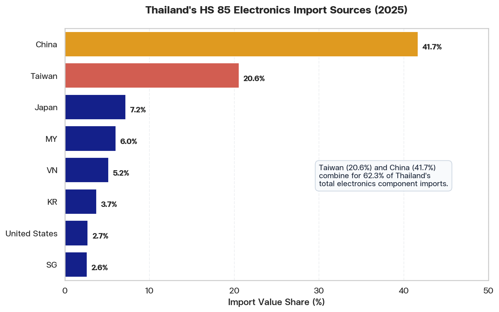

# Special Economic Brief: Geopolitical Risk Analysis
## Geopolitical Disruption Scenario: Naval Blockade of Taiwan and Impact on Thailand's Trade and Supply Chains

**Date:** June 11, 2026  
**Prepared by:** Chief Economist, NESDC  
**Classification:** Policy Research Brief  

---

### Executive Summary
This brief provides a quantitative and qualitative situational analysis of the economic security risks facing Thailand in the event of a naval blockade of Taiwan by China. By analyzing 2025 trade data from the Global Trade Atlas (`GTA.db`) and macroeconomic indicators from CEIC (`CEIC.db`), we examine Thailand's critical trade exposure to four key partners—China, Japan, the United States, and Taiwan—and identify key vulnerabilities across manufacturing value chains, shipping infrastructure, and financial insurance. The brief outlines strategic policy mitigation options to strengthen Thailand's economic resilience.

---

### Section 1: Overview of Taiwan's Role in the Global Supply Chain

Taiwan is the undisputed linchpin of the global technology supply chain, particularly for high-end semiconductors, microchips, and electronic components. A naval blockade would effectively isolate Taiwan, halting its exports and paralyzing global high-tech assembly. 

Data from the Global Trade Atlas (`GTA.db`) confirms Taiwan's highly specialized export profile. In 2025, Taiwan's total exports reached **$637.90 billion**, with over **80.8%** concentrated in just two tech-heavy categories: Electrical Machinery (HS 85) and Mechanical Machinery/Boilers (HS 84).

**Table 1: Taiwan's Top 10 Export Categories in 2025**

| Rank | HS Code | HS Chapter Description | Export Value (USD) | Share (%) |
| :---: | :---: | :--- | :---: | :---: |
| 1 | 85 | Electrical Machinery, Equipment, and Parts; Sound/TV Recorders | 276,649,850,000 | 43.37% |
| 2 | 84 | Nuclear Reactors, Boilers, Machinery, and Mechanical Appliances | 238,551,320,000 | 37.40% |
| 3 | 39 | Plastics and Articles Thereof | 15,627,950,000 | 2.45% |
| 4 | 90 | Optical, Photographic, Measuring, Precision, Medical Instruments | 12,397,720,000 | 1.94% |
| 5 | 27 | Mineral Fuels, Mineral Oils, and Products of Their Distillation | 10,049,960,000 | 1.58% |
| 6 | 87 | Vehicles (Other than Railway/Tramway) and Parts and Accessories | 9,503,787,000 | 1.49% |
| 7 | 72 | Iron and Steel | 7,403,388,000 | 1.16% |
| 8 | 73 | Articles of Iron or Steel | 7,288,185,000 | 1.14% |
| 9 | 29 | Organic Chemicals | 6,907,959,000 | 1.08% |
| 10 | 74 | Copper and Articles Thereof | 5,550,907,000 | 0.87% |

This extreme concentration of supply demonstrates that Taiwan acts as a critical upstream supplier of technology hardware. The blockade of Taiwan represents a systemic threat that would instantly disrupt the production of computers, AI servers, telecommunications hardware, and automotive electronics worldwide.

---

### Section 2: China Group

#### 1. Situational Analysis
China is Thailand's largest trading partner. According to 2025 GTA data, Thailand imported **$108.80 billion** from China and exported **$39.39 billion** to China, representing a massive trade deficit of **$69.41 billion**. 
*   **Electronics (HS 85)**: Thailand imported **$37.65 billion** in electrical/electronic goods from China (representing **41.7%** of Thailand's total HS 85 imports).
*   **Automotive (HS 87)**: China has surged to become Thailand's largest import source for vehicles and parts, accounting for **$4.58 billion** (**38.3%** of Thailand's total HS 87 imports), driven heavily by electric vehicles (EVs) and EV components.

#### 2. Economic Security Risks
*   **EV Supply Chain Paralysis**: A blockade would lead to immediate disruptions in Chinese component shipments. Because Thailand's EV assembly lines rely almost entirely on Chinese battery packs, cells, and electric drivetrains, domestic EV production would halt within weeks.
*   **Primary Import Freeze**: With over 41% of electronics parts and 38% of automotive inputs originating in China, any military conflict in the Taiwan Strait would choke the South China Sea shipping lanes, cutting off Thailand's manufacturing inputs and leading to factory shutdowns and spikes in inflation.

#### 3. Mitigation Strategies
*   **Accelerate Localization**: Mandate higher localized content requirements for EV battery cell assembly and structural components, offering tax incentives for companies building battery gigafactories in Thailand.
*   **Import Source Diversification**: Work with Thai manufacturers to secure alternative component sources from India, Vietnam, and Eastern Europe, utilizing trade facilitation desks to fast-track import permits.

---

### Section 3: Japan Group

#### 1. Situational Analysis
Japan is historically Thailand's most integrated industrial partner, especially in traditional Internal Combustion Engine (ICE) automotive supply chains. In 2025, Thailand imported **$29.98 billion** from Japan and exported **$23.53 billion** to Japan.
*   **Automotive (HS 87)**: Japan remains the bedrock of Thailand's component supply, accounting for **$2.94 billion** (**24.6%** of Thailand's total HS 87 imports), largely consisting of specialized steel, engine parts, and transmissions.
*   **Electronics (HS 85)**: Japan supplied **$6.50 billion** (**7.2%** share) of Thailand's electronics imports.

#### 2. Economic Security Risks
*   **ICE Automotive Bottlenecks**: Traditional automotive manufacturing (which represents the bulk of Thailand's $34.17 billion auto exports) relies on Japanese "just-in-time" supply chains. Disruptions in Japanese advanced component exports (due to regional shipping hazards or Japan's own chip shortages) would freeze Thailand's domestic assembly.
*   **Japanese FDI Contraction**: A prolonged conflict in the region would reduce Japan's outbound capital, leading to a contraction of foreign direct investment (FDI) in Thailand's Eastern Economic Corridor (EEC).

#### 3. Mitigation Strategies
*   **Strategic Industrial Stockpiling**: Create a government-backed national buffer stock for critical automotive components, steel alloys, and electronic controllers in collaboration with the Thai Automotive Industry Association.
*   **Flexible ICE-EV Transition**: Maintain flexible domestic manufacturing policies to allow auto plants to shift capacity between EV and ICE assembly depending on input availability.

---

### Section 4: US Group

#### 1. Situational Analysis
The United States is Thailand's largest export customer, acting as the primary source of Thailand's trade surplus. In 2025, Thailand exported **$72.33 billion** to the US and imported **$21.60 billion** from the US, generating a trade surplus of **$50.73 billion**.
*   **Electronics (HS 85)**: The US is the single largest buyer of Thailand's electronics, absorbing **$23.67 billion** (**37.5%** of Thailand's total HS 85 exports), mainly consisting of assembled hard disk drives (HDDs), semiconductor assemblies, and smart appliances.
*   **Automotive (HS 87)**: The US purchased **$2.48 billion** (**7.2%** share) of Thailand's automotive exports.

#### 2. Economic Security Risks
*   **Export Revenue Collapse**: Because Thailand's export sector is heavily exposed to the US market, any halt in Thai assembly lines (due to missing Taiwanese microchips) would lead to an immediate collapse in shipments to the US. A 50% drop in HS 85 exports to the US would wipe out over **$11.8 billion** in export revenue, severely impacting Thailand's GDP.
*   **US Dollar Liquidity Shock**: A major geopolitical conflict in Asia would trigger a "flight to safety," leading to a rapid appreciation of the US Dollar and a sharp depreciation of the Thai Baht, increasing the cost of raw material imports.

#### 3. Mitigation Strategies
*   **Export Credit Guarantee Extensions**: Provide government-backed export credit insurance and liquidity facilities to help Thai exporters manage cash flow shortfalls if shipments to the US are delayed or cancelled.
*   **Trade Agreement Expansion**: Proactively negotiate bilateral trade agreements with secondary export markets (e.g., Middle East, South Asia, Latin America) to hedge against extreme US demand exposure.

---

### Section 5: Shipping Routes and Maritime Insurance

#### 1. Situational Analysis
Thailand is geographically positioned at the center of Southeast Asian maritime trade, but its major trade routes to North America and Northeast Asia pass directly through the South China Sea, the Taiwan Strait, and the Luzon Strait. 

**Figure 1: Thailand Bilateral Trade Exposure with Key Partners (2025)**

The chart above illustrates that Thailand's trade is highly exposed to partners on both sides of the Taiwan Strait. Over **$190 billion** in bilateral trade with China, Japan, the US, and Taiwan is directly dependent on these maritime corridors.

#### 2. Economic Security Risks
*   **Shipping Lane Closure & Detours**: A naval blockade of Taiwan would render the Taiwan Strait impassable and turn the South China Sea into a high-risk conflict zone. Container ships would be forced to detour through the Lombok Strait or Makassar Strait in Indonesia. This detour adds **10 to 15 days** of transit time, significantly increasing fuel costs and vessel charter rates.
*   **Maritime Insurance Skyrocketing**: War risk insurance premiums for vessels traversing the Asia-Pacific region would skyrocket, and some underwriters would suspend coverage entirely. This would lead to container shortages, cargo strandings, and port congestion at Laem Chabang.

#### 3. Mitigation Strategies
*   **National Shipping Line Development**: Accelerate the development of a state-owned national shipping line to guarantee cargo transit for essential goods (food, fuel, medicine) during crises.
*   **Alternative Land-Bridge Routes**: Leverage regional rail networks (e.g., China-Laos-Thailand railway) and land corridors through Myanmar and Malaysia to bypass maritime choke points for critical imports.
*   **State-Backed War Risk Insurance Pool**: Create a national maritime insurance underwriting pool to subsidize war-risk insurance for shipping companies carrying essential Thai trade.

---

### Section 6: Electronics and AI-Related Exports

#### 1. Situational Analysis
Electronics and electrical equipment (HS 85) is Thailand's largest export sector, reaching **$63.18 billion** in 2025. However, Thailand's assembly model is deeply dependent on intermediate imports of microchips and integrated circuits from Taiwan.

**Figure 2: Thailand's HS 85 Electronics Import Sources (2025)**

As shown in the chart above, Taiwan is Thailand's 2nd largest electronics import source, supplying **$18.56 billion** (**20.6%** of total HS 85 imports). China dominates with **$37.65 billion** (**41.7%** share). 

#### 2. Economic Security Risks
*   **The Semiconductor Choke Point**: Thailand does not possess advanced silicon wafer fabrication facilities. It imports microchips from Taiwan (TSMC) to assemble hard drives, computer parts, and home appliances. A blockade would immediately sever the supply of Taiwanese wafers and chips.
*   **Production Halt in EEC**: Without microchips, assembly plants in the Eastern Economic Corridor (EEC) would grind to a halt. The electronics export industry ($63.18B) would face systemic supply-side disruption, leading to massive layoffs and loss of technological competitiveness.

#### 3. Mitigation Strategies
*   **Upstream Semiconductor Investment**: Provide aggressive tax holidays (e.g., 15 years BOI privileges) to attract legacy-node semiconductor fabs, assembly, testing, and packaging (OSAT) facilities to relocate to Thailand.
*   **Strategic Chip Reserves**: Establish a national semiconductor registry and mandate that electronics manufacturers maintain a minimum of 90 days of critical microchip inventory.

---

### Section 7: Automotive Exports

#### 1. Situational Analysis
Thailand is the "Detroit of Asia," with a massive automotive industry (HS 87) that exported **$34.17 billion** in 2025.
*   **Exports**: Unlike electronics, Thailand's automotive exports are globally dispersed, with Australia being the largest single market at **$6.06 billion** (**17.7%** share), followed by the US (**$2.48 billion**, **7.2%**), and the Philippines (**$2.43 billion**, **7.1%**).
*   **Imports**: The supply chain is highly concentrated, with China (**$4.58 billion**, **38.3%** share) and Japan (**$2.94 billion**, **24.6%** share) supplying a combined **62.9%** of automotive imports (parts, engines, chassis, and EV batteries).

**Figure 3: Thailand's Automotive Sector Trade Mapping (2025)**

The figures above highlight the structural mismatch in Thailand's automotive sector: it imports components from East Asia (China and Japan) but exports finished vehicles to Oceania, North America, and ASEAN.

#### 2. Domestic Industry Structure (TSIC Drilldown)
To understand the downstream transmission of these shocks, we analyze the micro-structure of Thailand's domestic automotive manufacturing sector using registry data from the Department of Business Development (`DBD.db`). 

In total, Thailand has **2,551 active registered firms** in motor vehicle and parts manufacturing, generating a combined annual revenue of **3,723.18 Billion THB** (~$106.38 Billion USD) and holding **2,242.06 Billion THB** in assets. The industry is divided into a few large assemblers and a massive network of component suppliers.

**Table 2: Thailand's Automotive Manufacturing Sub-sectors (Detailed Breakdown)**

| TSIC | TSIC Sub-sector Description | Number of Firms | Total Revenue (Billion THB) | Total Assets (Billion THB) | Total Revenue (Billion USD) | Total Assets (Billion USD) |
| :---: | :--- | :---: | :---: | :---: | :---: | :---: |
| 29309 | Other Parts and Accessories Manufacturing | 1,626 | 1,566.43 | 1,208.37 | 44.76 | 34.52 |
| 29102 | Personal Car Assembly and Production | 80 | 1,557.29 | 648.09 | 44.49 | 18.52 |
| 29101 | Motor Vehicle Engine Manufacturing | 28 | 198.36 | 72.97 | 5.67 | 2.08 |
| 30911 | Motorcycle Production and Assembly | 58 | 114.90 | 66.57 | 3.28 | 1.90 |
| 29302 | Electrical and Electronic Equipment for Vehicles | 55 | 104.40 | 90.26 | 2.98 | 2.58 |
| 29109 | Other Automotive Assembly (N.E.C.) | 139 | 80.48 | 54.61 | 2.30 | 1.56 |
| 29301 | Production of Seats within Automotives | 63 | 40.70 | 31.87 | 1.16 | 0.91 |
| 30912 | Motorcycle Engine Parts and Accessories | 176 | 40.66 | 37.80 | 1.16 | 1.08 |
| 29201 | Motor Vehicle Body Manufacturing | 113 | 19.14 | 20.78 | 0.55 | 0.59 |
| 29104 | Other Passenger Automotive Production | 22 | 18.70 | 15.32 | 0.53 | 0.44 |
| 29202 | Production of Trailers and Semi-trailers | 73 | 17.83 | 16.71 | 0.51 | 0.48 |
| 30990 | Other Transportation Equipment (N.E.C.) | 65 | 8.89 | 7.17 | 0.25 | 0.20 |
| 30921 | Bicycle Production | 56 | 3.10 | 4.49 | 0.09 | 0.13 |
| 29203 | Production of Cargo Cabinets | 63 | 2.05 | 1.94 | 0.06 | 0.06 |
| 29103 | 1 Ton Pickup Truck Production | 8 | 0.23 | 0.18 | 0.01 | 0.01 |
| 30922 | Car Production for Disabled People | 2 | <0.01 | 0.00 | <0.01 | <0.01 |
| **Total**| **Automotive & Motorcycle Manufacturing** | **2,551** | **3,723.18** | **2,242.06** | **106.38** | **64.06** |
*Source: Department of Business Development (DBD) Firm Registry SQL Database. Note: USD values converted at 1 USD = 35 THB. Sub-sectors may not sum to totals due to rounding.*

#### Key Classifications & Industry Insights:
*   **Pickup Truck Registry Anomaly**: Although Thailand is a global powerhouse in **1-Ton Pickup Truck** manufacturing, TSIC `29103` shows only **8 firms** and **0.23 Billion THB** in revenue. This is because major multinational assemblers (Toyota, Isuzu, Mitsubishi, Ford) that build both passenger cars and pickup trucks are registered under the broader **Personal Car Assembly (TSIC 29102)** or **Other Automotive Assembly (TSIC 29109)** codes. TSIC `29103` only captures small-scale niche builders and pickup truck modifiers.
*   **Concentration of Economic Value**: The automotive industry's revenue is heavily concentrated in two sectors: **Other Parts & Accessories (TSIC 29309)** (42.1% share) and **Personal Car Assembly (TSIC 29102)** (41.8% share). Together, they represent **83.9%** of the industry's total revenue.

**Figure 4: Thailand's Automotive Manufacturing Sub-sectors by Revenue**

#### 3. Economic Security Risks & Semiconductor Transmission Pathway
A blockade of Taiwan would trigger a severe supply-and-demand squeeze on Thailand's automotive sector.

*   **The Semiconductor Transmission Pathway**: While finished cars and parts represent mechanical assembly, modern vehicles require hundreds of semiconductors. A blockade of Taiwan would instantly cut off advanced wafers and legacy-node microcontrollers from TSMC. Wafers from Taiwan are the starting point for electronic circuits. The shock would propagate through the domestic value chain in three stages:
    1.  **Stage 1 - The Electronic Choke Point**: The **55 vehicle electronics manufacturers (TSIC 29302)** generating **104.40 Billion THB** ($2.98 billion) in revenue would halt operations within days as their microchip stocks deplete.
    2.  **Stage 2 - Downstream Assembly Freeze**: Thailand's **80 passenger car plants (TSIC 29102)** and pickup lines would grind to a complete halt within **2 to 4 weeks** because finished vehicles cannot be completed without engine control units (ECUs), sensor modules, and safety electronics.
    3.  **Stage 3 - SME Parts Supplier Crash**: The assembly freeze would halt all orders to the **1,626 parts and accessories manufacturers (TSIC 29309)**. Unlike large automotive MNCs, these Tier-2 and Tier-3 domestic SMEs operate with tight cash flows and zero inventory buffers under Just-In-Time (JIT) scheduling. The sudden freeze would trigger widespread bankruptcies and threaten the livelihoods of hundreds of thousands of auto workers.
*   **EV Transition Stalling**: If battery components from China are cut off, Thailand's EV transition goals will stall, forcing factories to shut down and undermining the country's carbon-reduction commitments.
*   **The "Dual-Squeeze" Vulnerability**: The automotive sector is vulnerable to a dual supply-demand shock. On the supply side, a blockade halts chip imports from Taiwan and battery/parts components from China and Japan. On the demand side, maritime shipping detours and rising freight costs make exports of heavy finished vehicles to Australia and the US economically unviable.

#### 4. Mitigation Strategies
*   **Establish Strategic Component Reserves**: Partner with the Thai Automotive Industry Association to build national stockpiles of critical vehicle microcontrollers, ECUs, and raw metal alloys.
*   **Regional Automotive Integration**: Partner with Malaysia and Indonesia under the ASEAN Industrial Cooperation (AICO) scheme to build a regional, decentralized automotive components network, bypassing East Asian maritime choke points.
*   **Domestic Part Localization**: Offer targeted BOI incentives and research grants to establish domestic steel alloy processing, aluminum die-casting, and automotive sensor packaging facilities to localize raw inputs for Tier-2/3 parts manufacturers.

---

### Summary Data Reference

For analytical verification, the key bilateral trade data points utilized in this report are summarized in the table below.

**Table 3: Thailand's 2025 Trade Exposure with Key Partners (Billion USD)**

| Partner Country | ISO Code | Imports to Thailand (Billion USD) | Exports from Thailand (Billion USD) | Trade Balance (Billion USD) |
| :--- | :---: | :---: | :---: | :---: |
| China | CN | 108.80 | 39.39 | -69.41 |
| Japan | JP | 29.98 | 23.53 | -6.45 |
| United States | US | 21.60 | 72.33 | +50.73 |
| Taiwan | TW | 25.81 | 5.31 | -20.50 |
*Source: Global Trade Atlas (GTA) SQL Database - Compiled June 2026.*

---

### 📥 Download Raw Datasets (Embedded CSVs)

You can download the raw datasets utilized in this report directly from this self-contained HTML file by clicking the buttons below:

*   **Taiwan's Top 10 Exports (2025)**: [Download CSV](../../output/data/taiwan_blockade_impact/taiwan_top_exports_2025.csv){download="taiwan_top_exports_2025.csv" class="download-btn"}
*   **Thailand's Bilateral Trade Exposure (2025)**: [Download CSV](../../output/data/taiwan_blockade_impact/th_bilateral_exposure_2025.csv){download="th_bilateral_exposure_2025.csv" class="download-btn"}
*   **Thailand's Electronics HS 85 Imports (2025)**: [Download CSV](../../output/data/taiwan_blockade_impact/th_electronics_imports_2025.csv){download="th_electronics_imports_2025.csv" class="download-btn"}
*   **Thailand's Automotive Component Imports (2025)**: [Download CSV](../../output/data/taiwan_blockade_impact/th_automotive_imports_2025.csv){download="th_automotive_imports_2025.csv" class="download-btn"}
*   **Thailand's Automotive Vehicle Exports (2025)**: [Download CSV](../../output/data/taiwan_blockade_impact/th_automotive_exports_2025.csv){download="th_automotive_exports_2025.csv" class="download-btn"}
*   **Thailand's Automotive Industry Sub-sectors (DBD - Consolidated)**: [Download CSV](../../output/data/taiwan_blockade_impact/th_auto_firms_summary.csv){download="th_auto_firms_summary.csv" class="download-btn"}
*   **Thailand's Detailed Automotive Sub-sectors (DBD)**: [Download CSV](../../output/data/taiwan_blockade_impact/th_detailed_auto_subsectors.csv){download="th_detailed_auto_subsectors.csv" class="download-btn"}